# .NET Core / .NET 8 - Complete Interview Guide
## For 8+ Years Experienced Senior Developers

---

## 1. .NET Platform Overview

### Definition
.NET is a free, open-source, cross-platform development framework created by Microsoft for building modern applications including web, desktop, mobile, cloud, gaming, IoT, and AI applications.

### Purpose
To provide a unified development platform that enables developers to build any type of application using a single set of tools, languages, and libraries across multiple operating systems.

### Problem It Solves
Before .NET Core, developers faced:
- Windows-only deployment (locked into Microsoft ecosystem)
- No side-by-side versioning (one .NET Framework version per machine)
- Monolithic framework (must deploy entire framework even for small apps)
- Poor performance compared to Node.js and Go for web workloads
- No containerization support

### Why It Was Introduced
Microsoft needed to modernize its development platform to compete in the cloud-native, containerized, microservices world where Linux dominates server deployments.

### Industry Relevance
- Powers millions of enterprise applications globally
- Used by Stack Overflow, GoDaddy, UPS, Siemens, Samsung
- One of the fastest web frameworks (TechEmpower benchmarks)
- Preferred choice for enterprise .NET shops migrating to cloud

---

## 2. .NET Platform Evolution

### Concept Explanation

The .NET ecosystem has undergone significant transformation:

**Phase 1: .NET Framework (2002-2019)**
- Windows-only, machine-wide installation
- Tightly coupled to Windows OS
- Monolithic - all libraries bundled together

**Phase 2: .NET Core (2016-2020)**
- Cross-platform (Windows, Linux, macOS)
- Side-by-side deployment
- Modular architecture (NuGet packages)
- Open source

**Phase 3: Unified .NET (2020-present)**
- .NET 5 merged Framework and Core
- Single platform for all workloads
- .NET 6, 7, 8 (LTS releases: 6 and 8)

### Platform Comparison

| Feature | .NET Framework | .NET Core | .NET 5/6/7/8 |
|---------|---------------|-----------|--------------|
| Platform | Windows Only | Cross-Platform | Cross-Platform |
| Deployment | Machine-wide | Side-by-side | Side-by-side |
| Performance | Moderate | High | Very High |
| Open Source | Partial | Full | Full |
| Container Support | Limited | Full | Native |
| LTS Support | Maintenance only | 3.1 (ended) | 6 LTS, 8 LTS |
| Minimal APIs | No | No | Yes (6+) |
| Native AOT | No | No | Yes (7+) |


### .NET 8 Key Features (Latest LTS)

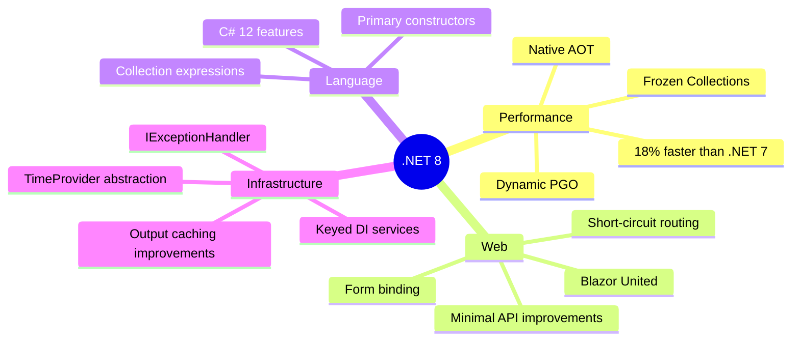

---

## 3. CLR (Common Language Runtime) Internals

### Definition
The CLR is the virtual machine component of .NET that manages the execution of .NET programs. It provides services like memory management, type safety, exception handling, garbage collection, security, and thread management.

### Purpose
To provide a managed execution environment that handles low-level concerns (memory, threads, security) so developers can focus on business logic.

### How CLR Works - Internal Architecture

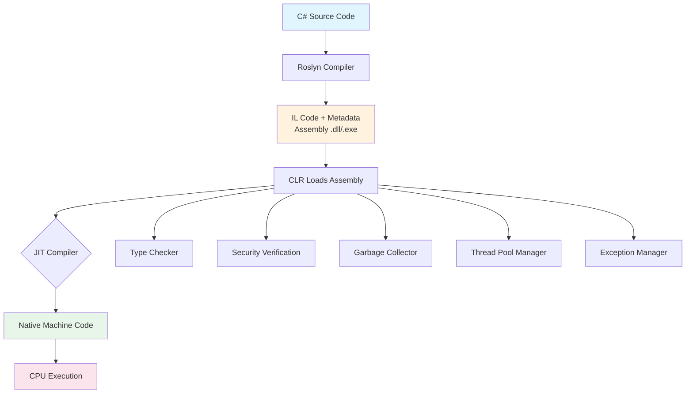

### CLR Execution Process - Step by Step

```
Step 1: COMPILATION (Build Time)
┌─────────────────────────────────────────────────────────┐
│ C# Code → Roslyn Compiler → IL (Intermediate Language)  │
│                                                          │
│ IL is CPU-independent bytecode stored in assemblies      │
│ (.dll or .exe files)                                     │
└─────────────────────────────────────────────────────────┘

Step 2: LOADING (Runtime - App Start)
┌─────────────────────────────────────────────────────────┐
│ CLR Loader → Reads assembly metadata                     │
│           → Verifies type safety                         │
│           → Resolves dependencies                        │
│           → Prepares for execution                       │
└─────────────────────────────────────────────────────────┘

Step 3: JIT COMPILATION (Runtime - First Method Call)
┌─────────────────────────────────────────────────────────┐
│ Method called for first time                             │
│ → JIT compiles IL to native CPU instructions             │
│ → Native code cached for subsequent calls                │
│ → Method runs at native speed after first call           │
└─────────────────────────────────────────────────────────┘

Step 4: EXECUTION (Runtime - Ongoing)
┌─────────────────────────────────────────────────────────┐
│ Native code executes on CPU                              │
│ GC manages memory automatically                          │
│ Thread pool manages concurrency                          │
│ Exception handling catches errors                        │
└─────────────────────────────────────────────────────────┘
```

### JIT Compilation Types

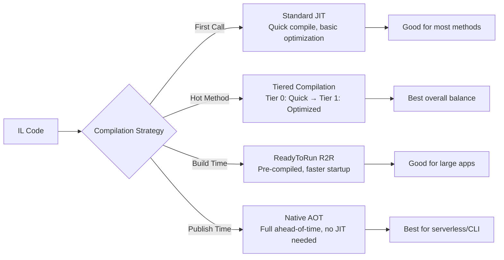

**Tiered Compilation (Default in .NET Core 3.0+):**
- **Tier 0**: Quick compilation with minimal optimization (fast startup)
- **Tier 1**: Background recompilation of "hot" methods with full optimization (peak performance)
- Result: Fast startup AND excellent steady-state performance

### Real-World Enterprise Scenario
Large organizations like banks use CLR understanding for:
- Troubleshooting production performance issues (GC pauses)
- Making informed decisions about AOT vs JIT for serverless functions
- Optimizing memory layout for high-throughput trading systems

### Interview Perspective
Interviewers expect senior developers to understand:
- IL compilation and why .NET can run cross-platform
- How Tiered Compilation improves both startup and peak performance
- When to choose Native AOT vs standard deployment
- How to diagnose JIT-related issues in production

---

## 4. Memory Management and Garbage Collection

### Definition
Garbage Collection (GC) is an automatic memory management system that reclaims memory occupied by objects that are no longer in use, preventing memory leaks and dangling pointer access.

### Problem It Solves
- **Manual memory management errors**: Use-after-free, double-free, memory leaks
- **Developer productivity**: No need to track every allocation manually
- **Safety**: Eliminates entire categories of bugs common in C/C++

### How GC Works Internally

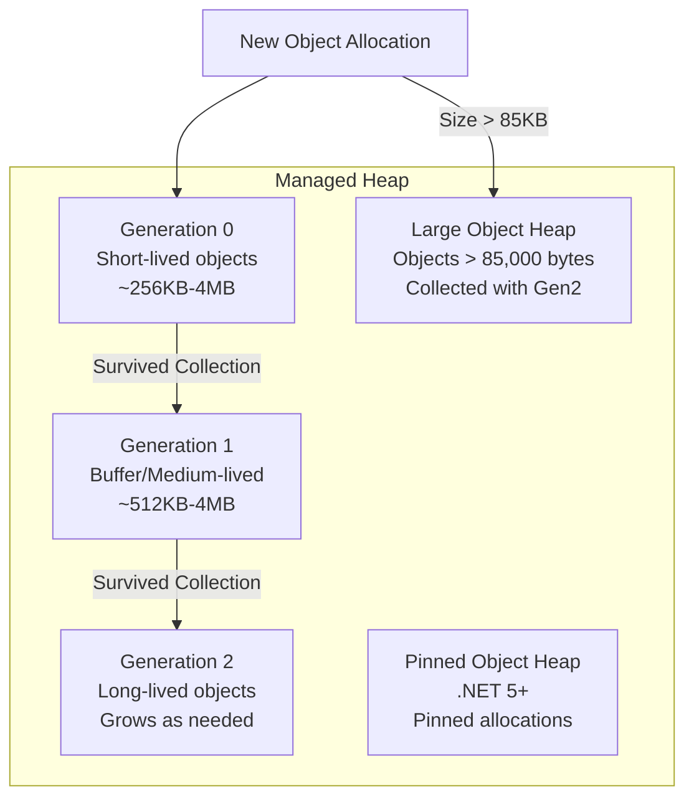

### GC Collection Process

```
MARK PHASE (Which objects are alive?)
┌──────────────────────────────────────────────┐
│ 1. Start from "roots" (stack variables,       │
│    static fields, CPU registers, GC handles)  │
│ 2. Walk all references from roots             │
│ 3. Mark each reachable object as "alive"      │
│ 4. Unmarked objects = garbage                 │
└──────────────────────────────────────────────┘
           ↓
COMPACT PHASE (Reclaim memory)
┌──────────────────────────────────────────────┐
│ 1. Move surviving objects together            │
│ 2. Update all references to new locations     │
│ 3. Free contiguous memory block               │
│ 4. Promote survivors to next generation       │
└──────────────────────────────────────────────┘
```

### GC Modes

| Mode | Threads | Best For | Characteristics |
|------|---------|----------|-----------------|
| Workstation GC | Single GC thread | Desktop apps | Lower latency, lower throughput |
| Server GC | One thread per CPU core | Web servers | Higher throughput, higher memory |
| Background GC | Concurrent Gen2 | Both | Gen2 collection without freezing app |

### Generational Hypothesis
The GC is designed around the empirical observation that:
- **Most objects die young** (temporary variables, request-scoped objects)
- **Objects that survive tend to live long** (singletons, caches)

This is why Gen0 collections are frequent (milliseconds) and Gen2 collections are rare (seconds).


### Value Types vs Reference Types - Memory Layout

```
STACK (Fast, automatic cleanup)          HEAP (GC-managed)
┌──────────────────────┐                 ┌──────────────────────────┐
│ int age = 30         │ ← Value type    │                          │
│ double salary = 75K  │ ← Value type    │  ┌────────────────────┐  │
│ Point p = {x:1,y:2} │ ← Struct        │  │ Customer object    │  │
│                      │                  │  │  Name: "John"      │  │
│ ref → ─────────────────────────────────────│  Age: 30          │  │
│                      │                  │  │  Email: "j@x.com"  │  │
│ ref → ─────────────────────────────────────└────────────────────┘  │
│                      │                  │                          │
└──────────────────────┘                  │  ┌────────────────────┐  │
                                          │  │ String "Hello"     │  │
                                          │  └────────────────────┘  │
                                          └──────────────────────────┘
```

### Memory Leak Patterns and Prevention

**Common Memory Leak Sources:**

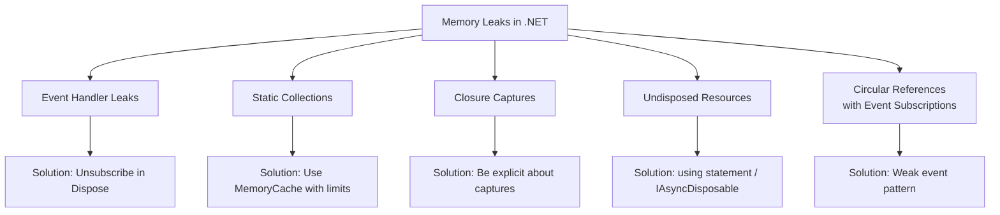

### Diagnostic Tools

| Tool | Purpose | When to Use |
|------|---------|-------------|
| dotnet-counters | Real-time GC metrics | Live monitoring |
| dotnet-dump | Memory dump capture/analysis | Production diagnostics |
| dotnet-trace | Performance tracing | Profiling |
| dotMemory | Visual memory profiler | Development |
| Application Insights | Continuous monitoring | Production |

### Code Example - After Full Concept Understanding

```csharp
// PROBLEM: Event handler memory leak
public class Publisher
{
    public event EventHandler DataChanged;
}

public class Subscriber : IDisposable
{
    private readonly Publisher _publisher;
    
    public Subscriber(Publisher pub)
    {
        _publisher = pub;
        _publisher.DataChanged += OnDataChanged; // Creates strong reference!
    }
    
    private void OnDataChanged(object? sender, EventArgs e) { /* handle */ }
    
    // SOLUTION: Always unsubscribe
    public void Dispose()
    {
        _publisher.DataChanged -= OnDataChanged;
    }
}

// PROBLEM: Static collection growing indefinitely
public static class BadCache
{
    private static readonly Dictionary<string, object> _cache = new(); // Never cleared!
}

// SOLUTION: Use MemoryCache with size limits and expiration
public class GoodCache
{
    private readonly IMemoryCache _cache;
    
    public GoodCache(IMemoryCache cache) => _cache = cache;
    
    public T GetOrCreate<T>(string key, Func<T> factory, TimeSpan expiry)
    {
        return _cache.GetOrCreate(key, entry =>
        {
            entry.AbsoluteExpirationRelativeToNow = expiry;
            entry.Size = 1; // Contribute to size limit
            return factory();
        })!;
    }
}
```

### Span<T> and Memory<T> - Zero-Allocation Programming

**Definition:** Span<T> provides type-safe access to a contiguous region of memory without heap allocation.

**Why it matters:** In high-throughput systems (10K+ requests/sec), even small allocations cause GC pressure.

```csharp
// Traditional approach - allocates new string on heap per operation
string input = "2024-01-15T10:30:00Z";
string datePart = input.Substring(0, 10); // NEW string allocated!
string timePart = input.Substring(11, 8); // ANOTHER allocation!

// Span approach - zero allocation, just pointer arithmetic
ReadOnlySpan<char> span = input.AsSpan();
ReadOnlySpan<char> datePart = span[..10];   // No allocation! Just a view
ReadOnlySpan<char> timePart = span[11..19]; // No allocation!
```

### Interview Questions with Detailed Answers

**Q: How would you diagnose a memory leak in production?**

**Expected Senior Answer:**
1. Monitor Gen2 collections and total memory via Application Insights/dotnet-counters
2. If memory grows steadily without release, capture a memory dump: `dotnet-dump collect -p <pid>`
3. Analyze with `dotnet-dump analyze`: run `dumpheap -stat` to find types consuming most memory
4. Find root references with `gcroot <address>` to understand WHY objects stay alive
5. Common culprits: event handlers not unsubscribed, static collections, timers not disposed, DbContext held too long

---

## 5. Async/Await and Threading

### Definition
Async/await is a language feature that allows writing asynchronous code that reads like synchronous code. It enables non-blocking I/O operations without managing threads manually.

### Problem It Solves
- **Thread pool starvation**: Blocking threads during I/O wastes resources
- **Scalability ceiling**: Synchronous servers limited by thread count
- **Code complexity**: Callbacks and continuations are hard to maintain

### Why It Matters for Senior Developers
A .NET web server with 100 threads:
- **Synchronous**: Can only handle 100 concurrent requests (threads blocked on I/O)
- **Asynchronous**: Can handle 10,000+ concurrent requests (threads returned during I/O wait)

### How Async/Await Works Internally

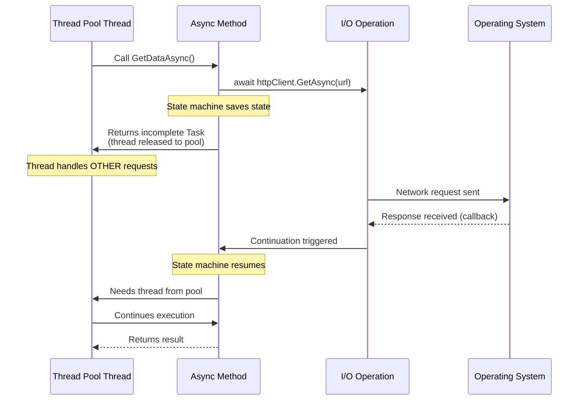

### State Machine - What the Compiler Generates

```
Your Code:                          Compiler Generates:
┌─────────────────────┐            ┌──────────────────────────────────┐
│ async Task<int>     │            │ struct GetDataStateMachine        │
│   GetDataAsync()    │            │ {                                │
│ {                   │     →      │   int state = 0;                 │
│   var x = await A();│            │   TaskAwaiter awaiter;           │
│   var y = await B();│            │   int x, y;                      │
│   return x + y;     │            │                                  │
│ }                   │            │   void MoveNext() {              │
└─────────────────────┘            │     switch(state) {              │
                                   │       case 0: call A, state=1    │
                                   │       case 1: x=result, call B   │
                                   │       case 2: y=result, return   │
                                   │     }                            │
                                   │   }                              │
                                   │ }                                │
                                   └──────────────────────────────────┘
```

### Common Async Pitfalls

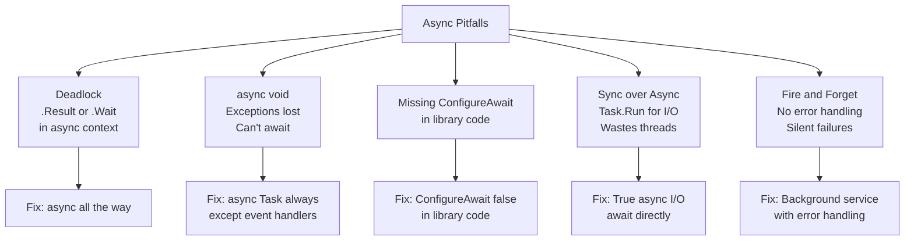

### Code Examples

```csharp
// ❌ DEADLOCK: Blocking on async in synchronous context
public ActionResult GetData()
{
    var data = _service.GetDataAsync().Result; // DEADLOCK in ASP.NET!
    return Ok(data);
}

// ✅ FIX: Async all the way
public async Task<ActionResult> GetData()
{
    var data = await _service.GetDataAsync();
    return Ok(data);
}

// ❌ THREAD POOL STARVATION: Wrapping I/O in Task.Run
public async Task<Data> GetDataAsync()
{
    return await Task.Run(() => _dbContext.Orders.ToList()); // Wastes a thread!
}

// ✅ FIX: Use truly async I/O
public async Task<List<Order>> GetDataAsync()
{
    return await _dbContext.Orders.ToListAsync(); // No thread blocked!
}

// Parallel processing with controlled concurrency
await Parallel.ForEachAsync(items,
    new ParallelOptions { MaxDegreeOfParallelism = 10 },
    async (item, ct) => await ProcessItemAsync(item, ct));
```

---

## 6. ASP.NET Core Request Pipeline and Middleware

### Definition
Middleware are components assembled into a pipeline to handle HTTP requests and responses. Each middleware can perform operations before and after the next component.

### How the Pipeline Works

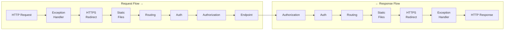

### Middleware Order (Critical)

```
1. Exception Handling     ← Outermost: catches everything
2. HSTS                   ← Security headers
3. HTTPS Redirection      ← Force HTTPS
4. Static Files           ← Short-circuits for .css, .js, images
5. Routing                ← Matches URL to endpoint
6. CORS                   ← Cross-origin headers
7. Authentication         ← WHO are you?
8. Authorization          ← WHAT can you do?
9. Rate Limiting          ← Throttle abusive clients
10. Endpoint Execution    ← Controller/Minimal API handler
```

**Why order matters:** Authentication MUST come before Authorization. Static Files SHOULD come before routing (short-circuits expensive auth for CSS/JS files).

### Custom Middleware Example

```csharp
public class RequestTimingMiddleware
{
    private readonly RequestDelegate _next;
    private readonly ILogger<RequestTimingMiddleware> _logger;

    public RequestTimingMiddleware(RequestDelegate next, ILogger<RequestTimingMiddleware> logger)
    {
        _next = next;
        _logger = logger;
    }

    public async Task InvokeAsync(HttpContext context)
    {
        var stopwatch = Stopwatch.StartNew();
        var correlationId = context.Request.Headers["X-Correlation-Id"].FirstOrDefault()
            ?? Guid.NewGuid().ToString();
        
        context.Response.Headers.Append("X-Correlation-Id", correlationId);

        try
        {
            await _next(context); // Pass to next middleware
        }
        finally
        {
            stopwatch.Stop();
            _logger.LogInformation(
                "Request {Method} {Path} completed in {Ms}ms - Status {Status}",
                context.Request.Method, context.Request.Path,
                stopwatch.ElapsedMilliseconds, context.Response.StatusCode);
        }
    }
}
```

---

## 7. Dependency Injection

### Definition
Dependency Injection (DI) is a design pattern where objects receive their dependencies from an external source rather than creating them internally. ASP.NET Core has a built-in IoC (Inversion of Control) container.

### Why DI Exists
Without DI, classes create their own dependencies, leading to:
- Tight coupling (can't swap implementations)
- Untestable code (can't mock dependencies)
- Hidden dependencies (hard to understand what a class needs)

### Service Lifetimes Explained

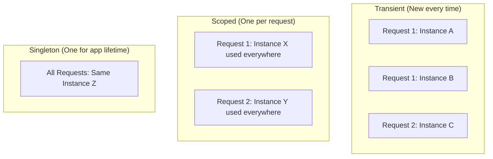

| Lifetime | Created | Destroyed | Use Case | Example |
|----------|---------|-----------|----------|---------|
| Transient | Every injection | After use | Lightweight, stateless | Validators, mappers |
| Scoped | Per HTTP request | End of request | Request state | DbContext, UnitOfWork |
| Singleton | First request | App shutdown | Shared state | Cache, HttpClientFactory |

### Captive Dependency Problem

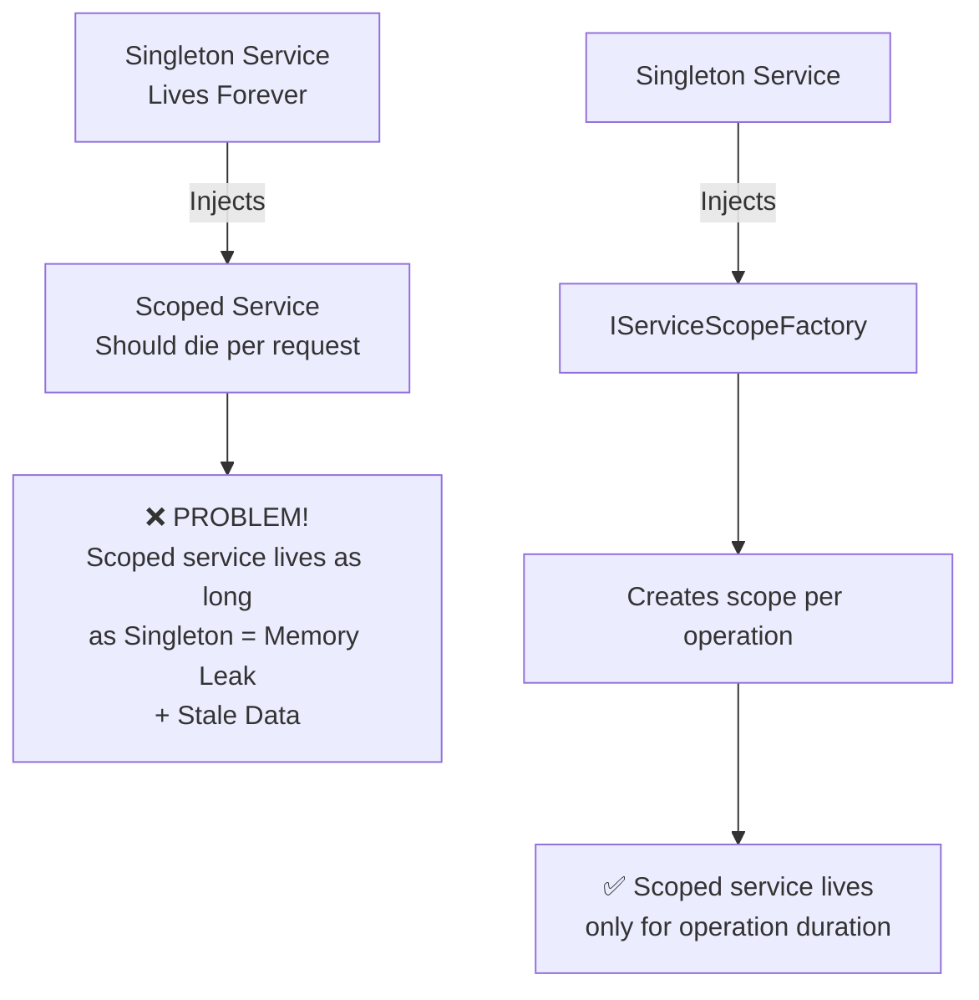

### Code Example

```csharp
// ❌ CAPTIVE DEPENDENCY: Scoped DbContext captured by Singleton
public class CacheService : ICacheService  // Registered as Singleton
{
    private readonly AppDbContext _db;  // CAPTURED! Lives forever now
    public CacheService(AppDbContext db) { _db = db; }
}

// ✅ SOLUTION: Use IServiceScopeFactory
public class CacheService : ICacheService  // Singleton is safe now
{
    private readonly IServiceScopeFactory _scopeFactory;
    
    public CacheService(IServiceScopeFactory scopeFactory)
    {
        _scopeFactory = scopeFactory;
    }
    
    public async Task RefreshCacheAsync()
    {
        using var scope = _scopeFactory.CreateScope();
        var db = scope.ServiceProvider.GetRequiredService<AppDbContext>();
        // db lives only for this operation, then properly disposed
    }
}
```

---

## 8. Configuration and Options Pattern

### Definition
The Options pattern provides strongly-typed access to configuration settings with validation, change notifications, and proper separation of concerns.

### Options Pattern Decision Tree

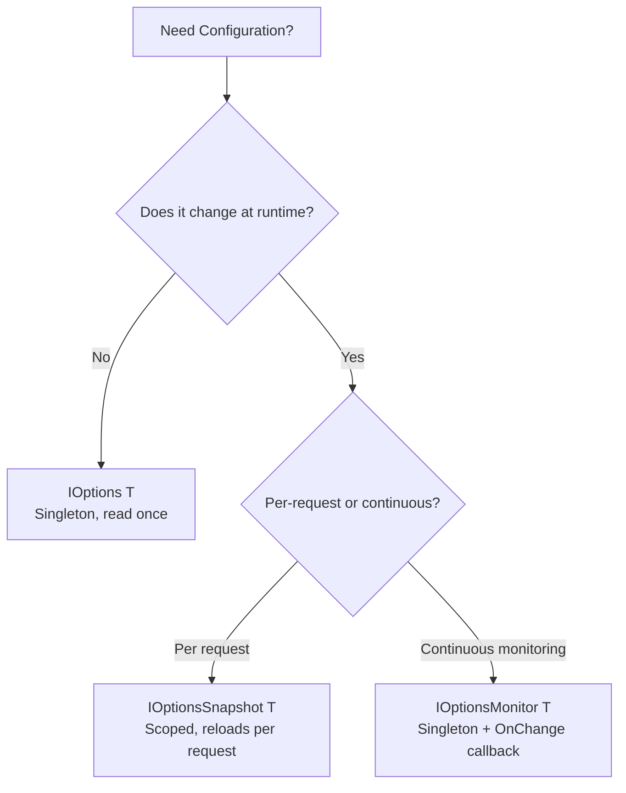

---

## 9. Web API Architecture

### Request Processing Flow

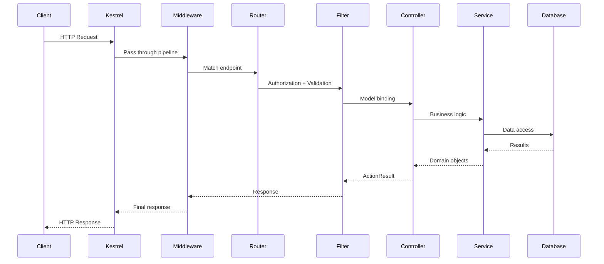

### Minimal APIs vs Controllers

| Aspect | Minimal APIs | Controllers |
|--------|-------------|-------------|
| Best For | Microservices, simple APIs | Complex APIs, large teams |
| Code Size | Less boilerplate | More structured |
| Filters | Endpoint filters (7+) | Full filter pipeline |
| Model Binding | Parameter injection | [FromBody], [FromQuery] |
| Organization | Route groups | Controller classes |
| Testing | Direct delegate testing | Established patterns |
| Performance | Slightly faster | Minimal overhead |

---

## 10. Synchronization Primitives

### Lock vs Monitor vs SemaphoreSlim

```
┌─────────────────────────────────────────────────────────────────┐
│ LOCK (syntactic sugar for Monitor)                               │
│ • Simplest: lock(obj) { ... }                                   │
│ • Compiler generates Monitor.Enter/Exit with try-finally         │
│ • Cannot await inside lock block!                                │
│ • Cannot set timeout                                            │
│                                                                  │
│ MONITOR (more control than lock)                                 │
│ • Monitor.TryEnter(obj, timeout) - can timeout                  │
│ • Monitor.Wait/Pulse - producer/consumer signaling              │
│ • Same thread must Enter and Exit                               │
│                                                                  │
│ SEMAPHORESLIM (async-compatible throttling)                      │
│ • await semaphore.WaitAsync() - works in async code!            │
│ • Can allow N concurrent entries (not just 1)                   │
│ • Different thread can release than acquired                     │
│ • Best for async resource throttling                            │
└─────────────────────────────────────────────────────────────────┘
```

| Primitive | Async? | Timeout? | Re-entrant? | Use Case |
|-----------|--------|----------|-------------|----------|
| lock | ❌ | ❌ | ❌ | Simple critical sections |
| Monitor | ❌ | ✅ | ❌ | Timed lock attempts |
| SemaphoreSlim | ✅ | ✅ | ❌ | Async throttling (DB connections) |
| ReaderWriterLockSlim | ❌ | ✅ | Optional | Many readers, few writers |
| Interlocked | N/A | N/A | N/A | Atomic counter operations |

```csharp
// ❌ DEADLOCK: Can't await inside lock
lock (_sync)
{
    await _httpClient.GetAsync(url); // COMPILE ERROR in strict mode / DEADLOCK risk
}

// ✅ CORRECT: Use SemaphoreSlim for async locking
private readonly SemaphoreSlim _asyncLock = new(1, 1);

public async Task<Data> GetDataAsync()
{
    await _asyncLock.WaitAsync();
    try
    {
        return await _httpClient.GetAsync(url);
    }
    finally
    {
        _asyncLock.Release();
    }
}

// Throttling: Allow max 5 concurrent database connections
private readonly SemaphoreSlim _dbThrottle = new(5, 5);

public async Task ProcessBatchAsync(IEnumerable<Item> items)
{
    var tasks = items.Select(async item =>
    {
        await _dbThrottle.WaitAsync();
        try { await SaveItemAsync(item); }
        finally { _dbThrottle.Release(); }
    });
    await Task.WhenAll(tasks);
}
```

---

## 11. API Route Constraints and Model Binding

### Route Constraints

```csharp
// Route constraints restrict which URLs match a route
app.MapGet("/orders/{id:int}", GetOrder);           // Only integers
app.MapGet("/orders/{id:guid}", GetOrderByGuid);    // Only GUIDs
app.MapGet("/users/{name:alpha}", GetUser);          // Only letters
app.MapGet("/files/{path:regex(^[a-z]+$)}", GetFile); // Custom regex

// Common constraints:
// {id:int}        - Integer only
// {id:long}       - Long integer
// {id:guid}       - GUID format
// {name:alpha}    - Alphabetic characters only
// {name:minlength(3)} - Minimum length
// {age:range(18,120)} - Numeric range
// {slug:regex(^[a-z0-9-]+$)} - Custom pattern
```

### Overload Resolution — How ASP.NET Core Matches Routes

```
Request: GET /orders/123

Route Table:
┌──────────────────────────────────────────────────────┐
│ 1. /orders/{id:int}     → GetOrderById (MATCHES!)    │
│ 2. /orders/{name:alpha} → GetOrderByName (no match)  │
│ 3. /orders/{id}         → GetOrderGeneric (matches)  │
│                                                       │
│ Winner: Route 1 (most specific constraint wins)       │
└──────────────────────────────────────────────────────┘

Priority: Literal segments > constrained parameters > unconstrained parameters
```

---

## 12. Performance Optimization

### Performance Optimization Decision Tree

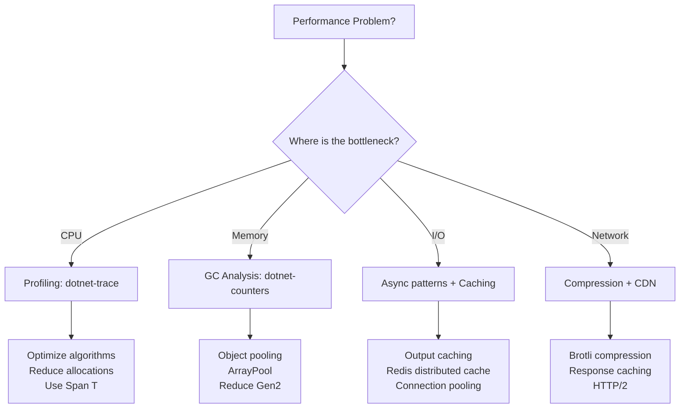

### Key Performance Strategies

| Strategy | Impact | Complexity | When to Use |
|----------|--------|-----------|-------------|
| Output Caching | Very High | Low | Repeated identical responses |
| Connection Pooling | High | Low | Always for database access |
| Async I/O | High | Medium | All I/O operations |
| Response Compression | Medium | Low | Large response bodies |
| Object Pooling | Medium | Medium | Frequent allocations of expensive objects |
| Span<T> | High | High | Hot paths with string/buffer manipulation |

---

## 11. Security

### Authentication Flow

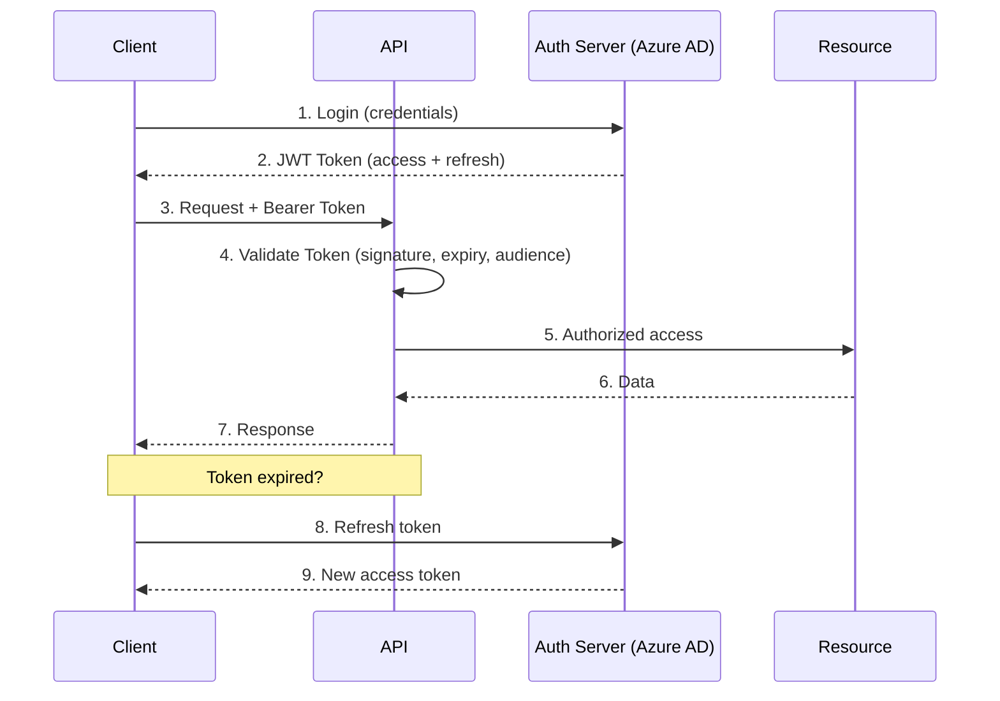

### Security Best Practices

| Area | Practice | Why |
|------|----------|-----|
| Secrets | Azure Key Vault + Managed Identity | Zero secrets in config/code |
| Auth | JWT with short-lived tokens | Minimize blast radius if stolen |
| Data | Always parameterized queries | Prevent SQL injection |
| Transport | HTTPS everywhere + HSTS | Prevent MITM attacks |
| Headers | Security headers middleware | Prevent XSS, clickjacking |
| Rate Limiting | Per-IP and per-user limits | Prevent abuse/DDoS |

---

## 12. Scenario-Based Questions

### Scenario: API response time degraded from 200ms to 2000ms after release

**Systematic Diagnosis Approach:**

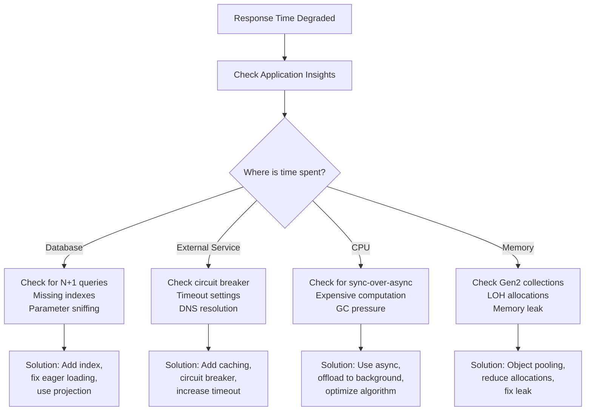

---

## 13. Best Practices Summary

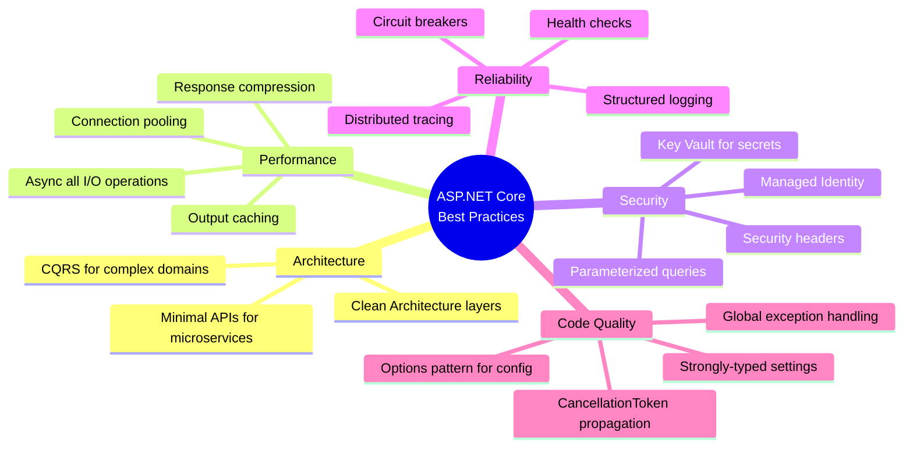

---

## 14. Interview Perspective - What Interviewers Expect

For 8+ years experience, interviewers expect you to:

1. **Explain WHY** before HOW - demonstrate understanding of problems being solved
2. **Discuss trade-offs** - every decision has costs and benefits
3. **Reference production experience** - "In our system, we encountered..."
4. **Think about failure modes** - "What happens when X goes down?"
5. **Consider observability** - "How would we know if this is working?"
6. **Know when NOT to use something** - over-engineering awareness

### Follow-up Questions to Prepare For:
- "How would this change at 10x scale?"
- "What would you do differently if starting fresh?"
- "How do you handle this in production vs development?"
- "What metrics would you monitor?"
- "How would you test this?"
