# C# Advanced Features - Complete Interview Guide
## For 8+ Years Experienced Senior Developers

---

## 1. C# Language Evolution

### Definition
C# is a modern, type-safe, object-oriented programming language that evolves annually with new features focused on developer productivity, performance, and expressiveness.

### Purpose
Each C# version addresses specific pain points: reducing boilerplate, improving safety, enabling better performance patterns, and supporting modern programming paradigms.

### Problem It Solves
- **Verbose code**: Excessive boilerplate for simple operations (pre-records, pre-pattern-matching)
- **Null safety**: NullReferenceException was the #1 runtime error before nullable reference types
- **Performance ceilings**: Boxing, allocations, and reflection overhead in high-throughput systems
- **Type limitations**: Lack of value-equality types, limited pattern matching, no async streams

### Industry Relevance
- C# 12 is the current version (.NET 8 LTS)
- Language features directly impact code quality, performance, and maintainability
- Senior developers must know WHEN to use each feature, not just HOW

### Evolution Mind Map

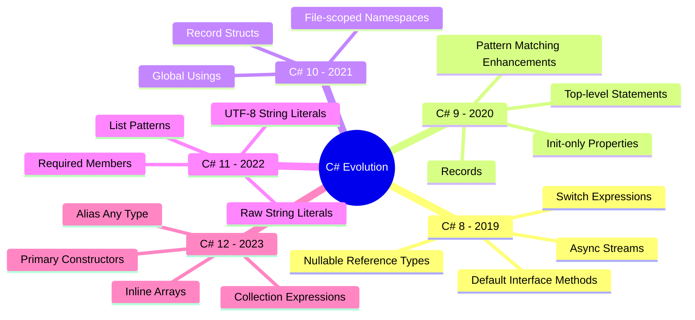

---

## 2. Generics

### Definition
Generics allow you to define type-safe data structures and algorithms without committing to a specific data type. The type is specified when the class/method is used, not when it's defined.

### Problem It Solves
- **Type safety**: Catches type errors at compile time instead of runtime
- **Code reuse**: Write once, use with any type
- **Performance**: Avoids boxing/unboxing for value types
- **No casting**: Eliminates runtime type cast exceptions

### How Generics Work Internally

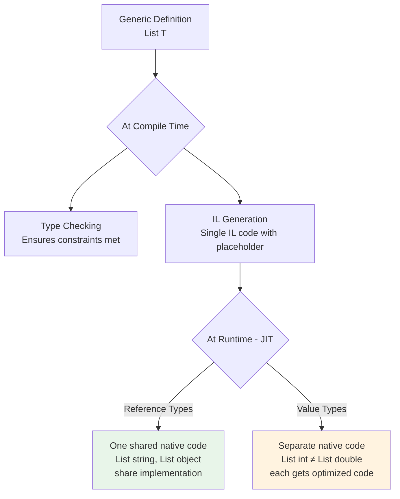

### Generic Constraints

```
Constraint          │ Meaning                           │ Use Case
────────────────────┼───────────────────────────────────┼──────────────────────────
where T : class     │ Must be reference type            │ Nullable operations
where T : struct    │ Must be value type                │ Non-null guarantees
where T : new()     │ Must have parameterless ctor      │ Factory pattern
where T : BaseClass │ Must inherit from BaseClass       │ Hierarchy constraints
where T : IInterface│ Must implement interface          │ Behavior contracts
where T : notnull   │ Must be non-nullable              │ Safety guarantees
where T : unmanaged │ Must be unmanaged type            │ Interop, pointers
```

### Covariance and Contravariance

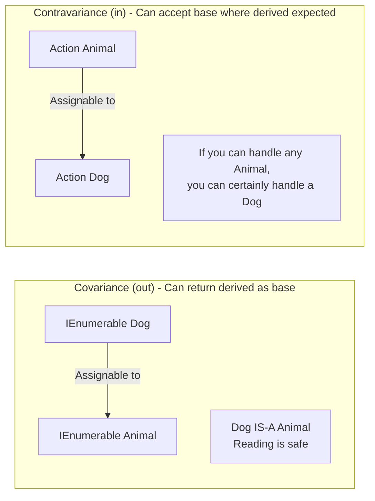

**Simple Analogy:**
- **Covariance (out)**: A cage of dogs can be viewed as a cage of animals (safe to READ from)
- **Contravariance (in)**: A vet that treats all animals can work on dogs (safe to WRITE to)

### Code Example

```csharp
// Covariant interface - produces T (output only)
public interface IReadRepository<out T> where T : class
{
    T GetById(int id);           // T in output position only
    IEnumerable<T> GetAll();     // Safe: can return derived types
}

// Contravariant interface - consumes T (input only)
public interface IValidator<in T>
{
    bool Validate(T item);       // T in input position only
}

// Usage demonstrating variance
IReadRepository<Dog> dogRepo = new DogRepository();
IReadRepository<Animal> animalRepo = dogRepo;  // ✅ Covariance

IValidator<Animal> animalValidator = new AnimalValidator();
IValidator<Dog> dogValidator = animalValidator; // ✅ Contravariance
```

---

## 3. Delegates, Events, and Lambdas

### Definition
- **Delegate**: A type-safe function pointer that holds a reference to a method
- **Event**: A restricted delegate that only the owning class can invoke
- **Lambda**: An anonymous function expression used to create delegates

### Concept Hierarchy

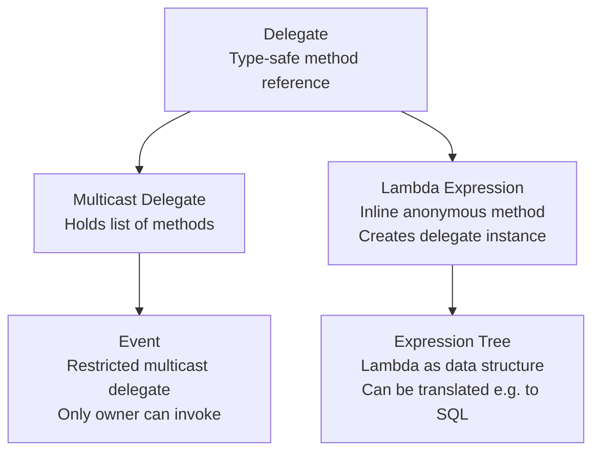

### How Events Prevent Misuse

```
Without Events (raw delegate):              With Events:
┌─────────────────────────────┐            ┌─────────────────────────────┐
│ External code CAN:          │            │ External code CAN:          │
│  ✅ Subscribe (+=)          │            │  ✅ Subscribe (+=)          │
│  ✅ Unsubscribe (-=)        │            │  ✅ Unsubscribe (-=)        │
│  ❌ Invoke directly         │            │  ❌ Invoke directly         │
│  ❌ Replace all subscribers │            │  ❌ Replace all subscribers │
│  ❌ Read subscriber list    │            │  ❌ Read subscriber list    │
│                             │            │                             │
│ Problem: Anyone can fire    │            │ Only owning class fires     │
│ the event or wipe out       │            │ the event                   │
│ other subscribers with =    │            │                             │
└─────────────────────────────┘            └─────────────────────────────┘
```

### Expression Trees - Data vs Code

**Key Insight:** Expression trees represent code AS DATA that can be analyzed and translated.

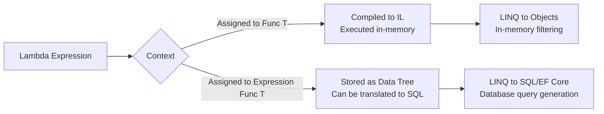

```csharp
// Same syntax, completely different behavior based on target type:
Func<Order, bool> func = o => o.Total > 100;
// Compiled to IL → filters in memory

Expression<Func<Order, bool>> expr = o => o.Total > 100;
// Stored as data → EF Core translates to: WHERE Total > 100
```

---

## 4. LINQ Deep Dive

### Definition
LINQ (Language Integrated Query) is a set of language features that enables querying data from any source (collections, databases, XML, APIs) using a consistent, type-safe syntax.

### Deferred vs Immediate Execution

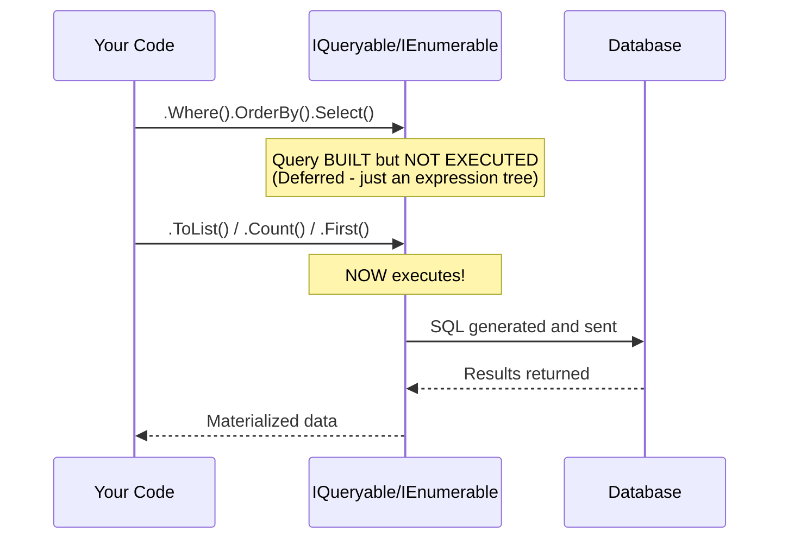

**Critical Understanding:**
- Building a query (Where, Select, OrderBy) does NOT execute it
- Execution triggers: `ToList()`, `ToArray()`, `Count()`, `First()`, `foreach`
- Danger: Enumerating twice executes the query twice!

### IQueryable vs IEnumerable

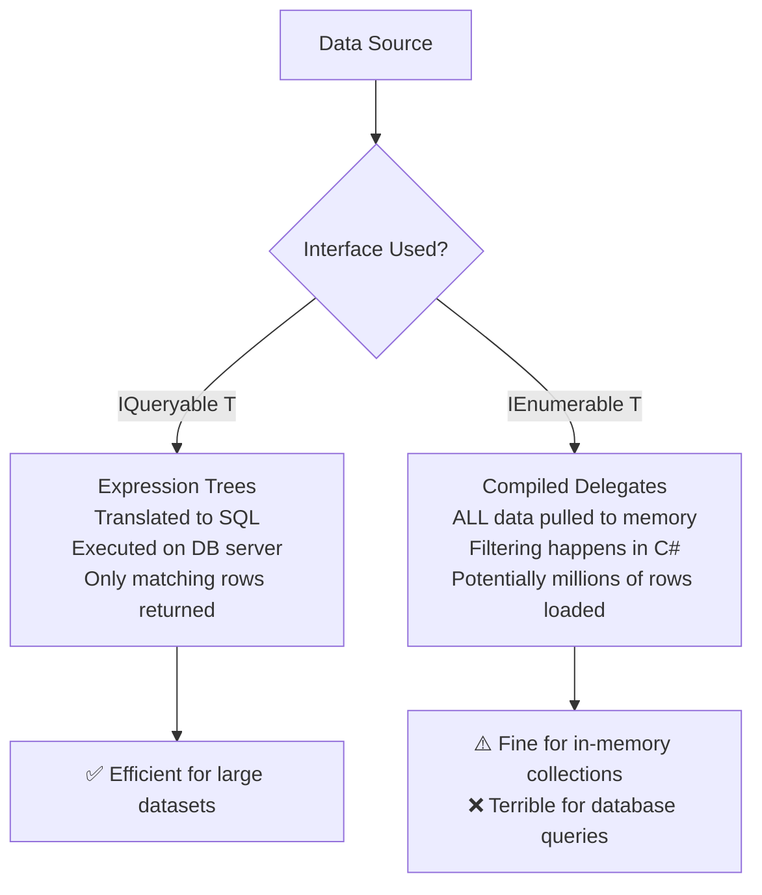

| Feature | IQueryable<T> | IEnumerable<T> |
|---------|--------------|----------------|
| Execution | On database server | In application memory |
| Translation | Expression trees → SQL | Compiled delegates |
| Filtering | WHERE clause on DB | Client-side iteration |
| Performance | Only transfers needed data | Loads all data first |
| Use Case | EF Core / remote data | Collections already in memory |

---

## 5. Pattern Matching

### Definition
Pattern matching allows testing a value against a pattern and extracting information when there's a match. It replaces complex if-else chains and type checking with concise, readable syntax.

### Pattern Types Decision Tree

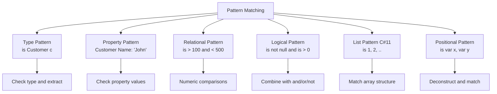

### Code Example - Real-World Usage

```csharp
// Instead of complex if-else chains:
public decimal CalculateShipping(Order order) => order switch
{
    { Total: > 100, Customer.IsPremium: true } => 0m,         // Free for premium
    { Total: > 100 } => 5.99m,                                // Reduced for large orders
    { Weight: > 50 } => 29.99m,                               // Heavy items
    { DeliveryType: DeliveryType.Express } => 14.99m,         // Express surcharge
    { Destination.Country: not "US" } => 24.99m,              // International
    _ => 9.99m                                                 // Default
};

// List patterns (C# 11) - matching array structure
int[] numbers = { 1, 2, 3, 4, 5 };
var description = numbers switch
{
    [1, 2, ..] => "Starts with 1, 2",
    [.., 4, 5] => "Ends with 4, 5",
    { Length: > 10 } => "Too many",
    [] => "Empty",
    _ => "Other"
};
```

---

## 6. Records and Value Objects

### Definition
Records are reference types (or value types with `record struct`) that provide value-based equality, immutability, and concise syntax for data-carrying types.

### When to Use Records

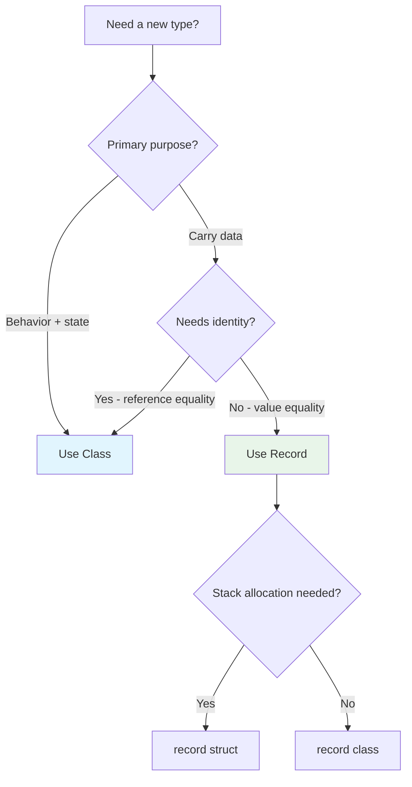

### Class vs Record Comparison

| Feature | Class | Record | Record Struct |
|---------|-------|--------|---------------|
| Equality | Reference (same instance) | Value (same data) | Value (same data) |
| Mutability | Mutable by default | Immutable by default | Immutable with readonly |
| Storage | Heap | Heap | Stack |
| `with` expression | No | Yes | Yes |
| Deconstruction | Manual | Automatic | Automatic |
| ToString | Type name | All properties | All properties |
| Best for | Entities, services | DTOs, events, value objects | Small data, coordinates |

---

## 7. Nullable Reference Types

### Definition
Nullable reference types (NRT) is a compile-time feature that helps prevent null reference exceptions by distinguishing between nullable (`string?`) and non-nullable (`string`) reference types.

### Problem It Solves
NullReferenceException is the most common runtime error in .NET. NRT shifts null checking from runtime to compile time.

```
Before NRT:                          After NRT:
┌────────────────────────────┐      ┌────────────────────────────┐
│ string name;               │      │ string name;  // never null │
│ // Could be null!          │      │ string? name; // might be   │
│ // No way to know          │      │                             │
│ // Runtime crash: name.X   │      │ // Compiler warns if you    │
│                            │      │ // use name? without check  │
└────────────────────────────┘      └────────────────────────────┘
```

---

## 8. Collections - Choosing the Right One

### Decision Tree

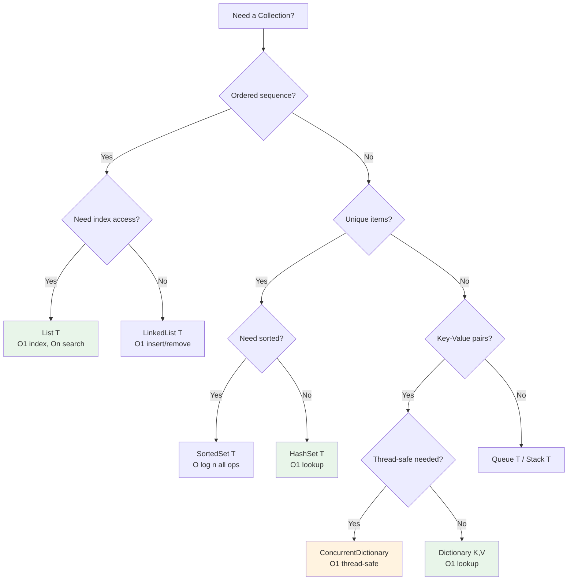

### Performance Comparison

| Collection | Lookup | Insert | Remove | Thread-Safe | Best For |
|-----------|--------|--------|--------|-------------|----------|
| List<T> | O(n) | O(1)* | O(n) | ❌ | Indexed sequences |
| Dictionary<K,V> | O(1) | O(1) | O(1) | ❌ | Key-value lookups |
| HashSet<T> | O(1) | O(1) | O(1) | ❌ | Unique items, set ops |
| SortedSet<T> | O(log n) | O(log n) | O(log n) | ❌ | Sorted unique items |
| ConcurrentDictionary | O(1) | O(1) | O(1) | ✅ | Multi-threaded cache |
| FrozenDictionary (.NET 8) | O(1) | N/A | N/A | ✅ | Read-heavy, set once |
| ImmutableList<T> | O(log n) | O(log n) | O(log n) | ✅* | Functional patterns |

---

## 9. Source Generators

### Definition
Source generators are compiler plugins that generate additional C# source code during compilation, enabling compile-time code generation that replaces runtime reflection.

### Why Source Generators Matter

```
Traditional (Reflection):              Source Generators:
┌─────────────────────────┐           ┌─────────────────────────┐
│ Runtime                  │           │ Compile Time             │
│  • Slower (reflection)   │           │  • Zero runtime cost     │
│  • No AOT support        │           │  • AOT compatible        │
│  • Runtime errors        │           │  • Compile-time errors   │
│  • Hidden behavior       │           │  • Inspectable output    │
└─────────────────────────┘           └─────────────────────────┘
```

### Real-World Usage
- **System.Text.Json**: Generates serialization code at compile time
- **Logging**: Generates high-performance logging methods
- **Regex**: Compiles regex patterns at build time
- **AutoMapper alternative**: Generate mapping code without reflection

---

## 10. Interview Questions with Detailed Answers

### Q: Explain the difference between IEnumerable<T> and IQueryable<T>

**Senior-Level Answer:**
IEnumerable operates on in-memory collections using compiled delegates. When you chain LINQ methods, each method receives and returns `IEnumerable<T>` and filtering happens in C# after ALL data is loaded.

IQueryable builds an expression tree that represents the entire query. This tree is translated by a provider (like EF Core) into the target language (SQL). Only matching rows come back from the database.

**The critical implication**: If you accidentally cast an `IQueryable<T>` to `IEnumerable<T>` early in your query chain, all subsequent filtering happens in memory instead of on the database server, potentially loading millions of rows.

### Q: What are the performance implications of boxing?

**Senior-Level Answer:**
Boxing occurs when a value type is stored as a reference type (e.g., casting `int` to `object`). This:
1. Allocates memory on the heap (GC pressure)
2. Copies the value from stack to heap
3. Creates garbage when the boxed value is no longer needed

In high-throughput scenarios (tight loops, collections), boxing can cause significant GC pressure. Generics eliminate boxing by generating specialized code per value type.

### Q: When would you use `record struct` vs `record class`?

**Senior-Level Answer:**
- `record struct`: For small value types (< 16 bytes) used frequently in computations (Point, Money, Range). Stack-allocated, no GC. Copied by value on assignment.
- `record class`: For larger DTOs, events, API responses. Heap-allocated, shared by reference, GC-managed. Immutable by default with `with` expressions.

Rule of thumb: If it's small (2-3 fields of primitive types) and you create millions of them, use `record struct`. Otherwise, `record class`.

---

## 11. Channels and Concurrent Programming

### Definition
Channels provide a high-performance, thread-safe producer/consumer data structure for passing data between async operations.

### When to Use

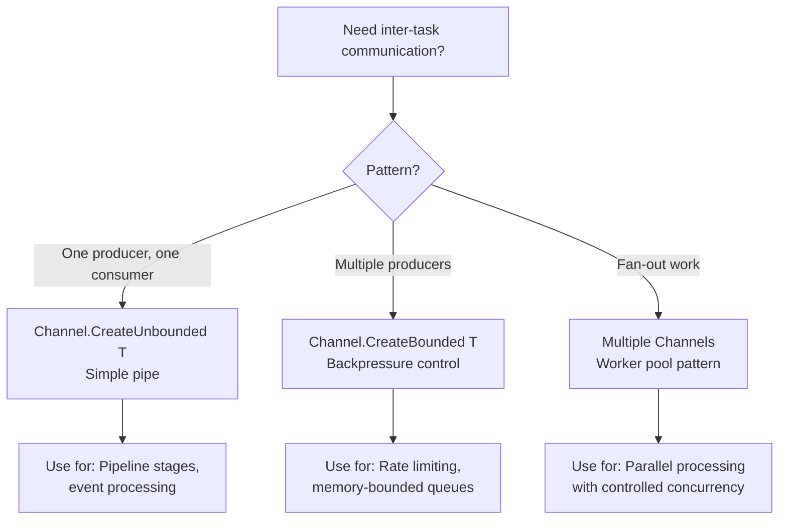

### Code Example

```csharp
// Producer-consumer pipeline with channels
public class OrderProcessingPipeline
{
    private readonly Channel<Order> _validationChannel = Channel.CreateBounded<Order>(100);
    private readonly Channel<Order> _enrichmentChannel = Channel.CreateBounded<Order>(50);
    
    public async Task StartAsync(CancellationToken ct)
    {
        // Start pipeline stages in parallel
        var validation = Task.Run(() => ValidationStageAsync(ct), ct);
        var enrichment = Task.Run(() => EnrichmentStageAsync(ct), ct);
        var persistence = Task.Run(() => PersistenceStageAsync(ct), ct);
        
        await Task.WhenAll(validation, enrichment, persistence);
    }
    
    public async Task EnqueueAsync(Order order)
    {
        await _validationChannel.Writer.WriteAsync(order);
    }
    
    private async Task ValidationStageAsync(CancellationToken ct)
    {
        await foreach (var order in _validationChannel.Reader.ReadAllAsync(ct))
        {
            if (IsValid(order))
                await _enrichmentChannel.Writer.WriteAsync(order, ct);
        }
    }
}
```

### Thread Safety Primitives Comparison

| Type | Use Case | Blocking? | Async? |
|------|----------|-----------|--------|
| lock | Short critical sections | Yes | No |
| SemaphoreSlim | Throttling, async lock | Optional | Yes |
| Channel<T> | Producer-consumer | No (backpressure) | Yes |
| ConcurrentDictionary | Thread-safe lookups | No (lock-free) | No |
| Interlocked | Atomic counter ops | No | No |
| ReaderWriterLockSlim | Many readers, few writers | Yes | No |

---

## 12. Expression Trees and Metaprogramming

### Definition
Expression trees represent code as a data structure that can be inspected, modified, or compiled at runtime. They're the foundation of LINQ-to-SQL translation.

### How EF Core Uses Expression Trees

```
Your C# Code:
  .Where(o => o.Status == "Active" && o.Total > 100)

Compiled to Expression Tree (NOT executed):
  BinaryExpression (AndAlso)
  ├── BinaryExpression (Equal)
  │   ├── MemberAccess: o.Status
  │   └── Constant: "Active"
  └── BinaryExpression (GreaterThan)
      ├── MemberAccess: o.Total
      └── Constant: 100

EF Core translates tree to SQL:
  WHERE [o].[Status] = N'Active' AND [o].[Total] > 100
```

### Building Dynamic Queries

```csharp
// Dynamic filter builder using Expression Trees
public static Expression<Func<T, bool>> BuildFilter<T>(
    string propertyName, object value, string operation = "equals")
{
    var parameter = Expression.Parameter(typeof(T), "x");
    var property = Expression.Property(parameter, propertyName);
    var constant = Expression.Constant(value);
    
    Expression body = operation switch
    {
        "equals" => Expression.Equal(property, constant),
        "contains" => Expression.Call(property, 
            typeof(string).GetMethod("Contains", new[] { typeof(string) })!, constant),
        "greaterThan" => Expression.GreaterThan(property, constant),
        _ => throw new NotSupportedException()
    };
    
    return Expression.Lambda<Func<T, bool>>(body, parameter);
}

// Usage: Build filter dynamically from user search criteria
var filter = BuildFilter<Order>("Status", "Active");
var orders = await dbContext.Orders.Where(filter).ToListAsync();
```

---

## 13. Disposal, Finalization, and IAsyncDisposable

### Resource Management Hierarchy

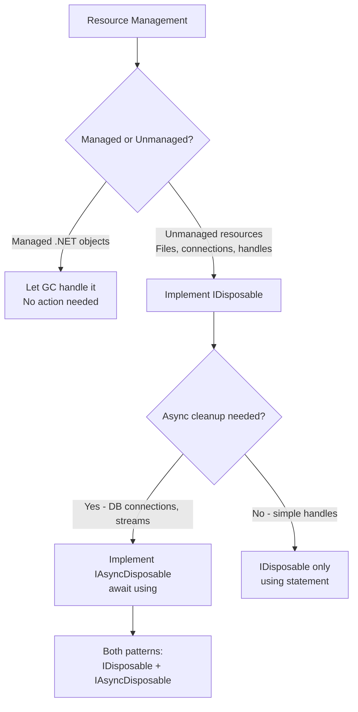

### Code Example

```csharp
// Modern disposal pattern with IAsyncDisposable
public class OrderExporter : IAsyncDisposable, IDisposable
{
    private readonly FileStream _stream;
    private readonly StreamWriter _writer;
    private bool _disposed;
    
    public OrderExporter(string path)
    {
        _stream = File.Create(path);
        _writer = new StreamWriter(_stream);
    }
    
    public async Task WriteOrderAsync(Order order)
    {
        ObjectDisposedException.ThrowIf(_disposed, this);
        await _writer.WriteLineAsync(JsonSerializer.Serialize(order));
    }
    
    public async ValueTask DisposeAsync()
    {
        if (_disposed) return;
        _disposed = true;
        
        await _writer.DisposeAsync();
        await _stream.DisposeAsync();
        
        GC.SuppressFinalize(this);
    }
    
    public void Dispose()
    {
        if (_disposed) return;
        _disposed = true;
        
        _writer.Dispose();
        _stream.Dispose();
        
        GC.SuppressFinalize(this);
    }
}

// Usage with await using (C# 8+)
await using var exporter = new OrderExporter("orders.json");
await exporter.WriteOrderAsync(order1);
await exporter.WriteOrderAsync(order2);
// Automatically calls DisposeAsync at end of scope
```

---

## 14. Scenario-Based Questions

### Scenario: Build a high-throughput event processor (10K events/sec)

```csharp
// Key techniques: Channels, batching, Span<T>, ArrayPool
public class HighThroughputEventProcessor
{
    private readonly Channel<ReadOnlyMemory<byte>> _channel;
    private readonly ArrayPool<byte> _pool = ArrayPool<byte>.Shared;
    
    public HighThroughputEventProcessor()
    {
        _channel = Channel.CreateBounded<ReadOnlyMemory<byte>>(
            new BoundedChannelOptions(10_000)
            {
                FullMode = BoundedChannelFullMode.Wait,
                SingleReader = false,
                SingleWriter = false
            });
    }
    
    // Multiple consumers process in parallel
    public async Task ProcessBatchAsync(CancellationToken ct)
    {
        var batch = new List<ReadOnlyMemory<byte>>(100);
        
        await foreach (var item in _channel.Reader.ReadAllAsync(ct))
        {
            batch.Add(item);
            
            if (batch.Count >= 100) // Batch for efficiency
            {
                await PersistBatchAsync(batch);
                batch.Clear();
            }
        }
    }
}
```

---

## 15. Best Practices Summary

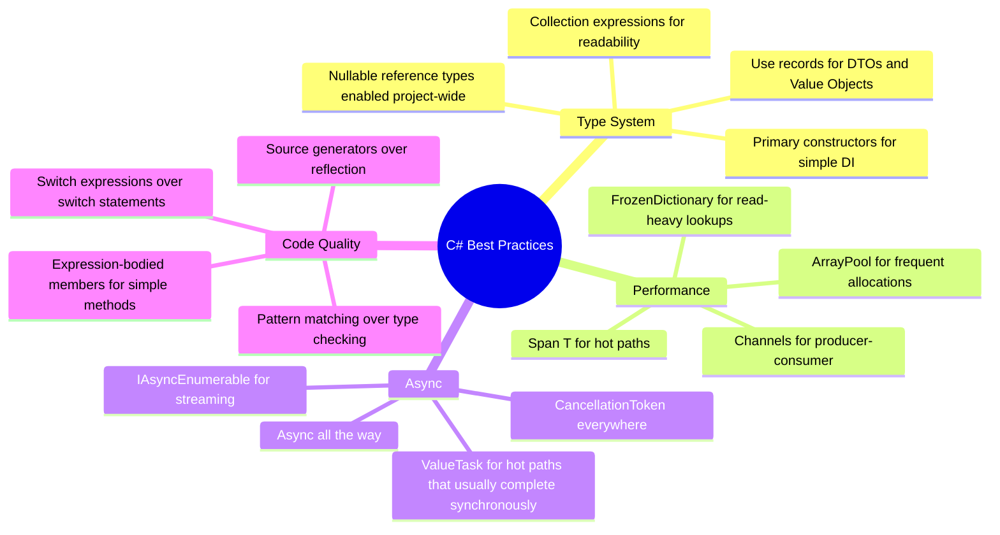

---

## 16. Interview Perspective - What Interviewers Expect

For 8+ years experience, C# interviewers expect:

1. **Language mastery** - Know C# 10-12 features and when each is appropriate
2. **Performance awareness** - Understand allocation, GC pressure, and when to optimize
3. **Async expertise** - State machines, SynchronizationContext, deadlock avoidance
4. **LINQ fluency** - IEnumerable vs IQueryable implications, deferred execution
5. **Type system leverage** - Records, generics constraints, nullable annotations
6. **Real-world patterns** - Channels, concurrent collections, expression trees in production

### Follow-up Questions to Prepare For:
- "What's the difference between ValueTask and Task?"
- "How do you prevent memory allocations in a hot path?"
- "Explain how the compiler transforms async/await"
- "When would you use a struct vs class vs record?"
- "How does generic variance (covariance/contravariance) work?"
- "What performance improvements did you get from source generators?"
