# Angular - Complete Interview Guide
## For 8+ Years Experienced Senior Developers

---

## 1. Angular Overview

### Definition
Angular is a TypeScript-based front-end web application framework developed by Google for building single-page applications (SPAs) with a component-based architecture.

### Purpose
To provide a complete, opinionated framework for building enterprise-scale web applications with built-in solutions for routing, forms, HTTP, testing, and state management.

### Problem It Solves
- **DOM manipulation complexity**: Manual DOM updates are error-prone and hard to maintain
- **State synchronization**: Keeping UI in sync with data is the hardest frontend problem
- **Code organization**: Large SPAs need structure, conventions, and modularity
- **Team scalability**: Multiple developers need consistent patterns and tooling

### Why Angular Over Other Frameworks

| Aspect | Angular | React | Vue |
|--------|---------|-------|-----|
| Architecture | Complete framework | Library + ecosystem | Progressive framework |
| Language | TypeScript (enforced) | JavaScript/TypeScript | JavaScript/TypeScript |
| Learning Curve | Steep, structured | Moderate, flexible | Gentle, progressive |
| Best For | Enterprise, large teams | Flexible, any size | Small-medium apps |
| DI System | Built-in hierarchical | None (context/hooks) | Provide/inject |
| State | Signals, RxJS, NgRx | Redux, Zustand, hooks | Pinia, Vuex |
| CLI | Full-featured | CRA/Vite (third party) | Vite-based |

---

## 2. Angular Architecture

### Component-Based Architecture

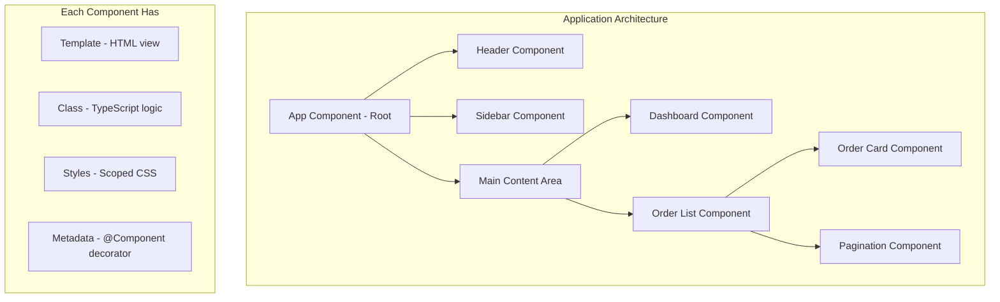

### Angular Module System Evolution

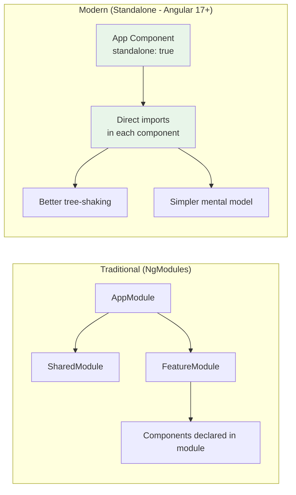

---

## 3. Change Detection

### Definition
Change detection is Angular's mechanism for keeping the DOM synchronized with the component's data. When data changes, Angular detects what changed and updates only the affected parts of the DOM.

### How Change Detection Works

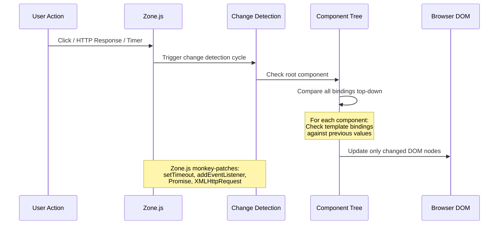

### Change Detection Strategies

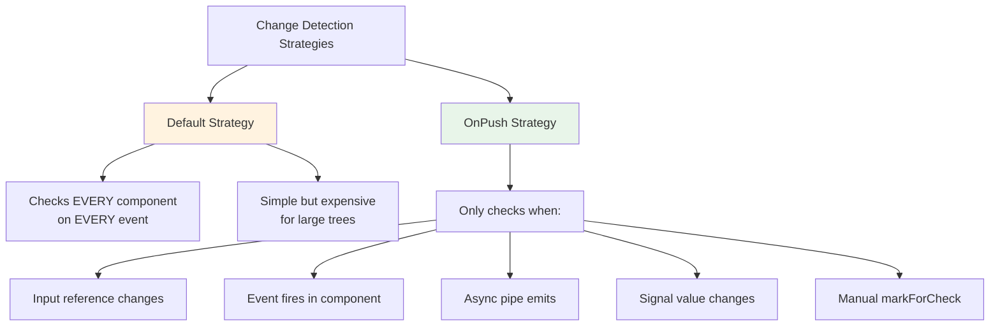

### When Each Strategy Triggers

| Trigger | Default | OnPush |
|---------|---------|--------|
| Any browser event | ✅ Checks all | ❌ Only if in this component |
| setTimeout/setInterval | ✅ Checks all | ❌ No |
| HTTP response | ✅ Checks all | ✅ Only with async pipe |
| Input property change | ✅ Always | ✅ Only if new reference |
| Signal update | ✅ Always | ✅ Yes (fine-grained) |

### Performance Impact

```
100 Components with Default:
├── User clicks a button
├── Zone.js triggers CD
├── ALL 100 components checked (even unrelated ones)
└── Result: Potentially slow with complex templates

100 Components with OnPush:
├── User clicks button in Component #42
├── Zone.js triggers CD  
├── Only Component #42 and ancestors checked
└── Result: Much faster, predictable performance
```

---

## 4. Angular Signals (Angular 16+)

### Definition
Signals are a reactive primitive that holds a value and notifies consumers when that value changes. They provide fine-grained reactivity without Zone.js dependency.

### Why Signals Were Introduced
- Zone.js patches ALL async APIs (heavy, magical, hard to debug)
- RxJS has a steep learning curve for simple state
- Change detection checked entire tree unnecessarily
- Signals enable future zone-less Angular

### Signal Concepts

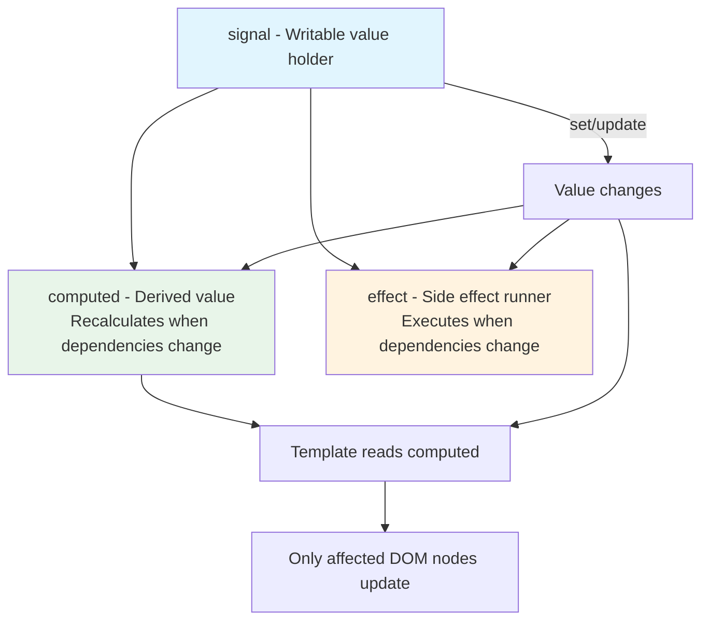

### Signals vs RxJS - When to Use Each

| Use Case | Signals | RxJS |
|----------|---------|------|
| Component state | ✅ Best choice | Overkill |
| Derived values | ✅ computed() | combineLatest |
| HTTP responses | toSignal() wrapper | ✅ Native |
| Event streams | ❌ Not designed for | ✅ Best choice |
| Complex async flows | ❌ | ✅ switchMap, merge |
| Time-based operations | ❌ | ✅ debounce, throttle |
| Multicasting | ❌ | ✅ share, shareReplay |

### Code Example

```typescript
@Component({
  selector: 'app-product-list',
  standalone: true,
  template: `
    <input (input)="searchTerm.set($event.target.value)" />
    <p>Showing {{ filteredProducts().length }} of {{ products().length }}</p>
    
    @for (product of filteredProducts(); track product.id) {
      <app-product-card [product]="product" />
    } @empty {
      <p>No products match your search</p>
    }
  `,
  changeDetection: ChangeDetectionStrategy.OnPush
})
export class ProductListComponent {
  private productService = inject(ProductService);
  
  // Signal: holds the raw product list
  products = toSignal(this.productService.getAll$(), { initialValue: [] });
  
  // Signal: user's search input
  searchTerm = signal('');
  
  // Computed: automatically recalculates when products or searchTerm change
  filteredProducts = computed(() => {
    const term = this.searchTerm().toLowerCase();
    return this.products().filter(p => 
      p.name.toLowerCase().includes(term)
    );
  });
}
```

---

## 5. RxJS and Reactive Programming

### Definition
RxJS (Reactive Extensions for JavaScript) is a library for composing asynchronous and event-based programs using observable sequences.

### Core Concepts

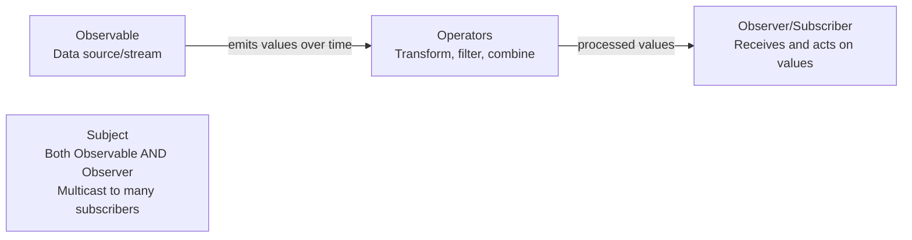

### Operator Selection Guide

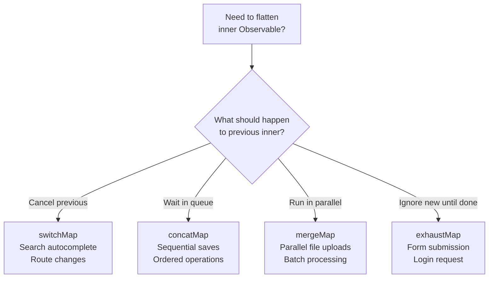

### Memory Leak Prevention

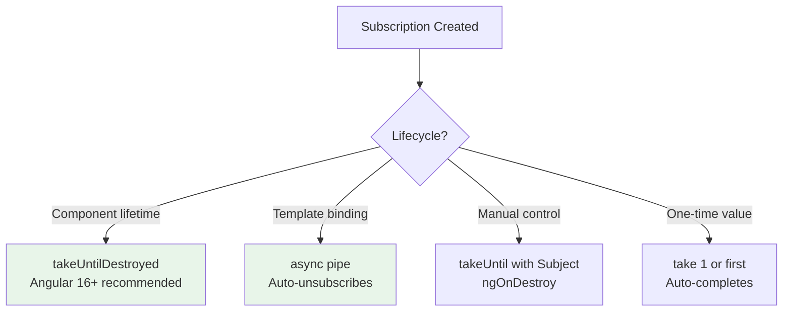

---

## 6. State Management

### State Management Options

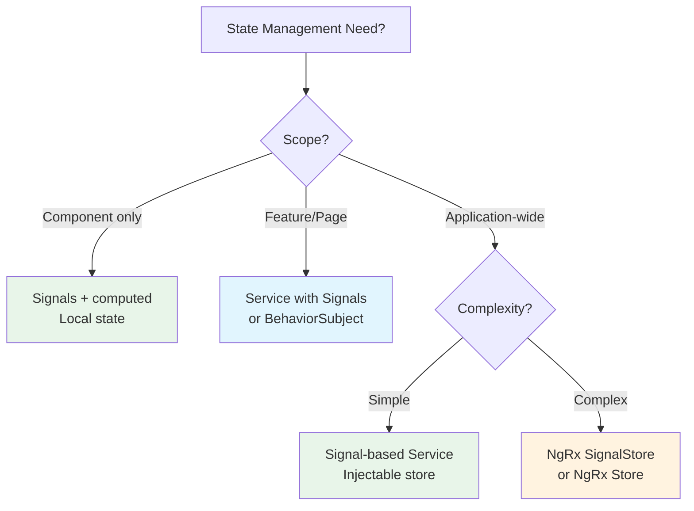

---

## 7. Routing and Lazy Loading

### Lazy Loading Architecture

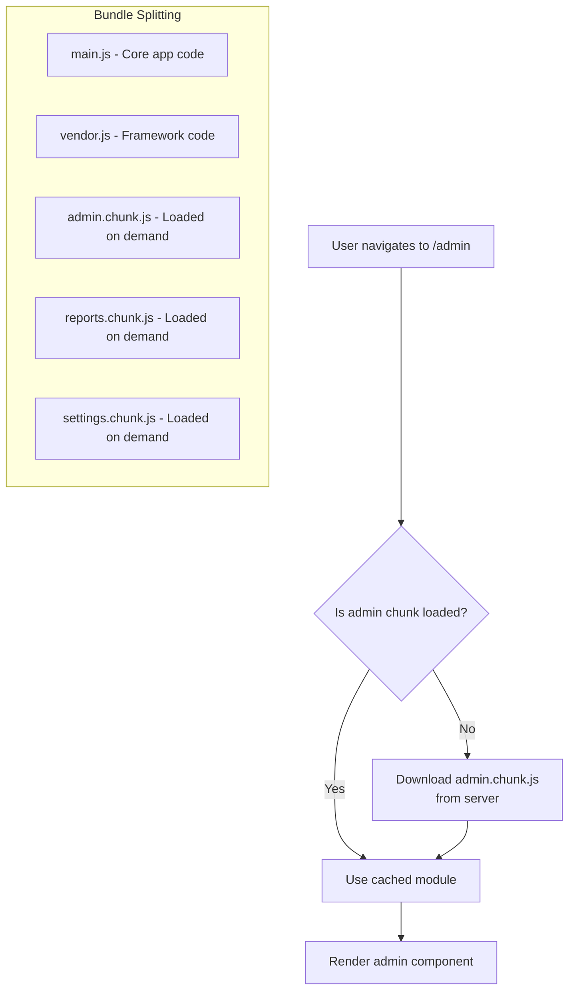

### @defer Blocks (Angular 17+)

```
Trigger Types for @defer:
┌──────────────────────────────────────────────────┐
│ on viewport  → Load when element enters viewport │
│ on idle      → Load when browser is idle         │
│ on interaction → Load on click/focus             │
│ on hover     → Load when mouse hovers            │
│ on timer(5s) → Load after 5 seconds              │
│ on immediate → Load immediately (async)          │
│ when (condition) → Load when condition is true   │
│                                                  │
│ prefetch on idle → Download early, render later  │
└──────────────────────────────────────────────────┘
```

---

## 8. Performance Optimization

### Performance Checklist

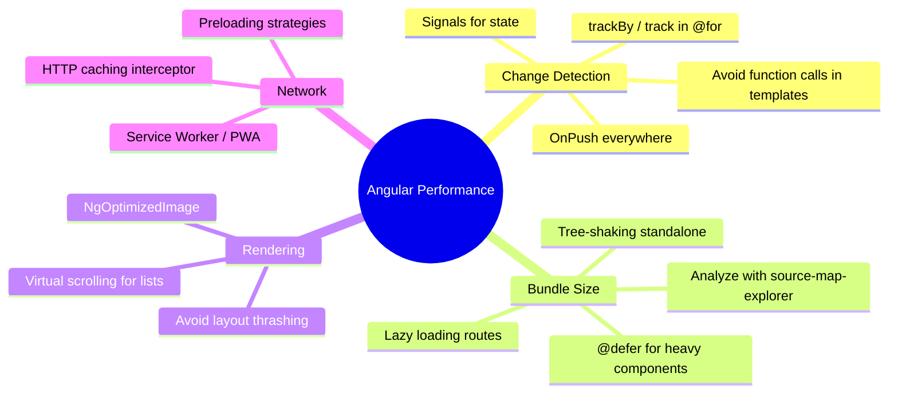

---

## 9. Interview Questions with Detailed Answers

### Q: Explain Angular's change detection mechanism for a senior audience

**Senior-Level Answer:**
Angular uses Zone.js to monkey-patch all async APIs (setTimeout, addEventListener, Promise, XMLHttpRequest). When any async operation completes, Zone.js notifies Angular to run change detection.

Change detection traverses the component tree top-down, comparing each template binding's current value with its previous value. If different, the DOM is updated.

With OnPush strategy, a component is skipped unless: its Input received a new reference (not mutation), an event originated within it, or an Observable piped through async pipe emitted.

Signals (Angular 16+) provide an alternative: they track exactly which template expressions depend on which signals, enabling surgical DOM updates without checking the entire subtree.

**Follow-up knowledge**: Zone.js adds ~100KB to bundle and patches 200+ browser APIs. Angular is moving toward zone-less mode where Signals drive all reactivity.

### Q: How would you design a real-time notification system?

**Senior-Level Answer:**
Architecture: WebSocket connection (via RxJS webSocket) → Signal-based notification store → Toast/Badge UI components

Key decisions:
1. Connection management: Exponential backoff reconnection strategy
2. State: SignalStore with notification array, unread count as computed
3. Offline handling: Queue missed notifications, reconcile on reconnect
4. Performance: Virtual scrolling for notification list, @defer for dropdown panel
5. Testing: Mock WebSocket in tests, verify store state transitions

### Q: How do you prevent memory leaks in Angular applications?

**Senior-Level Answer:**
Memory leaks in Angular come from unmanaged subscriptions. Prevention hierarchy:
1. **async pipe** in templates (auto-cleanup, preferred)
2. **takeUntilDestroyed()** in injection context (Angular 16+)
3. **Signals + toSignal()** (no subscription to manage)
4. **takeUntil(destroy$)** pattern (pre-Angular 16)
5. Manual unsubscribe (last resort)

Common leak sources: router events subscriptions, form valueChanges without cleanup, setInterval without clearInterval, DOM event listeners added in ngAfterViewInit without removal.

---

## 10. Forms (Reactive vs Template-Driven)

### Decision Guide

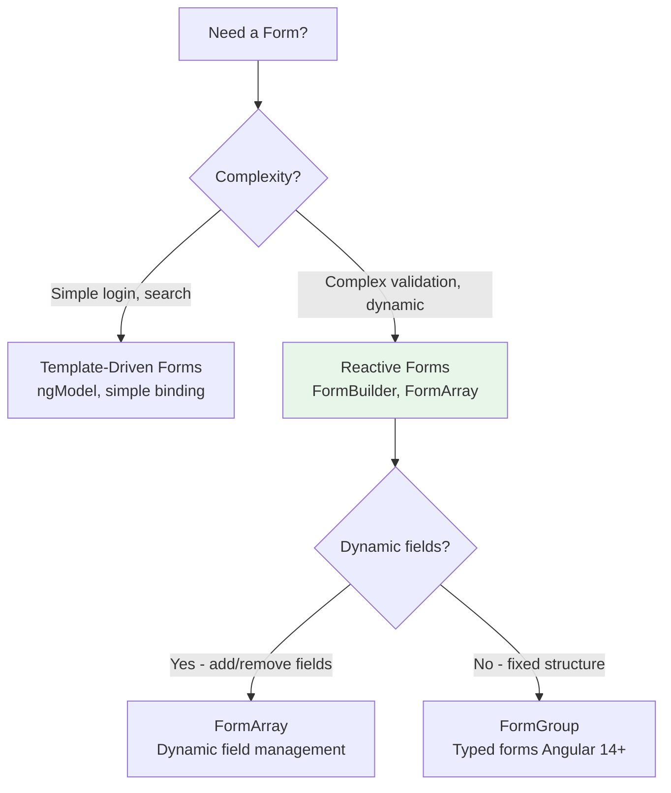

### Comparison

| Feature | Template-Driven | Reactive Forms |
|---------|----------------|----------------|
| Setup | Minimal (FormsModule) | FormBuilder + ReactiveFormsModule |
| Logic location | Template | Component class |
| Validation | Directives in template | Validators in class |
| Testing | Requires DOM | Pure unit tests |
| Dynamic fields | Difficult | FormArray - easy |
| Type safety | Weak | Strong (Angular 14+ typed forms) |
| Best for | Simple forms | Complex business forms |

### Typed Reactive Forms (Angular 14+)

```typescript
// Strongly typed - compiler catches errors
interface OrderForm {
  customerId: FormControl<string>;
  items: FormArray<FormGroup<{
    productId: FormControl<string>;
    quantity: FormControl<number>;
    price: FormControl<number>;
  }>>;
  notes: FormControl<string | null>;
}

@Component({ ... })
export class OrderFormComponent {
  private fb = inject(NonNullableFormBuilder);
  
  form = this.fb.group<OrderForm>({
    customerId: this.fb.control('', Validators.required),
    items: this.fb.array<FormGroup<...>>([]),
    notes: this.fb.control(null)
  });
  
  // Type-safe access
  get items() { return this.form.controls.items; }
  
  addItem() {
    this.items.push(this.fb.group({
      productId: this.fb.control('', Validators.required),
      quantity: this.fb.control(1, [Validators.min(1)]),
      price: this.fb.control(0)
    }));
  }
  
  submit() {
    if (this.form.invalid) return;
    const value = this.form.getRawValue(); // Fully typed!
    // value.customerId is string (not string | null)
  }
}
```

### Custom Validators

```typescript
// Cross-field validator
function dateRangeValidator(group: AbstractControl): ValidationErrors | null {
  const start = group.get('startDate')?.value;
  const end = group.get('endDate')?.value;
  
  if (start && end && start > end) {
    return { dateRange: 'End date must be after start date' };
  }
  return null;
}

// Async validator (API check)
function uniqueEmailValidator(http: HttpClient): AsyncValidatorFn {
  return (control: AbstractControl) => {
    return http.get<boolean>(`/api/check-email/${control.value}`).pipe(
      map(exists => exists ? { emailTaken: true } : null),
      catchError(() => of(null))
    );
  };
}
```

---

## 11. HTTP Client and Interceptors

### Interceptor Architecture (Functional - Angular 15+)

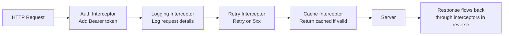

### Functional Interceptors (Modern Approach)

```typescript
// Auth interceptor - adds JWT token to all requests
export const authInterceptor: HttpInterceptorFn = (req, next) => {
  const authService = inject(AuthService);
  const token = authService.getToken();
  
  if (token) {
    req = req.clone({
      setHeaders: { Authorization: `Bearer ${token}` }
    });
  }
  
  return next(req).pipe(
    catchError((error: HttpErrorResponse) => {
      if (error.status === 401) {
        authService.refreshToken(); // Attempt refresh
      }
      return throwError(() => error);
    })
  );
};

// Retry interceptor with exponential backoff
export const retryInterceptor: HttpInterceptorFn = (req, next) => {
  return next(req).pipe(
    retry({
      count: 3,
      delay: (error, retryCount) => {
        if (error.status < 500) return throwError(() => error); // Don't retry 4xx
        return timer(Math.pow(2, retryCount) * 1000); // 2s, 4s, 8s
      }
    })
  );
};

// Cache interceptor for GET requests
export const cacheInterceptor: HttpInterceptorFn = (req, next) => {
  const cache = inject(HttpCacheService);
  
  if (req.method !== 'GET') return next(req);
  
  const cached = cache.get(req.urlWithParams);
  if (cached) return of(cached);
  
  return next(req).pipe(
    tap(response => cache.set(req.urlWithParams, response, 300)) // 5 min TTL
  );
};

// Registration in app.config.ts
export const appConfig: ApplicationConfig = {
  providers: [
    provideHttpClient(
      withInterceptors([authInterceptor, retryInterceptor, cacheInterceptor])
    )
  ]
};
```

---

## 12. Testing Strategies

### Testing Pyramid for Angular

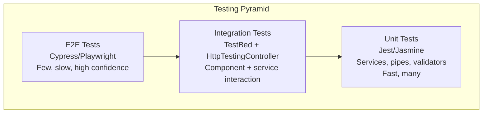

### Component Testing Approaches

```typescript
// Unit test: Service with signals
describe('CartService', () => {
  let service: CartService;
  
  beforeEach(() => {
    TestBed.configureTestingModule({});
    service = TestBed.inject(CartService);
  });
  
  it('should add items and update count', () => {
    service.addItem({ id: '1', name: 'Widget', price: 10, quantity: 1 });
    
    expect(service.items().length).toBe(1);
    expect(service.totalCount()).toBe(1);
    expect(service.totalPrice()).toBe(10);
  });
  
  it('should increase quantity for existing items', () => {
    service.addItem({ id: '1', name: 'Widget', price: 10, quantity: 1 });
    service.addItem({ id: '1', name: 'Widget', price: 10, quantity: 1 });
    
    expect(service.items().length).toBe(1);
    expect(service.items()[0].quantity).toBe(2);
  });
});

// Integration test: Component with HTTP
describe('OrderListComponent', () => {
  let httpMock: HttpTestingController;
  
  beforeEach(() => {
    TestBed.configureTestingModule({
      imports: [OrderListComponent],
      providers: [provideHttpClient(), provideHttpClientTesting()]
    });
    httpMock = TestBed.inject(HttpTestingController);
  });
  
  it('should load and display orders', () => {
    const fixture = TestBed.createComponent(OrderListComponent);
    fixture.detectChanges();
    
    const req = httpMock.expectOne('/api/orders');
    req.flush([{ id: 1, total: 100 }, { id: 2, total: 200 }]);
    fixture.detectChanges();
    
    const rows = fixture.nativeElement.querySelectorAll('[data-testid="order-row"]');
    expect(rows.length).toBe(2);
  });
});
```

---

## 13. Security Best Practices

### Angular Security Model

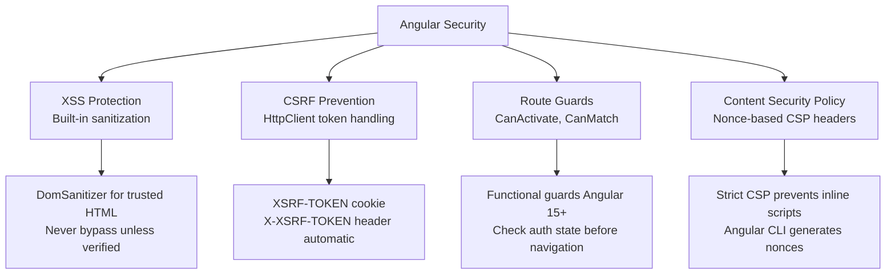

### Authentication Pattern

```typescript
// Functional route guard (Angular 15+)
export const authGuard: CanActivateFn = (route, state) => {
  const authService = inject(AuthService);
  const router = inject(Router);
  
  if (authService.isAuthenticated()) {
    return true;
  }
  
  // Store attempted URL for redirect after login
  return router.createUrlTree(['/login'], {
    queryParams: { returnUrl: state.url }
  });
};

// Role-based guard
export const roleGuard = (requiredRole: string): CanActivateFn => {
  return () => {
    const authService = inject(AuthService);
    return authService.hasRole(requiredRole);
  };
};

// Route configuration
export const routes: Routes = [
  { path: 'admin', loadComponent: () => import('./admin/admin.component'),
    canActivate: [authGuard, roleGuard('admin')] },
  { path: 'dashboard', loadComponent: () => import('./dashboard/dashboard.component'),
    canActivate: [authGuard] }
];
```

---

## 14. Best Practices Summary

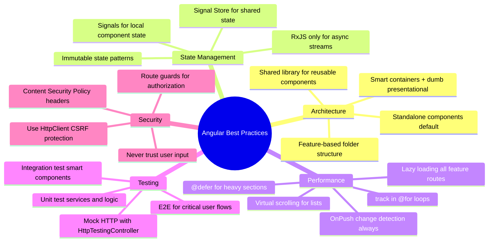

---

## 15. Interview Perspective - What Interviewers Expect

For 8+ years experience, Angular interviewers expect:

1. **Modern Angular fluency** - Signals, standalone components, new control flow, functional APIs
2. **Performance optimization** - OnPush, lazy loading, @defer, and knowing WHY each matters
3. **Architecture decisions** - Smart/dumb components, state management choices, folder structure
4. **RxJS competence** - Know when to use which operator, and when NOT to use RxJS
5. **Testing strategy** - Component testing, service mocking, integration tests
6. **Migration awareness** - Understand NgModules → standalone transition, Zone.js → signals

### Follow-up Questions to Prepare For:
- "How would you migrate a large NgModule-based app to standalone?"
- "Explain the difference between signals and observables - when use each?"
- "How do you architect a complex form with dynamic validation?"
- "Design a data table component with server-side sorting, filtering, and pagination"
- "How would you handle authentication and token refresh in a SPA?"
- "What's your strategy for state management in a large application?"
