# SQL Server - Complete Interview Guide
## For 8+ Years Experienced Senior Developers

---

## 1. SQL Server Overview

### Definition
SQL Server is Microsoft's enterprise relational database management system (RDBMS) that provides data storage, processing, and analysis capabilities for enterprise applications.

### Purpose
To provide a reliable, scalable, and secure platform for storing structured data with ACID transaction guarantees, complex query processing, and enterprise-grade high availability.

### Industry Relevance
- Powers critical systems in banking, healthcare, retail, and government
- Deep integration with .NET ecosystem
- Azure SQL provides cloud-native managed experience
- Handles both OLTP (transactional) and OLAP (analytical) workloads

### Problem It Solves
- **Data integrity**: ACID transactions ensure financial and business data is never corrupted
- **Complex querying**: Joins, aggregations, window functions for analytics
- **Concurrency**: Multiple users accessing same data without conflicts
- **Performance at scale**: Indexing, query optimization, and partitioning for billions of rows

### varchar vs nvarchar — Critical Distinction

```
VARCHAR (non-Unicode):                  NVARCHAR (Unicode):
┌──────────────────────────────┐       ┌──────────────────────────────┐
│ • 1 byte per character       │       │ • 2 bytes per character      │
│ • ASCII/Latin characters only│       │ • ALL languages supported    │
│ • Max 8,000 characters       │       │ • Max 4,000 characters       │
│ • Half the storage           │       │ • Double the storage         │
│                              │       │                              │
│ Use for: Codes, slugs,       │       │ Use for: User names, content,│
│ internal IDs, English-only   │       │ international text, anything │
│                              │       │ user-facing                  │
└──────────────────────────────┘       └──────────────────────────────┘
```

| Aspect | varchar | nvarchar |
|--------|---------|----------|
| Storage | 1 byte/char | 2 bytes/char |
| Unicode | ❌ | ✅ |
| Max length | 8,000 chars | 4,000 chars |
| Comparison | Collation-dependent | Unicode rules |
| Index size | Smaller | Larger (2x) |
| Common mistake | Storing user input (breaks intl) | Using for codes (wastes space) |

**Critical Interview Point:** If a .NET string (which is ALWAYS Unicode/UTF-16) is stored in a varchar column, implicit conversion happens. This makes WHERE clauses **non-sargable** — the index can't be used!

```sql
-- ❌ IMPLICIT CONVERSION: .NET sends nvarchar parameter to varchar column
-- Query: WHERE Name = @name  (where @name is nvarchar from C#)
-- SQL Server converts EVERY row to nvarchar for comparison = TABLE SCAN!

-- ✅ FIX: Match types in EF Core
modelBuilder.Entity<Product>()
    .Property(p => p.Code)
    .HasColumnType("varchar(50)"); -- Ensures EF sends varchar parameter
```

---

## 2. Query Processing Internals

### How SQL Server Processes a Query

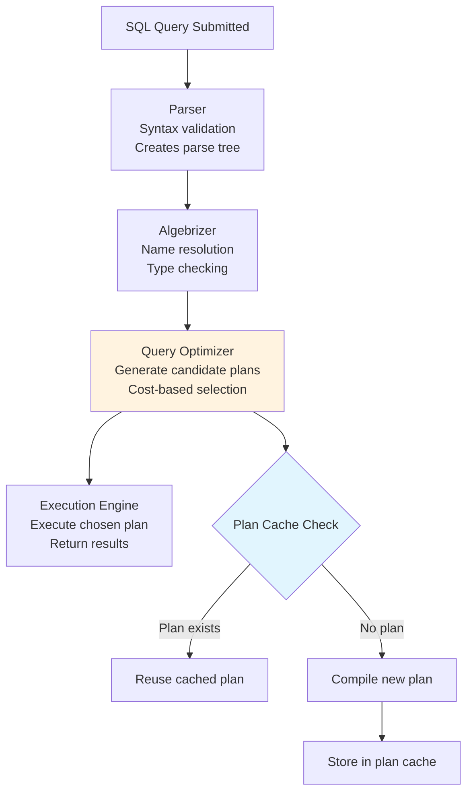

### Logical Query Processing Order

```
The order SQL is WRITTEN is NOT the order it's PROCESSED:

Written Order:          Logical Processing Order:
┌──────────────┐       ┌──────────────────────────────┐
│ 1. SELECT    │       │ 1. FROM (identify tables)     │
│ 2. FROM      │       │ 2. WHERE (filter rows)        │
│ 3. WHERE     │       │ 3. GROUP BY (aggregate)       │
│ 4. GROUP BY  │       │ 4. HAVING (filter groups)     │
│ 5. HAVING    │       │ 5. SELECT (choose columns)    │
│ 6. ORDER BY  │       │ 6. DISTINCT (remove dupes)    │
└──────────────┘       │ 7. ORDER BY (sort results)    │
                       │ 8. TOP/OFFSET (limit rows)    │
                       └──────────────────────────────┘

Why this matters: You can't use a SELECT alias in WHERE
because WHERE executes BEFORE SELECT!
```

---

## 3. Indexing Strategies

### Definition
An index is a data structure that improves the speed of data retrieval operations. Like a book's index, it allows the database to find data without scanning every row.

### Index Types Explained

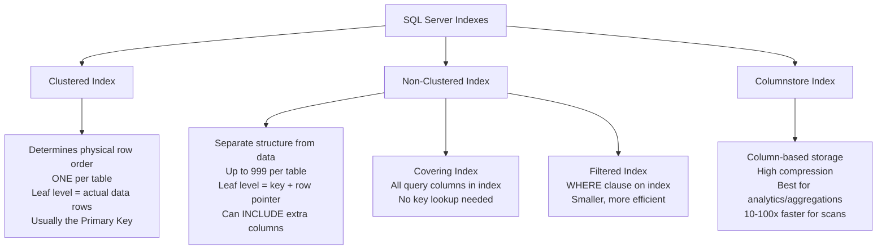

### How Index Seek vs Scan Works

```
INDEX SEEK (Good - O(log n)):          INDEX SCAN (Warning - O(n)):
┌─────────────────────────────┐       ┌─────────────────────────────┐
│                             │       │                             │
│        [Root Page]          │       │ Read ALL leaf pages         │
│        /         \          │       │ sequentially                │
│   [Page A]    [Page B]      │       │                             │
│    /    \      /    \       │       │ [Page 1] → [Page 2] → ...  │
│  [Leaf] [Leaf] [Leaf] [Leaf]│       │  ↓ Check   ↓ Check         │
│    ↑                        │       │  every     every            │
│    Direct to target leaf    │       │  row       row              │
│                             │       │                             │
│ Like using book INDEX       │       │ Like reading EVERY page     │
└─────────────────────────────┘       └─────────────────────────────┘
```

### Covering Index - Eliminating Key Lookups

```
WITHOUT Covering Index:                WITH Covering Index:
┌────────────────────────┐            ┌────────────────────────┐
│ 1. Seek NC Index       │            │ 1. Seek NC Index       │
│    Find matching keys  │            │    Find ALL needed     │
│                        │            │    columns in leaf     │
│ 2. Key Lookup          │            │                        │
│    For EACH row, go    │            │ Done! No extra I/O     │
│    back to clustered   │            │                        │
│    index to get other  │            │                        │
│    columns             │            │                        │
│                        │            │                        │
│ EXPENSIVE for many rows│            │ FAST - single structure│
└────────────────────────┘            └────────────────────────┘
```

```sql
-- Query that benefits from covering index
SELECT OrderId, CustomerName, OrderDate, Total
FROM Orders
WHERE CustomerId = @Id AND Status = 'Active'
ORDER BY OrderDate DESC

-- Covering index: All needed columns included
CREATE NONCLUSTERED INDEX IX_Orders_Customer_Active
ON Orders (CustomerId, OrderDate DESC)
INCLUDE (OrderId, CustomerName, Total)
WHERE Status = 'Active'  -- Filtered: only active orders
```

### Sargable vs Non-Sargable Predicates

**Definition:** "Sargable" means Search ARGument ABLE - the optimizer can use an index to satisfy the predicate.

```
NON-SARGABLE (Index CANNOT be used):    SARGABLE (Index CAN be used):
┌──────────────────────────────────┐   ┌──────────────────────────────────┐
│ WHERE YEAR(OrderDate) = 2024     │   │ WHERE OrderDate >= '2024-01-01'  │
│ WHERE UPPER(Name) = 'JOHN'       │   │       AND OrderDate < '2025-01-01'│
│ WHERE Price + 10 > 100           │   │ WHERE Name = 'John'              │
│ WHERE ISNULL(Status,'X') = 'X'   │   │ WHERE Price > 90                 │
│                                  │   │ WHERE Status IS NULL              │
│ Functions on columns = TABLE SCAN│   │ Direct comparison = INDEX SEEK    │
└──────────────────────────────────┘   └──────────────────────────────────┘
```

---

## 4. Execution Plans

### Key Operators

| Operator | Description | Performance | Action Needed |
|----------|-------------|-------------|---------------|
| Index Seek | Direct lookup via B-tree | ✅ Best | None - optimal |
| Index Scan | Read all index pages | ⚠️ Warning | Need better index |
| Table Scan | Read entire table | ❌ Worst | Create appropriate index |
| Key Lookup | Extra trip to clustered index | ⚠️ Expensive | Create covering index |
| Sort | Explicit sort operation | ⚠️ Memory | Add ORDER BY to index |
| Hash Match | Hash-based join | Varies | OK for large joins |
| Nested Loop | Loop join | ✅ Small sets | Bad for large tables |
| Parallelism | Multi-threaded | Varies | OK for large queries |

---

## 5. Transactions and Isolation Levels

### Definition
A transaction is a logical unit of work that guarantees ACID properties: Atomicity (all or nothing), Consistency (valid state), Isolation (concurrent transactions don't interfere), Durability (committed data persists).

### Isolation Levels Explained

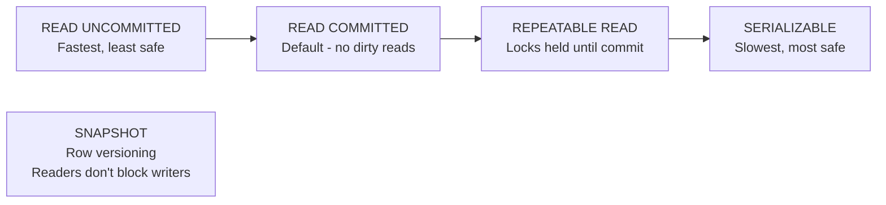

### Concurrency Problems

```
Problem               │ Description                    │ Prevented By
──────────────────────┼────────────────────────────────┼────────────────────
Dirty Read            │ Read uncommitted data          │ READ COMMITTED+
Non-Repeatable Read   │ Same row returns different     │ REPEATABLE READ+
                      │ values in same transaction     │
Phantom Read          │ New rows appear between reads  │ SERIALIZABLE
                      │ in same transaction            │
Lost Update           │ Two transactions overwrite     │ REPEATABLE READ+
                      │ each other's changes           │ or SNAPSHOT
```

### Deadlock Lifecycle

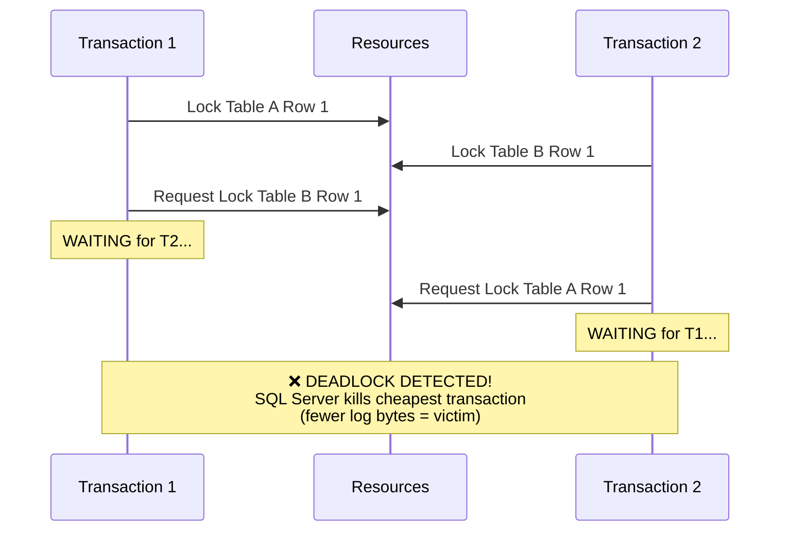

### Deadlock Prevention Strategies

| Strategy | How | Effectiveness |
|----------|-----|---------------|
| Consistent order | Always access tables in same order | High - eliminates most |
| Short transactions | Minimize time locks are held | High - reduces window |
| SNAPSHOT isolation | Readers use row versions, no locks | High - eliminates read locks |
| Retry logic | Catch error 1205, retry operation | Recovery mechanism |
| Lock hints | NOLOCK for read-only (careful!) | Medium - dirty reads risk |

---

## 6. Window Functions

### Definition
Window functions perform calculations across a set of rows that are somehow related to the current row, without collapsing the result set (unlike GROUP BY).

### Conceptual Model

```
Regular Aggregation (GROUP BY):          Window Function (OVER):
┌────────────────────────────┐          ┌────────────────────────────────────┐
│ Dept  │ TotalSalary        │          │ Dept  │ Name   │ Salary │ DeptAvg  │
│───────┼────────────────────│          │───────┼────────┼────────┼──────────│
│ IT    │ 300,000            │          │ IT    │ Alice  │ 80,000 │ 100,000  │
│ HR    │ 200,000            │          │ IT    │ Bob    │ 100,000│ 100,000  │
│                            │          │ IT    │ Carol  │ 120,000│ 100,000  │
│ Rows collapsed!            │          │ HR    │ Dave   │ 90,000 │ 100,000  │
│ Can't see individual rows  │          │ HR    │ Eve    │ 110,000│ 100,000  │
└────────────────────────────┘          │                                    │
                                        │ Individual rows preserved!          │
                                        └────────────────────────────────────┘
```

### Window Function Categories

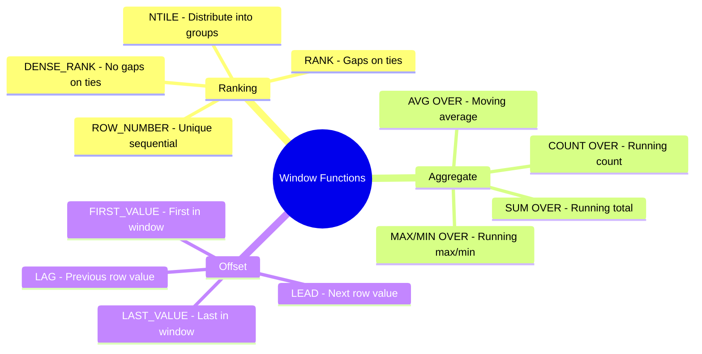

### Code Examples

```sql
-- Running total and moving average
SELECT 
    OrderDate,
    Revenue,
    SUM(Revenue) OVER (ORDER BY OrderDate 
        ROWS UNBOUNDED PRECEDING) AS RunningTotal,
    AVG(Revenue) OVER (ORDER BY OrderDate 
        ROWS BETWEEN 6 PRECEDING AND CURRENT ROW) AS MovingAvg7Day,
    Revenue - LAG(Revenue, 1) OVER (ORDER BY OrderDate) AS DayOverDay
FROM DailyRevenue;

-- Rank employees by salary within department
SELECT 
    Department, Name, Salary,
    ROW_NUMBER() OVER (PARTITION BY Department ORDER BY Salary DESC) AS RowNum,
    RANK() OVER (PARTITION BY Department ORDER BY Salary DESC) AS Rnk,
    DENSE_RANK() OVER (PARTITION BY Department ORDER BY Salary DESC) AS DenseRnk
FROM Employees;
```

---

## 7. Performance Tuning

### Performance Tuning Workflow

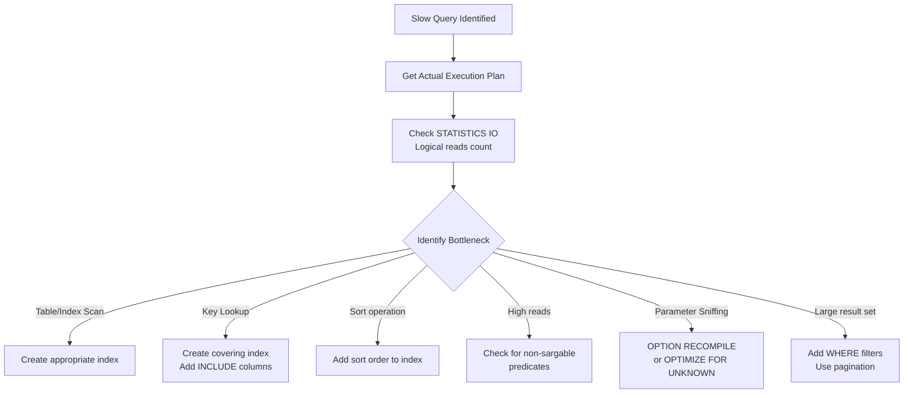

### Parameter Sniffing Explained

```
First Execution:                    Problem:
┌─────────────────────────────┐   ┌─────────────────────────────┐
│ EXEC GetOrders @Status='New'│   │ EXEC GetOrders @Status='All'│
│                             │   │                             │
│ Only 10 rows match          │   │ 1,000,000 rows match        │
│ Optimizer: Index Seek!      │   │ But uses SAME plan (Seek)   │
│ Plan cached for "few rows"  │   │ Terrible for large result!  │
└─────────────────────────────┘   └─────────────────────────────┘

SQL Server compiles plan based on FIRST parameter value.
Subsequent calls REUSE that plan regardless of parameter.
```

---

## 8. CTEs and Recursive Queries

### Definition
A Common Table Expression (CTE) is a named temporary result set that exists only within the scope of a single statement. It improves readability and enables recursive queries.

### CTE vs Subquery vs Temp Table

```
Decision Matrix:
┌────────────────────┬──────────────────┬──────────────────┬──────────────────┐
│ Criteria           │ CTE              │ Subquery         │ Temp Table       │
├────────────────────┼──────────────────┼──────────────────┼──────────────────┤
│ Scope              │ Single statement │ Single statement │ Session/batch    │
│ Reusability        │ Multiple refs    │ Inline only      │ Multiple queries │
│ Recursion          │ ✅ Yes           │ ❌ No            │ ❌ No            │
│ Statistics         │ ❌ No            │ ❌ No            │ ✅ Yes           │
│ Indexes            │ ❌ No            │ ❌ No            │ ✅ Yes           │
│ Materialization    │ Not guaranteed   │ Not guaranteed   │ Always on disk   │
│ Best for           │ Readability,     │ Simple inline    │ Large datasets,  │
│                    │ recursion        │ filtering        │ multiple uses    │
└────────────────────┴──────────────────┴──────────────────┴──────────────────┘
```

### Recursive CTE - How It Works

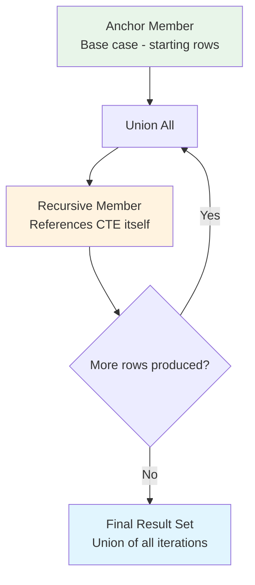

### Code Examples

```sql
-- Recursive CTE: Employee hierarchy (org chart)
WITH OrgChart AS (
    -- Anchor: CEO (no manager)
    SELECT EmployeeId, Name, ManagerId, 0 AS Level,
           CAST(Name AS NVARCHAR(1000)) AS Path
    FROM Employees
    WHERE ManagerId IS NULL
    
    UNION ALL
    
    -- Recursive: Join children to parents
    SELECT e.EmployeeId, e.Name, e.ManagerId, oc.Level + 1,
           CAST(oc.Path + ' → ' + e.Name AS NVARCHAR(1000))
    FROM Employees e
    INNER JOIN OrgChart oc ON e.ManagerId = oc.EmployeeId
)
SELECT * FROM OrgChart
ORDER BY Level, Name
OPTION (MAXRECURSION 100); -- Safety limit

-- CTE for readability: Complex report with multiple stages
WITH 
MonthlyRevenue AS (
    SELECT 
        CustomerId,
        DATEPART(MONTH, OrderDate) AS Month,
        SUM(Total) AS Revenue
    FROM Orders
    WHERE OrderDate >= '2024-01-01'
    GROUP BY CustomerId, DATEPART(MONTH, OrderDate)
),
CustomerTier AS (
    SELECT 
        CustomerId,
        AVG(Revenue) AS AvgMonthly,
        CASE 
            WHEN AVG(Revenue) > 10000 THEN 'Platinum'
            WHEN AVG(Revenue) > 5000 THEN 'Gold'
            ELSE 'Silver'
        END AS Tier
    FROM MonthlyRevenue
    GROUP BY CustomerId
)
SELECT c.Name, ct.Tier, ct.AvgMonthly
FROM CustomerTier ct
JOIN Customers c ON ct.CustomerId = c.Id
ORDER BY ct.AvgMonthly DESC;

-- Running total using CTE (alternative to window function)
WITH RunningTotals AS (
    SELECT 
        OrderId, OrderDate, Amount,
        SUM(Amount) OVER (ORDER BY OrderDate ROWS UNBOUNDED PRECEDING) AS RunningTotal
    FROM Orders
)
SELECT * FROM RunningTotals WHERE RunningTotal > 1000000;
```

---

## 9. Stored Procedures and Dynamic SQL

### When to Use Stored Procedures

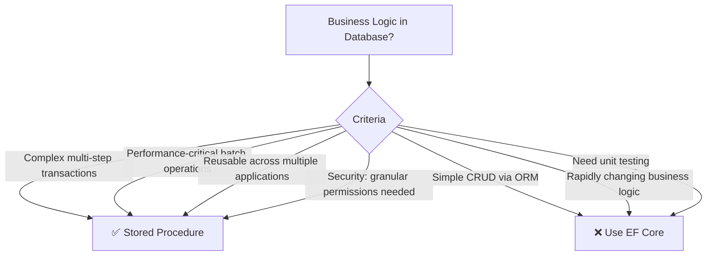

### Dynamic SQL - Safe Patterns

```sql
-- ❌ DANGEROUS: SQL Injection vulnerable
DECLARE @sql NVARCHAR(MAX) = 
    'SELECT * FROM Users WHERE Name = ''' + @UserInput + '''';
EXEC(@sql);  -- Attacker: ' OR 1=1; DROP TABLE Users; --

-- ✅ SAFE: Parameterized dynamic SQL
DECLARE @sql NVARCHAR(MAX) = N'
    SELECT * FROM Users WHERE Name = @Name';
EXEC sp_executesql @sql, N'@Name NVARCHAR(100)', @Name = @UserInput;

-- ✅ Dynamic search with optional filters (common pattern)
CREATE PROCEDURE SearchOrders
    @CustomerId INT = NULL,
    @Status NVARCHAR(50) = NULL,
    @DateFrom DATE = NULL,
    @DateTo DATE = NULL
AS
BEGIN
    DECLARE @sql NVARCHAR(MAX) = N'
        SELECT OrderId, CustomerId, Status, OrderDate, Total
        FROM Orders
        WHERE 1=1';
    
    DECLARE @params NVARCHAR(500) = N'
        @pCustomerId INT, @pStatus NVARCHAR(50),
        @pDateFrom DATE, @pDateTo DATE';
    
    IF @CustomerId IS NOT NULL
        SET @sql += N' AND CustomerId = @pCustomerId';
    IF @Status IS NOT NULL
        SET @sql += N' AND Status = @pStatus';
    IF @DateFrom IS NOT NULL
        SET @sql += N' AND OrderDate >= @pDateFrom';
    IF @DateTo IS NOT NULL
        SET @sql += N' AND OrderDate <= @pDateTo';
    
    SET @sql += N' ORDER BY OrderDate DESC';
    
    EXEC sp_executesql @sql, @params,
        @pCustomerId = @CustomerId,
        @pStatus = @Status,
        @pDateFrom = @DateFrom,
        @pDateTo = @DateTo;
END;
```

### OPTION(RECOMPILE) vs Plan Guides

```
When to force recompilation:
┌─────────────────────────────────────────────────────────────────┐
│ Scenario                        │ Solution                       │
├─────────────────────────────────┼────────────────────────────────│
│ Highly variable parameters      │ OPTION (RECOMPILE)             │
│ Table variables (no stats)      │ OPTION (RECOMPILE)             │
│ Temp tables with varying size   │ UPDATE STATISTICS + RECOMPILE  │
│ Known optimal plan for most     │ OPTIMIZE FOR (@x = 'typical')  │
│ Unknown distribution            │ OPTIMIZE FOR UNKNOWN           │
│ Production - can't change SP    │ Plan Guide (forced plan)       │
└─────────────────────────────────┴────────────────────────────────┘
```

---

## 10. Temp Tables vs Table Variables

### Decision Guide

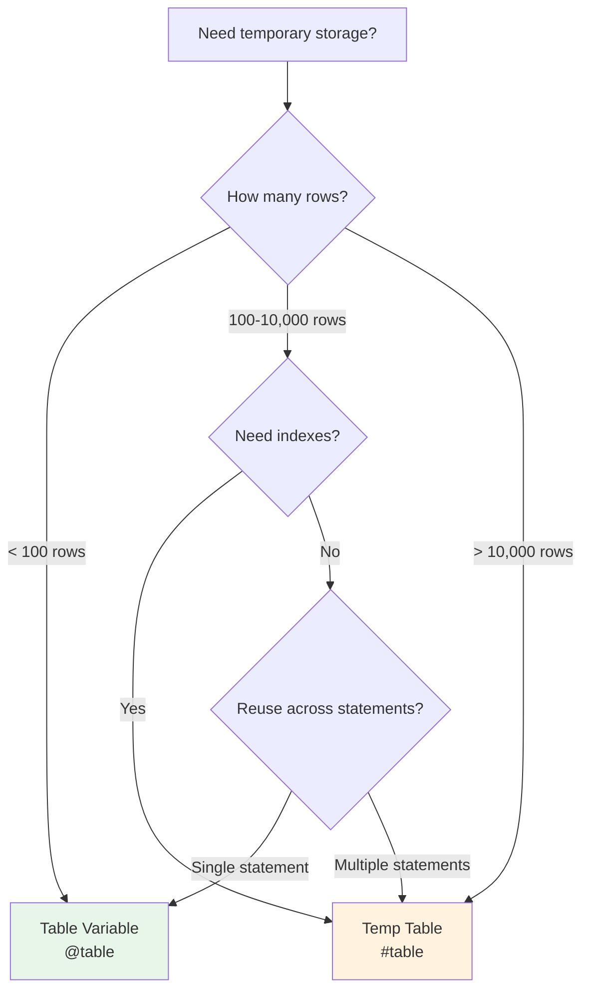

### Comparison

| Feature | Temp Table (#table) | Table Variable (@table) |
|---------|--------------------|-----------------------|
| Statistics | ✅ Auto-created | ❌ None (assumes 1 row!) |
| Indexes | ✅ After creation | ⚠️ Only in declaration |
| Parallelism | ✅ Supported | ❌ Forces serial plan |
| Transaction logs | ✅ Logged | ✅ Logged |
| Scope | Session or procedure | Batch or procedure |
| Triggers | ✅ Yes | ❌ No |
| ALTER | ✅ Yes | ❌ No |
| Best for | Large datasets, complex joins | Small lookups, OUTPUT clause |

### Critical Insight

```
WHY table variables with > 100 rows perform poorly:

Without statistics, SQL Server ESTIMATES 1 row for @table.
For a join against a million-row table:

  Estimated: 1 row × 1M rows → Nested Loop (perfect for small)
  Actual: 10,000 rows × 1M rows → Nested Loop (CATASTROPHIC!)
  
  Should have been: Hash Join or Merge Join

Fix: Use temp table, or add OPTION (RECOMPILE) which gives
optimizer the actual row count at execution time.
```

---

## 11. High Availability and Disaster Recovery

### HA/DR Options

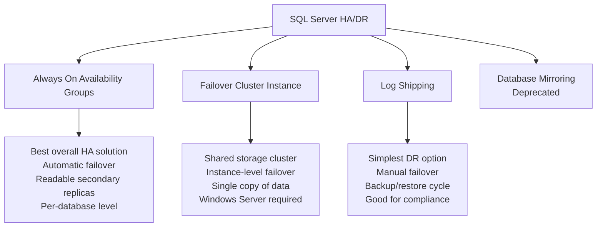

### Always On AG Architecture

```
                    Primary Replica                    Secondary Replicas
                    ┌──────────────────┐              ┌──────────────────┐
    Application ───▶│ Read/Write       │─── Log ────▶│ Synchronous      │
                    │                  │    Stream    │ (0 data loss)    │
                    │ Commit waits for │              │ Auto-failover    │
                    │ sync replica ACK │              ├──────────────────┤
                    │                  │─── Log ────▶│ Asynchronous     │
                    │                  │    Stream    │ (possible loss)  │
                    │                  │              │ Manual failover  │
                    └──────────────────┘              │ Read-only routing│
                                                     └──────────────────┘
    
    Listener DNS: ag-listener.company.com
    - Virtual IP, automatic routing
    - Applications connect to listener, transparent failover
```

### RPO vs RTO

| Metric | Definition | Synchronous AG | Async AG | Log Shipping |
|--------|-----------|----------------|----------|--------------|
| RPO (Recovery Point Objective) | Max data loss acceptable | 0 (no loss) | Seconds-minutes | Minutes-hours |
| RTO (Recovery Time Objective) | Max downtime acceptable | 10-30 seconds | Manual (minutes) | Manual (hours) |

---

## 12. Query Optimization Patterns

### Pagination Patterns

```sql
-- ❌ SLOW: OFFSET for deep pages (scans all skipped rows)
SELECT * FROM Orders
ORDER BY OrderDate DESC
OFFSET 100000 ROWS FETCH NEXT 25 ROWS ONLY;
-- Must sort and skip 100,000 rows every time!

-- ✅ FAST: Keyset pagination (seek method)
SELECT TOP 25 * FROM Orders
WHERE OrderDate < @LastSeenDate  -- Continue from last page
   OR (OrderDate = @LastSeenDate AND OrderId < @LastSeenId)
ORDER BY OrderDate DESC, OrderId DESC;
-- Index seek directly to position - O(log n) regardless of page number
```

### Avoiding Common Anti-Patterns

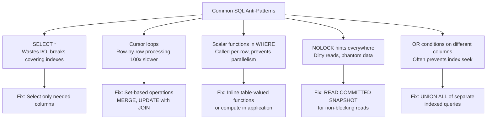

### EXISTS vs IN vs JOIN

```sql
-- For checking existence, these have DIFFERENT performance:

-- EXISTS: Stops at first match (semi-join)
SELECT c.* FROM Customers c
WHERE EXISTS (SELECT 1 FROM Orders o WHERE o.CustomerId = c.Id);

-- IN: Builds complete list then checks membership
SELECT c.* FROM Customers c
WHERE c.Id IN (SELECT CustomerId FROM Orders);

-- JOIN: Returns duplicates if multiple matches!
SELECT c.* FROM Customers c
JOIN Orders o ON o.CustomerId = c.Id;  -- WRONG if customer has many orders

-- Performance ranking for "has related rows":
-- EXISTS ≥ IN > JOIN (for this purpose)
-- EXISTS short-circuits, IN may materialize, JOIN produces extra rows
```

### Batch Processing Pattern

```sql
-- Process millions of rows without blocking the table
DECLARE @BatchSize INT = 5000;
DECLARE @RowsAffected INT = 1;

WHILE @RowsAffected > 0
BEGIN
    UPDATE TOP (@BatchSize) Orders
    SET Status = 'Archived'
    OUTPUT inserted.OrderId  -- Track what was updated
    WHERE Status = 'Completed' 
      AND OrderDate < DATEADD(YEAR, -2, GETDATE());
    
    SET @RowsAffected = @@ROWCOUNT;
    
    -- Prevent transaction log growth
    CHECKPOINT;
    -- Small delay to let other transactions proceed
    WAITFOR DELAY '00:00:00.100';
END;
```

---

## 13. Data Integrity and Constraints

### Constraint Types

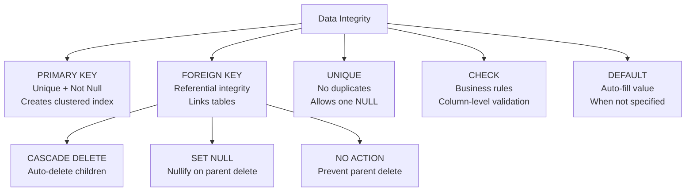

### Temporal Tables (System-Versioned)

```sql
-- Automatically tracks all historical changes
CREATE TABLE Products (
    ProductId INT PRIMARY KEY,
    Name NVARCHAR(100),
    Price DECIMAL(10,2),
    ValidFrom DATETIME2 GENERATED ALWAYS AS ROW START,
    ValidTo DATETIME2 GENERATED ALWAYS AS ROW END,
    PERIOD FOR SYSTEM_TIME (ValidFrom, ValidTo)
) WITH (SYSTEM_VERSIONING = ON 
    (HISTORY_TABLE = dbo.ProductsHistory));

-- Query data as it existed at any point in time
SELECT * FROM Products
FOR SYSTEM_TIME AS OF '2024-06-01 12:00:00'
WHERE ProductId = 42;

-- See all changes to a specific row
SELECT * FROM Products
FOR SYSTEM_TIME ALL
WHERE ProductId = 42
ORDER BY ValidFrom;
```

---

## 14. Scenario-Based Questions

### Scenario: Database deadlocks in production occurring 50+ times/day

**Systematic Diagnosis:**

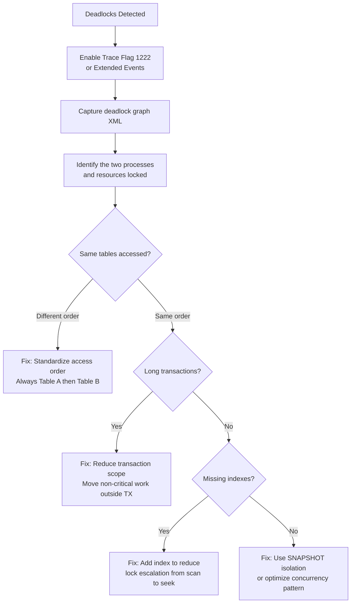

### Scenario: Query runs fast with one parameter, slow with another

**Root Cause: Parameter Sniffing**

```
Diagnosis steps:
1. Run both parameter values with OPTION (RECOMPILE)
   - If both fast → parameter sniffing confirmed
   - If one still slow → actual query design issue

2. Check cached plan with:
   SELECT * FROM sys.dm_exec_cached_plans
   CROSS APPLY sys.dm_exec_sql_text(plan_handle)
   WHERE text LIKE '%YourProcName%'

3. Solutions (choose based on scenario):
   a) OPTION (RECOMPILE) - Recompiles each call (OK if infrequent)
   b) OPTIMIZE FOR UNKNOWN - Uses average statistics
   c) Plan Guide - Force specific plan in production
   d) Split procedure into two (one per data distribution)
   e) Use local variables (loses parameter sniffing but gets generic plan)
```

---

## 15. Best Practices Summary

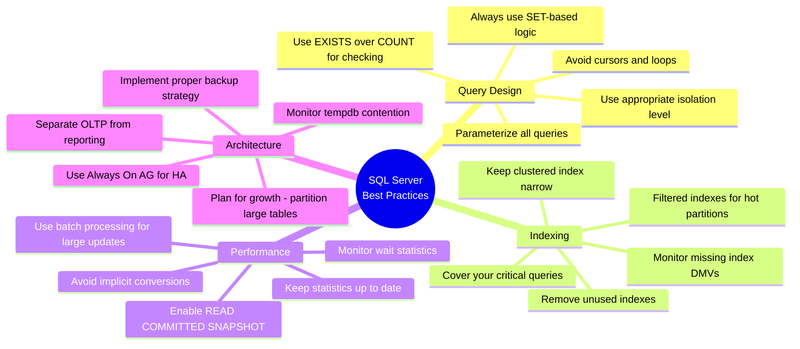

---

## 16. Interview Questions with Detailed Answers

### Q: How do you handle schema migrations in production with zero downtime?

**Senior-Level Answer:**
The expand-contract pattern:
1. **Expand**: Add new column/table alongside old one (non-breaking)
2. **Migrate**: Backfill new structure, dual-write temporarily
3. **Contract**: Remove old structure once all consumers switched

Key rules:
- Never rename/drop columns in a single release
- Always add columns as NULLABLE or with defaults
- Use online index operations (WITH (ONLINE = ON))
- Deploy schema changes independent of code changes
- Have a rollback script for every migration

### Q: Explain the differences between DELETE, TRUNCATE, and DROP

**Senior-Level Answer:**
- **DELETE**: DML, row-by-row, fully logged, fires triggers, WHERE clause supported, can rollback, identity not reset
- **TRUNCATE**: DDL, page-level deallocation, minimally logged, no triggers, no WHERE, can rollback, identity reset to seed
- **DROP**: DDL, removes entire table structure and data, no recovery without backup

Key insight: TRUNCATE is often 100x faster than DELETE for clearing a table because it deallocates pages rather than removing rows individually. But you can't TRUNCATE a table referenced by a foreign key.

### Q: How would you optimize a query that takes 30 seconds?

**Systematic Approach:**
1. Get actual execution plan (not estimated)
2. Check SET STATISTICS IO ON - how many logical reads?
3. Look for: Table Scans → need index; Key Lookups → need covering index
4. Check for implicit conversions (varchar vs nvarchar mismatch)
5. Check for non-sargable predicates (functions on indexed columns)
6. Check parameter sniffing (try with OPTION RECOMPILE)
7. Consider query restructuring (CTEs, temp tables for complex joins)
8. Review statistics freshness (UPDATE STATISTICS if stale)

### Q: Explain the difference between clustered and non-clustered indexes

**Senior-Level Answer:**
A clustered index defines the physical storage order of rows in the table. There can be only one because rows can only be physically sorted one way. The leaf level of a clustered index IS the data row.

A non-clustered index is a separate B-tree structure where leaf pages contain the index key columns plus a "bookmark" (clustered index key or RID) back to the actual row. You can have up to 999 per table.

Key insight: If a non-clustered index doesn't contain all columns needed by a query, a "key lookup" back to the clustered index is required for each row. This is why covering indexes (with INCLUDE columns) are so impactful.

### Q: When would you use SNAPSHOT isolation?

**Senior-Level Answer:**
SNAPSHOT isolation is ideal for read-heavy OLTP systems where blocking is a bigger problem than slightly stale reads. Readers get a point-in-time view using row versions (stored in tempdb), so they never block writers and writers never block readers.

Use when: High read/write concurrency causing blocking, reader SLA requires consistent response times, application can handle optimistic concurrency conflicts on write.

Trade-off: Tempdb growth (stores old row versions), potential update conflicts (first-writer-wins), doesn't help with write-write contention.

---

## 17. Interview Perspective - What Interviewers Expect

For 8+ years experience, SQL Server interviewers expect:

1. **Explain execution plans fluently** - Read plans like code, identify bottlenecks immediately
2. **Index design instincts** - Know when to add, when not to, and the maintenance cost
3. **Deadlock resolution experience** - "In production, we had a deadlock where..."
4. **Performance tuning methodology** - Systematic approach, not guessing
5. **HA/DR trade-offs** - Understand RPO/RTO implications of each approach
6. **Query design for scale** - Pagination, batch processing, avoiding N+1
7. **When NOT to use SQL** - Know when NoSQL or caching is the better answer

### Follow-up Questions to Prepare For:
- "How would you handle a table with 1 billion rows?"
- "What happens to query performance when statistics are stale?"
- "How would you migrate from SQL Server on-prem to Azure SQL?"
- "Walk me through your approach to resolving a production blocking issue"
- "How would you design the schema for a multi-tenant SaaS application?"
