# Microservices Architecture - Complete Interview Guide
## For 8+ Years Experienced Senior Developers

---

## 1. Microservices Overview

### Definition
Microservices is an architectural style where an application is composed of small, independently deployable services, each running in its own process and communicating via lightweight mechanisms (typically HTTP/gRPC or messaging).

### Purpose
To enable large organizations to build and evolve complex systems by dividing them into autonomous, independently deployable units aligned with business capabilities.

### Problem It Solves
- **Deployment coupling**: Monolith requires deploying EVERYTHING for any change
- **Scaling limitations**: Can't scale individual components independently
- **Technology lock-in**: Entire app must use same technology stack
- **Team coordination overhead**: All developers modify same codebase
- **Blast radius**: One bug can take down the entire application

### Industry Relevance
- Netflix, Amazon, Uber — all run thousands of microservices at scale
- Required knowledge for any senior/architect role at large enterprises
- Azure, AWS, and GCP all provide microservices-native infrastructure
- Understanding when NOT to use them is equally valued in interviews

### When NOT to Use Microservices

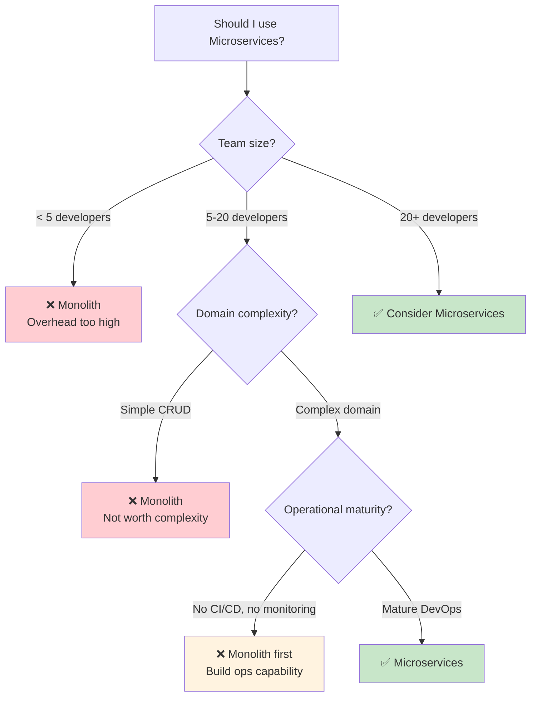

---

## 2. Architecture Concepts

### Monolith vs Microservices Comparison

| Aspect | Monolith | Microservices |
|--------|----------|---------------|
| Deployment | All-or-nothing, risky | Independent, low risk |
| Scaling | Entire application | Individual services |
| Data | Shared database | Database per service |
| Technology | Single stack | Polyglot (best tool per job) |
| Team Structure | Large coordinated team | Small autonomous teams |
| Complexity | In the code | In the infrastructure |
| Consistency | Strong (ACID) | Eventual (Saga pattern) |
| Debugging | Stack trace | Distributed tracing |
| Testing | Integration tests | Contract testing + E2E |
| Initial velocity | Higher (simpler) | Lower (more setup) |
| Long-term velocity | Decreases (coupling) | Maintained (independence) |

### Microservices Architecture Diagram

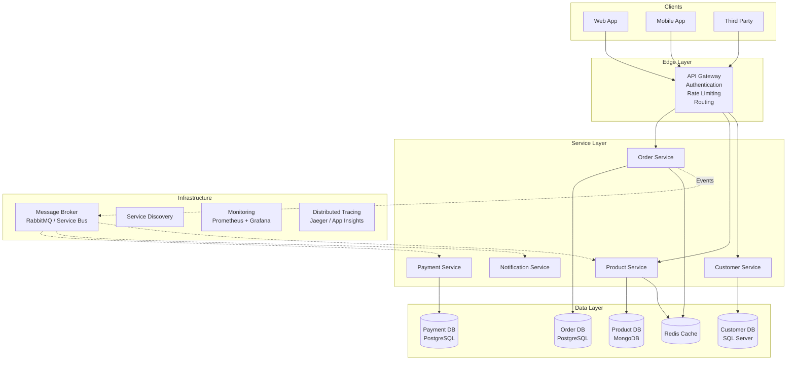

### Service Boundary Design (DDD)

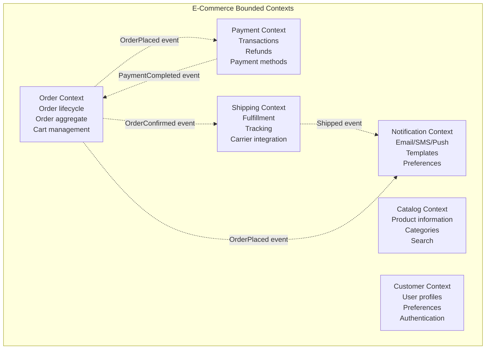

---

## 3. Communication Patterns

### Synchronous vs Asynchronous Communication

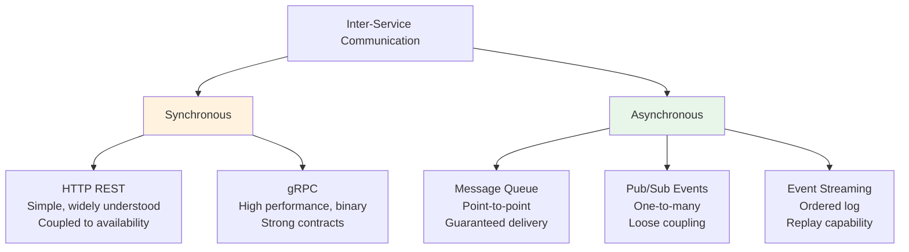

### Communication Pattern Selection

| Pattern | When to Use | Example | Drawback |
|---------|-------------|---------|----------|
| Sync HTTP/gRPC | Need immediate response | Get product price | Temporal coupling |
| Command Queue | Guaranteed delivery needed | Process payment | Latency |
| Domain Events | Multiple consumers react | Order placed | Eventual consistency |
| Event Streaming | Need replay/audit trail | Transaction log | Complexity |
| Request/Reply | Async but need response | Credit check | Correlation handling |

### Communication Flow Example

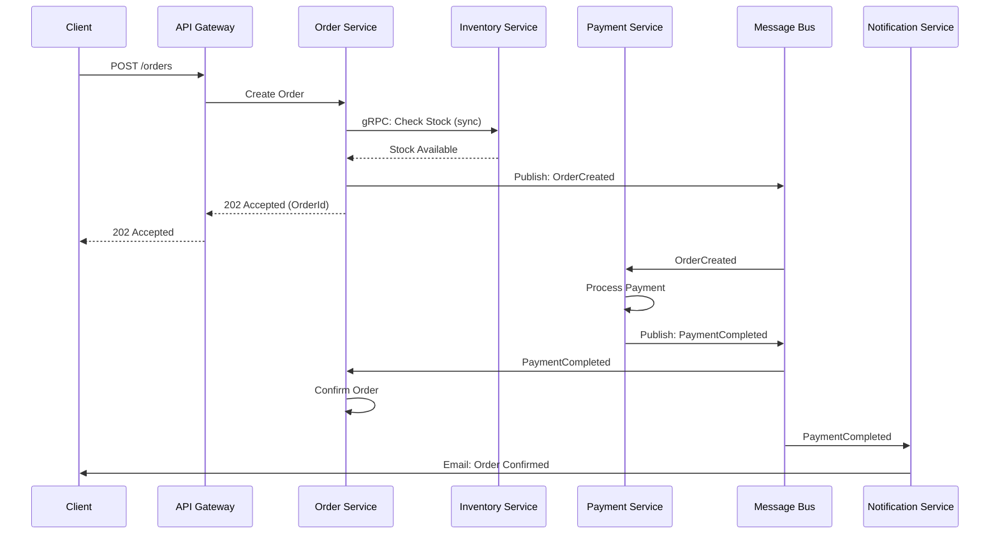

---

## 4. Resilience Patterns

### Why Resilience Matters
In distributed systems, network calls WILL fail. The question is not IF but WHEN and HOW OFTEN.

```
Monolith failure:                    Microservices failure:
┌────────────────────────┐          ┌────────────────────────┐
│ One component fails    │          │ One service fails      │
│ → Entire app crashes   │          │ → That feature degrades│
│                        │          │ → Rest of app works    │
│ Binary: works or       │          │ → Graceful degradation │
│ doesn't               │          │                        │
└────────────────────────┘          └────────────────────────┘
                                    (Only with proper resilience!)
```

### Circuit Breaker Pattern

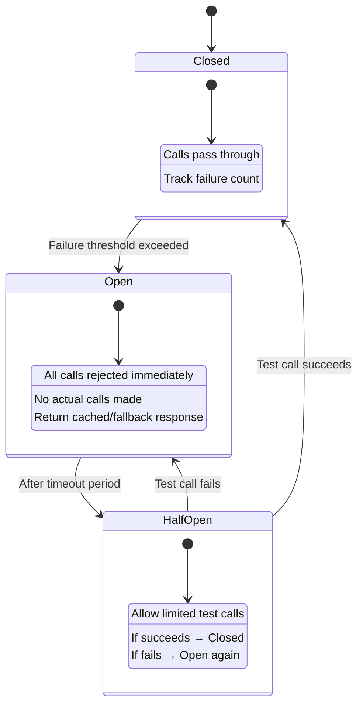

### Resilience Strategy Stack

```
┌─────────────────────────────────────────────────────────┐
│ RETRY (innermost)                                        │
│ Handles: transient failures, network blips               │
│ Config: 3 attempts, exponential backoff + jitter          │
├─────────────────────────────────────────────────────────┤
│ CIRCUIT BREAKER (wraps retry)                            │
│ Handles: downstream service outage                       │
│ Config: Open after 50% failure rate in 30s window        │
├─────────────────────────────────────────────────────────┤
│ TIMEOUT (wraps circuit breaker)                          │
│ Handles: slow responses, hanging connections             │
│ Config: 10 second overall timeout                        │
├─────────────────────────────────────────────────────────┤
│ BULKHEAD (wraps timeout)                                 │
│ Handles: resource exhaustion, noisy neighbor             │
│ Config: Max 20 concurrent calls per dependency           │
├─────────────────────────────────────────────────────────┤
│ FALLBACK (outermost)                                     │
│ Handles: all failures after other strategies exhausted   │
│ Config: Return cached data or degraded response          │
└─────────────────────────────────────────────────────────┘
```

---

## 5. Saga Pattern

### Definition
A Saga is a sequence of local transactions where each step publishes an event or triggers the next step. If a step fails, compensating transactions undo the preceding steps.

### Why Sagas Exist
- Distributed transactions (2PC) don't scale and are fragile
- Each microservice owns its database (can't join across services)
- Need to maintain consistency across service boundaries
- Must handle partial failures gracefully

### Choreography vs Orchestration

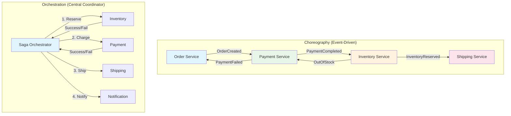

### Comparison

| Aspect | Choreography | Orchestration |
|--------|-------------|---------------|
| Coupling | Loose (event-driven) | Coupled to orchestrator |
| Complexity | Distributed, hard to track | Centralized, clear flow |
| Failure handling | Each service compensates | Orchestrator coordinates |
| Debugging | Difficult (follow events) | Easier (single point) |
| Best for | Simple flows (2-3 steps) | Complex flows (4+ steps) |
| Single point of failure | No | Yes (orchestrator) |

---

## 6. CQRS and Event Sourcing

### CQRS (Command Query Responsibility Segregation)

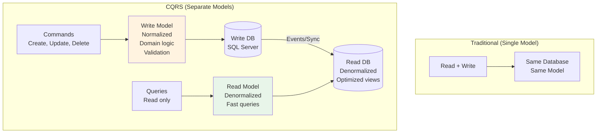

### When to Use CQRS

```
USE CQRS when:                          DON'T USE when:
✅ Read and write patterns differ       ❌ Simple CRUD application
✅ Different scaling needs              ❌ Single user system
✅ Complex domain logic on writes       ❌ Always need strong consistency
✅ Multiple read representations        ❌ Small team, simple domain
✅ Event-driven architecture already    ❌ Adding unnecessary complexity
```

---

## 7. Observability

### Three Pillars of Observability

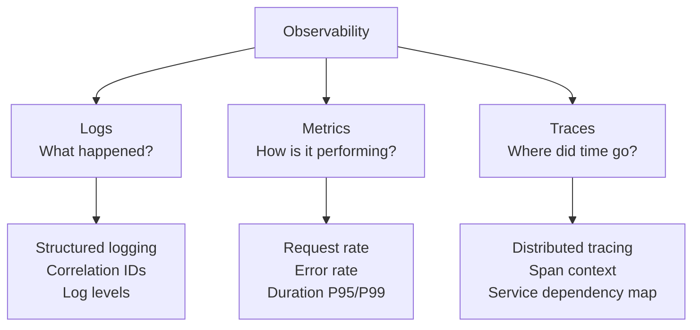

### Distributed Tracing Flow

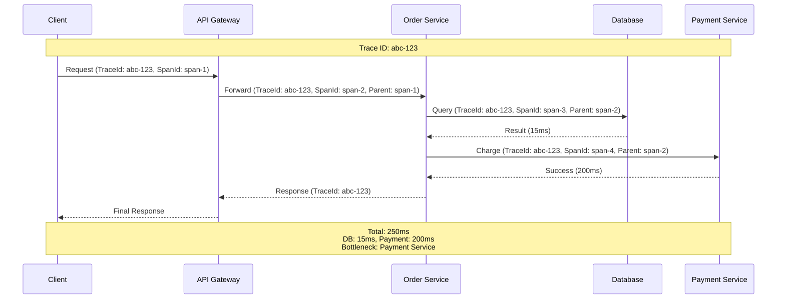

---

## 8. Interview Questions with Detailed Answers

### Q: How do you handle distributed transactions across microservices?

**Senior-Level Answer:**
Never use distributed 2-phase commit across microservices - it creates tight coupling and doesn't scale.

Use the Saga pattern instead:
- **Choreography** for simple flows (2-3 services): Each service publishes events, next service reacts
- **Orchestration** for complex flows (4+ services): Central coordinator manages steps and compensations

Key principles:
- Each local transaction is independently ACID
- Compensating actions undo previous steps on failure
- Every operation must be idempotent (safe to retry)
- Use the Outbox pattern to ensure events are published reliably

### Q: Explain the Outbox Pattern

**Senior-Level Answer:**
The Outbox pattern solves the "dual write" problem: you need to update your database AND publish an event, but these are two separate systems that can't share a transaction.

Solution: Write the event to an "outbox" table in the SAME database transaction as your business data. A separate background process (relay/publisher) reads the outbox and publishes to the message broker, then marks as processed.

This guarantees at-least-once delivery. Consumers MUST be idempotent because events may be delivered more than once.

### Q: When would you NOT use microservices?

**Senior-Level Answer:**
1. Small teams (< 5 devs) - operational overhead exceeds benefits
2. Unclear domain boundaries - you'll get the boundaries wrong and refactoring distributed systems is expensive
3. Low operational maturity - need CI/CD, monitoring, distributed tracing FIRST
4. Simple domains - CRUD apps don't benefit from the complexity
5. Prototypes/MVPs - speed to market matters more than scalability
6. Strict latency requirements - network hops add latency

My recommendation: Start monolith with clear module boundaries. Extract services when you have clear scaling needs, team growth, or deployment independence requirements.

---

## 9. API Gateway Pattern

### Definition
An API Gateway provides a single entry point for all client requests, handling cross-cutting concerns and routing to appropriate backend services.

### Architecture

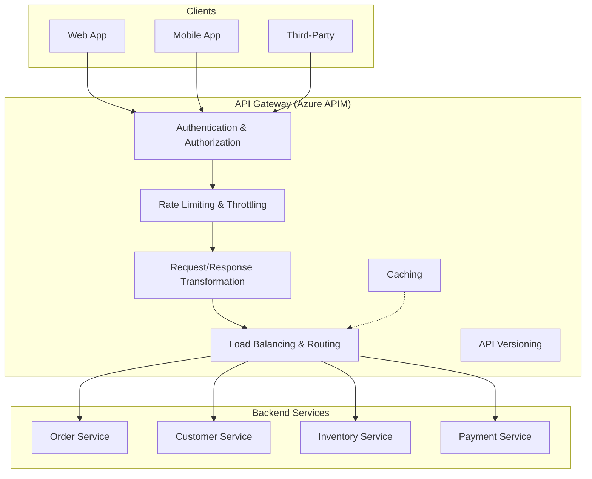

### Backend for Frontend (BFF) Pattern

```
Problem: Mobile and Web need DIFFERENT data shapes from same services

Solution: BFF per client type

Web App ────▶ Web BFF ────┐
                          ├──▶ Order Service
Mobile App ──▶ Mobile BFF ─┤
                          ├──▶ Customer Service
Admin App ───▶ Admin BFF ──┘

Web BFF: Returns rich data, full details, analytics
Mobile BFF: Returns minimal data, optimized for bandwidth
Admin BFF: Returns management data, bulk operations
```

---

## 10. Data Management in Microservices

### Database per Service Pattern

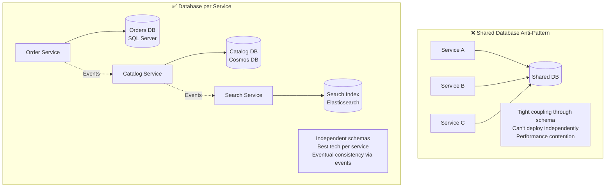

### Data Consistency Patterns

| Pattern | Consistency | Complexity | Use Case |
|---------|-------------|-----------|----------|
| Saga | Eventual | High | Multi-service writes |
| Event Sourcing | Eventual | Very High | Audit trail, temporal queries |
| Outbox Pattern | At-least-once | Medium | Reliable event publishing |
| Change Data Capture | Eventual | Medium | Sync data between services |
| API Composition | Read-time | Low | Join data from multiple services |

### Event Sourcing Explained

```
Traditional (State-based):          Event Sourcing:
┌──────────────────────────┐       ┌──────────────────────────────────────┐
│ Order { Status: Shipped } │       │ Events:                              │
│                           │       │ 1. OrderCreated { items, customer }  │
│ Only current state        │       │ 2. PaymentReceived { amount, txnId } │
│ History is lost           │       │ 3. InventoryReserved { items }       │
│                           │       │ 4. OrderShipped { trackingId }       │
│                           │       │                                      │
│                           │       │ Current state = replay all events    │
│                           │       │ Full audit trail preserved           │
│                           │       │ Can rebuild state at any point       │
└──────────────────────────┘       └──────────────────────────────────────┘
```

---

## 11. Service Mesh and Sidecar Pattern

### Definition
A service mesh provides infrastructure-level handling of service-to-service communication, including traffic management, security, and observability — without changing application code.

### Architecture

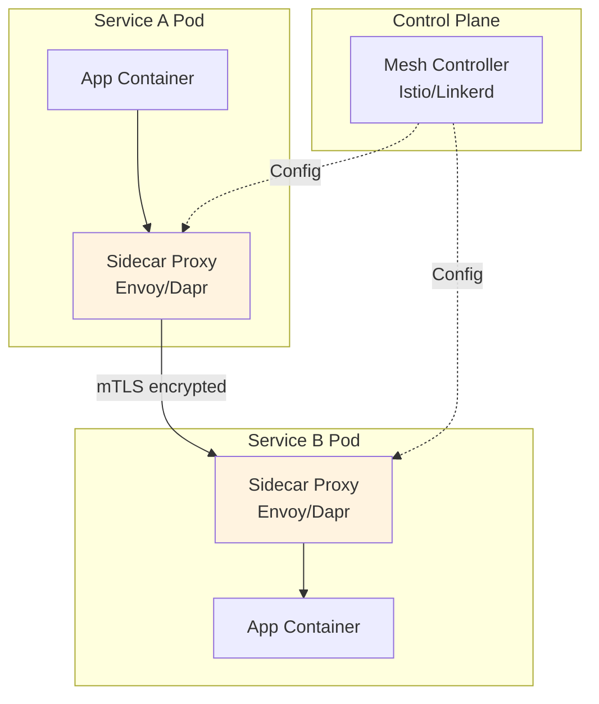

### Dapr (Distributed Application Runtime) with .NET

```csharp
// Service invocation via Dapr (no service URLs in code!)
public class OrderService
{
    private readonly DaprClient _dapr;
    
    public async Task<InventoryStatus> CheckInventoryAsync(string productId)
    {
        // Dapr handles: service discovery, retries, circuit breaking, mTLS
        return await _dapr.InvokeMethodAsync<InventoryStatus>(
            appId: "inventory-service",   // Logical name, not URL
            methodName: "check",
            data: new { ProductId = productId });
    }
    
    // State management (Dapr abstracts Redis/Cosmos/etc.)
    public async Task SaveOrderStateAsync(Order order)
    {
        await _dapr.SaveStateAsync("statestore", order.Id, order);
    }
    
    // Pub/Sub (Dapr abstracts Service Bus/Kafka/etc.)
    public async Task PublishOrderCreatedAsync(Order order)
    {
        await _dapr.PublishEventAsync("pubsub", "orders", new OrderCreatedEvent(order));
    }
}
```

---

## 12. Testing Microservices

### Testing Strategy

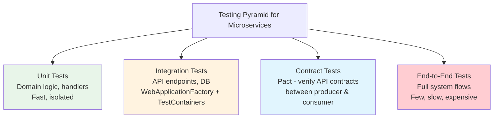

### Contract Testing with Pact

```
Problem: Service A calls Service B
         Service B changes its API → Service A breaks in production!

Solution: Consumer-Driven Contracts (Pact)

1. Consumer (Service A) writes expectations:
   "I expect GET /orders/{id} to return { id, status, total }"

2. Pact generates contract file (.json)

3. Provider (Service B) runs contract against its implementation:
   "Can I fulfill what Service A expects?" ✅ or ❌

4. If provider breaks contract → Build fails BEFORE deployment
```

### Integration Testing with TestContainers

```csharp
// Spin up real dependencies in Docker for integration tests
public class OrderServiceIntegrationTests : IAsyncLifetime
{
    private MsSqlContainer _sqlContainer = null!;
    private WebApplicationFactory<Program> _factory = null!;
    
    public async Task InitializeAsync()
    {
        _sqlContainer = new MsSqlBuilder()
            .WithImage("mcr.microsoft.com/mssql/server:2022-latest")
            .Build();
        await _sqlContainer.StartAsync();
        
        _factory = new WebApplicationFactory<Program>()
            .WithWebHostBuilder(builder =>
            {
                builder.ConfigureServices(services =>
                {
                    services.RemoveAll<DbContextOptions<AppDbContext>>();
                    services.AddDbContext<AppDbContext>(options =>
                        options.UseSqlServer(_sqlContainer.GetConnectionString()));
                });
            });
    }
    
    [Fact]
    public async Task CreateOrder_ReturnsCreated()
    {
        var client = _factory.CreateClient();
        var response = await client.PostAsJsonAsync("/orders", new { CustomerId = "123" });
        
        response.StatusCode.Should().Be(HttpStatusCode.Created);
    }
    
    public async Task DisposeAsync()
    {
        await _sqlContainer.DisposeAsync();
        await _factory.DisposeAsync();
    }
}
```

---

## 13. Security in Microservices

### Zero Trust Architecture

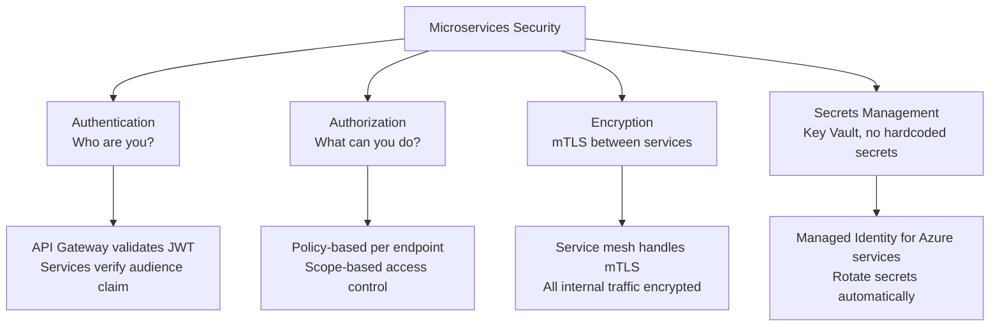

### Service-to-Service Authentication

```
Pattern: Token Exchange (on-behalf-of flow)

User → API Gateway (validates user token)
     → Order Service (receives scoped service token)
     → Payment Service (validates Order Service's identity)

Each service verifies:
1. Token is from trusted issuer (Azure AD)
2. Audience claim matches this service
3. Scopes/roles authorize the operation
4. Token hasn't expired
```

---

## 14. Best Practices Summary

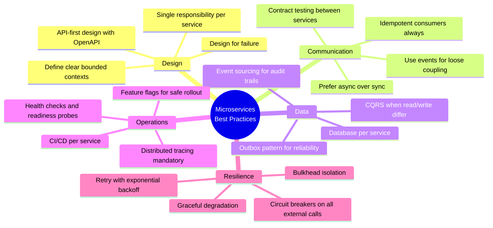

---

## 15. Interview Perspective - What Interviewers Expect

For 8+ years experience, microservices interviewers expect:

1. **Decomposition reasoning** - Why split here? What are the bounded contexts?
2. **Distributed systems awareness** - CAP, eventual consistency, network partitions
3. **Pattern selection** - Saga vs 2PC, choreography vs orchestration, when sync vs async
4. **Production experience** - "We had a cascading failure because..."
5. **Observability strategy** - How to debug across 20 services?
6. **When NOT to use** - Knowing monolith is sometimes better

### Follow-up Questions to Prepare For:
- "How do you handle a breaking API change across 5 consuming services?"
- "Your order service is getting 10x more traffic. What do you do?"
- "How do you debug a request that touches 8 services?"
- "Design the data flow for eventual consistency in an e-commerce checkout"
- "How do you handle schema evolution in event-driven systems?"
- "What's your deployment strategy for zero-downtime releases?"
