# Object-Oriented Programming - Complete Interview Guide
## For 8+ Years Experienced Senior Developers

---

## 1. OOP Overview

### Definition
Object-Oriented Programming (OOP) is a programming paradigm that organizes software design around objects - instances of classes that contain both data (attributes) and behavior (methods).

### Purpose
To model real-world entities and relationships in code, enabling better organization, reuse, and maintenance of complex software systems.

### Problem It Solves
- **Procedural chaos**: As codebases grow, procedural code becomes unmaintainable
- **Code duplication**: Same logic repeated across different contexts
- **Tight coupling**: Changes in one area break unrelated functionality
- **Poor abstraction**: Implementation details leak across boundaries

### Industry Relevance
- OOP is the foundation of C#, Java, and all enterprise frameworks
- Clean Architecture, DDD, and SOLID are built on OOP principles
- Every code review evaluates proper use of encapsulation, abstraction, and polymorphism
- Understanding OOP vs functional approaches is a senior developer expectation

### The Four Pillars

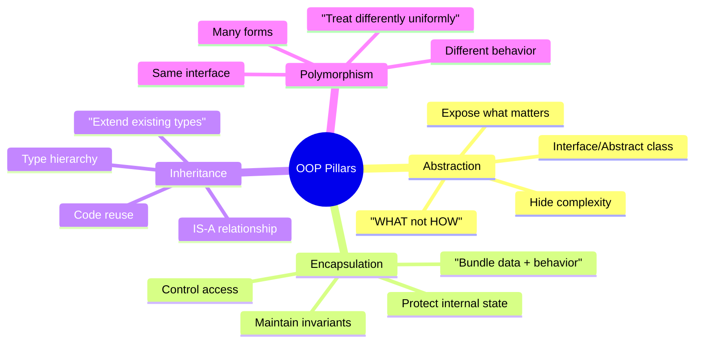

---

## 2. Abstraction

### Definition
Abstraction is the process of hiding complex implementation details and exposing only the essential features of an object.

### Real-World Analogy
When you drive a car, you interact with the steering wheel, pedals, and gear shift (abstraction). You don't need to understand the internal combustion engine, fuel injection system, or transmission mechanics (implementation).

### How Abstraction Works

```
Client Code                    Abstraction Layer              Implementation
┌──────────────────┐          ┌────────────────────┐        ┌────────────────────┐
│                  │          │                    │        │                    │
│ OrderService     │   uses   │ IPaymentGateway    │        │ StripeGateway      │
│                  │─────────▶│                    │◀───────│   API calls        │
│ Doesn't know     │          │ ProcessPayment()   │        │   Token handling   │
│ about Stripe or  │          │ Refund()           │        │   Webhooks         │
│ PayPal internals │          │ GetStatus()        │        │   Error mapping    │
│                  │          │                    │        │                    │
│                  │          │                    │        ├────────────────────┤
│                  │          │                    │◀───────│ PayPalGateway      │
│                  │          │                    │        │   REST API calls   │
│                  │          │                    │        │   OAuth flow       │
│                  │          │                    │        │   Dispute handling │
└──────────────────┘          └────────────────────┘        └────────────────────┘
```

### Benefits
1. **Reduces complexity**: Client code only sees what it needs
2. **Enables swapping**: Change implementation without affecting consumers
3. **Improves testing**: Mock the abstraction layer
4. **Team independence**: Teams work on implementations without coordination

---

## 3. Encapsulation

### Definition
Encapsulation bundles data and the methods that operate on that data together, restricting direct access to internal state and only exposing controlled interactions.

### Why It Matters

```
WITHOUT Encapsulation:                WITH Encapsulation:
┌──────────────────────────┐        ┌──────────────────────────┐
│ class BankAccount         │        │ class BankAccount         │
│   public decimal Balance  │        │   private decimal _balance│
│                           │        │                           │
│ // Anyone can do:         │        │   public void Deposit(amt)│
│ account.Balance = -500;   │ ❌     │     if (amt <= 0) throw   │
│ account.Balance *= 100;   │ ❌     │     _balance += amt       │
│                           │        │                           │
│ No validation!            │        │   public void Withdraw(amt│
│ No audit trail!           │        │     if (amt > _balance)   │
│ No business rules!        │        │       throw Insufficient  │
│                           │        │     _balance -= amt       │
└──────────────────────────┘        └──────────────────────────┘
                                     ✅ Invariants protected
                                     ✅ Business rules enforced
                                     ✅ Can add logging/audit
```

### Access Modifiers

| Modifier | Same Class | Same Assembly | Derived Class | External |
|----------|-----------|--------------|---------------|----------|
| private | ✅ | ❌ | ❌ | ❌ |
| protected | ✅ | ❌ | ✅ | ❌ |
| internal | ✅ | ✅ | ❌ | ❌ |
| protected internal | ✅ | ✅ | ✅ | ❌ |
| public | ✅ | ✅ | ✅ | ✅ |

---

## 4. Inheritance

### Definition
Inheritance allows a class to inherit properties and methods from a parent class, creating a hierarchical IS-A relationship.

### When to Use vs When to Avoid

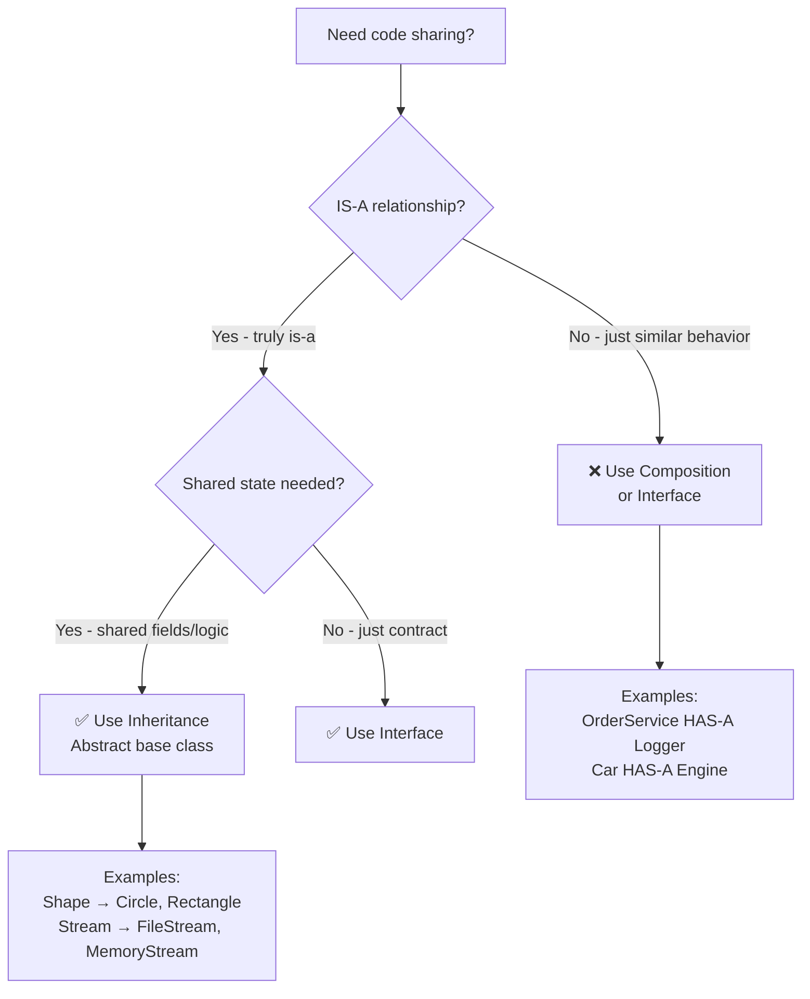

### Inheritance Anti-Patterns

```
❌ Deep Hierarchies (Fragile Base Class Problem):
Animal → Mammal → DomesticMammal → Pet → Dog → Labrador
Problem: Change to Animal breaks everything below

❌ Inheritance for Code Reuse Only:
class OrderService : Logger    // OrderService IS-A Logger? NO!
Problem: Violates IS-A, pollutes public interface

❌ God Base Class:
class BaseEntity {
    Save(), Delete(), Validate(), Log(), Notify(), Cache()
}
Problem: Every entity inherits unwanted behavior

✅ Correct Usage:
- Stream → FileStream, NetworkStream, MemoryStream (IS-A stream)
- Shape → Circle, Rectangle, Triangle (IS-A shape)
- Exception → ArgumentException, IOException (IS-A exception)
```

---

## 5. Polymorphism

### Definition
Polymorphism allows objects of different types to be treated through the same interface, with each type providing its own implementation of the interface's methods.

### Types of Polymorphism

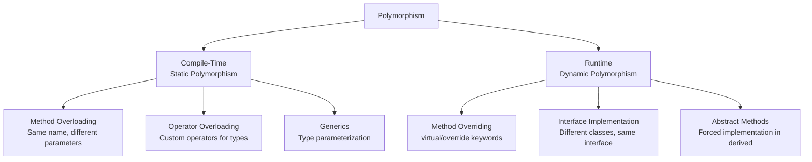

### Real-World Polymorphism Example

```
Scenario: E-commerce notification system

Interface: INotificationChannel
Method: SendAsync(Notification notification)

┌─────────────────────────────────────────────────────────────────┐
│ NotificationService.NotifyAsync(order, channels)                 │
│                                                                  │
│ for each channel in channels:                                    │
│     await channel.SendAsync(notification)  ← Same call for all! │
│                                                                  │
│ ┌───────────────┐  ┌───────────────┐  ┌───────────────┐        │
│ │EmailChannel   │  │SmsChannel     │  │PushChannel    │        │
│ │               │  │               │  │               │        │
│ │ SMTP server   │  │ Twilio API    │  │ Firebase      │        │
│ │ HTML template │  │ Character limit│  │ Device tokens │        │
│ │ Attachments   │  │ Short message │  │ Deep links    │        │
│ └───────────────┘  └───────────────┘  └───────────────┘        │
│                                                                  │
│ Adding new channel (Slack, Teams) = just implement interface     │
│ NO changes to NotificationService!                               │
└─────────────────────────────────────────────────────────────────┘
```

---

## 6. Composition vs Inheritance

### The Principle: "Favor composition over inheritance"

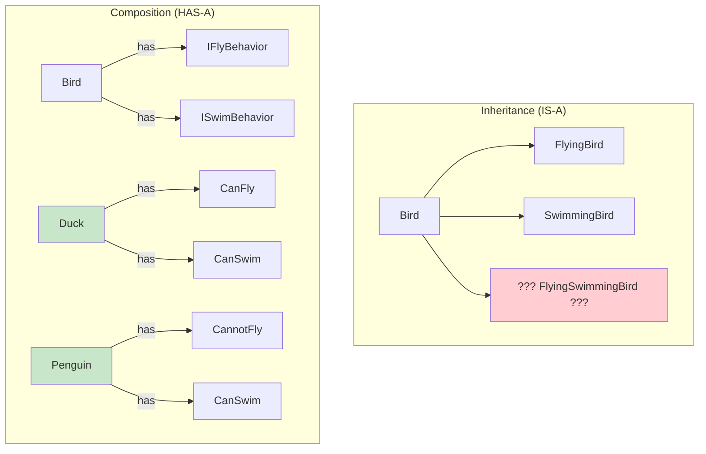

### Decision Matrix

| Criteria | Use Inheritance | Use Composition |
|----------|----------------|-----------------|
| Relationship | True IS-A | HAS-A or CAN-DO |
| Coupling | Acceptable tight coupling | Loose coupling needed |
| Flexibility | Fixed hierarchy | Mix-and-match behaviors |
| Testing | Base provides test infrastructure | Mock individual behaviors |
| Real-world fit | "A Dog IS an Animal" | "A Car HAS an Engine" |

---

## 7. Abstract Classes vs Interfaces

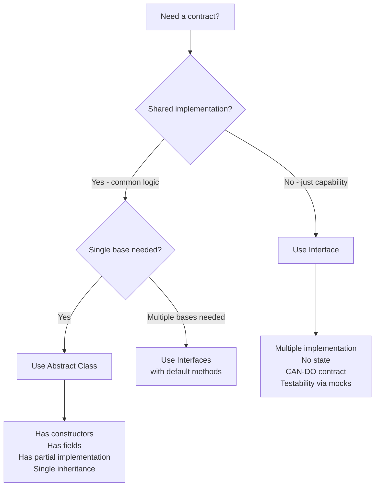

| Feature | Abstract Class | Interface |
|---------|---------------|-----------|
| Inheritance | Single | Multiple |
| Constructors | ✅ Yes | ❌ No |
| Fields/State | ✅ Yes | ❌ No |
| Access Modifiers | All | Public only |
| Default Implementation | ✅ Always | ✅ C# 8+ |
| When to Use | IS-A + shared state | CAN-DO capability |
| Example | `Stream` base class | `IDisposable`, `IComparable` |

---

## 8. Object Relationships and Coupling

### Types of Relationships

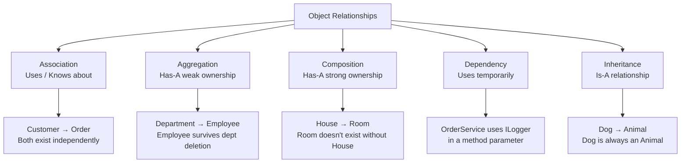

### Coupling Spectrum

```
Tight Coupling                                           Loose Coupling
◄──────────────────────────────────────────────────────────────────────►

Concrete class    →    Abstract class    →    Interface    →    Events/Messages
direct reference       inheritance             injection          pub/sub

new SqlRepository()    : BaseRepository       IRepository        MediatR notification
                                              via DI             

Hard to test           Moderate testing       Easy to mock       Fully decoupled
Hard to change         Some flexibility       Very flexible      Maximum flexibility
```

### Code Example - Coupling Levels

```csharp
// ❌ TIGHT COUPLING: Direct dependency on concrete class
public class OrderService
{
    private readonly SqlOrderRepository _repo = new SqlOrderRepository(); // Can't test!
    private readonly SmtpEmailService _email = new SmtpEmailService();    // Can't swap!
}

// ⚠️ MODERATE: Depends on abstract base class
public class OrderService
{
    private readonly BaseRepository<Order> _repo; // Slightly better, still specific
}

// ✅ LOOSE COUPLING: Depends on interface via DI
public class OrderService
{
    private readonly IOrderRepository _repo;
    private readonly INotificationService _notifications;
    
    public OrderService(IOrderRepository repo, INotificationService notifications)
    {
        _repo = repo;
        _notifications = notifications;
    }
}

// ✅ FULLY DECOUPLED: Event-driven
public class OrderService
{
    private readonly IMediator _mediator;
    
    public async Task PlaceOrderAsync(Order order)
    {
        await _repo.SaveAsync(order);
        await _mediator.Publish(new OrderPlacedEvent(order)); // Doesn't know who handles it
    }
}
```

---

## 9. SOLID Connection to OOP

### How SOLID Principles Reinforce OOP

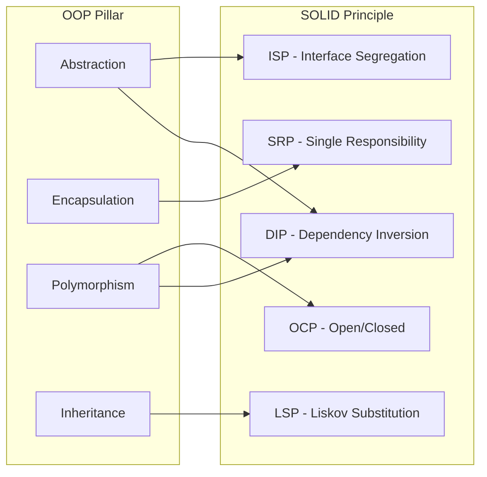

| OOP Pillar | SOLID Principles Applied | Result |
|-----------|--------------------------|--------|
| Abstraction | ISP + DIP | Clean interfaces, decoupled layers |
| Encapsulation | SRP | Each class has clear boundaries and single purpose |
| Polymorphism | OCP + DIP | Extend behavior without modifying existing code |
| Inheritance | LSP | Subtypes behave correctly when substituted |

---

## 10. OOP in Real Enterprise Architecture

### Layered Architecture with OOP

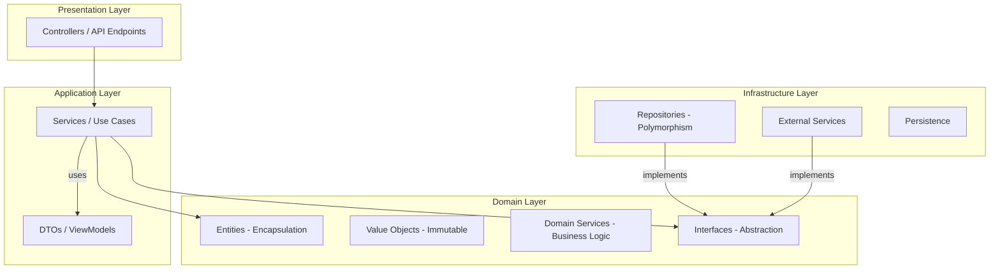

### Domain-Driven Design and OOP

```csharp
// Rich Domain Model - OOP done right
// Encapsulation: State protected, behavior exposed
// Abstraction: Domain events hide notification mechanism
public class Order
{
    private readonly List<OrderLine> _lines = new();
    private OrderStatus _status = OrderStatus.Draft;
    
    public IReadOnlyCollection<OrderLine> Lines => _lines.AsReadOnly();
    public OrderStatus Status => _status;
    public decimal Total => _lines.Sum(l => l.Subtotal);
    
    // Encapsulation: Business rules enforced
    public void AddLine(Product product, int quantity)
    {
        if (_status != OrderStatus.Draft)
            throw new DomainException("Cannot modify a submitted order");
        if (quantity <= 0)
            throw new DomainException("Quantity must be positive");
            
        var existing = _lines.FirstOrDefault(l => l.ProductId == product.Id);
        if (existing != null)
            existing.IncreaseQuantity(quantity);
        else
            _lines.Add(new OrderLine(product, quantity));
    }
    
    // State machine - valid transitions only
    public void Submit()
    {
        if (_status != OrderStatus.Draft)
            throw new DomainException("Can only submit draft orders");
        if (!_lines.Any())
            throw new DomainException("Cannot submit empty order");
            
        _status = OrderStatus.Submitted;
        AddDomainEvent(new OrderSubmittedEvent(this));
    }
}
```

### Value Objects - Immutability and Equality

```csharp
// Value Object: Defined by its values, not identity
// Two Money objects with same amount and currency ARE equal
public record Money(decimal Amount, string Currency)
{
    public Money Add(Money other)
    {
        if (Currency != other.Currency)
            throw new DomainException("Cannot add different currencies");
        return this with { Amount = Amount + other.Amount };
    }
    
    public Money Multiply(int factor) => this with { Amount = Amount * factor };
    
    // Value objects are immutable - operations return new instances
}

// Entity: Defined by identity
// Two customers with same name are NOT the same customer
public class Customer
{
    public Guid Id { get; private set; } // Identity
    public string Name { get; private set; }
    public Email Email { get; private set; } // Value object
    
    // Equality based on Id, not properties
}
```

---

## 11. OOP Design Smells and Refactoring

### Common OOP Violations

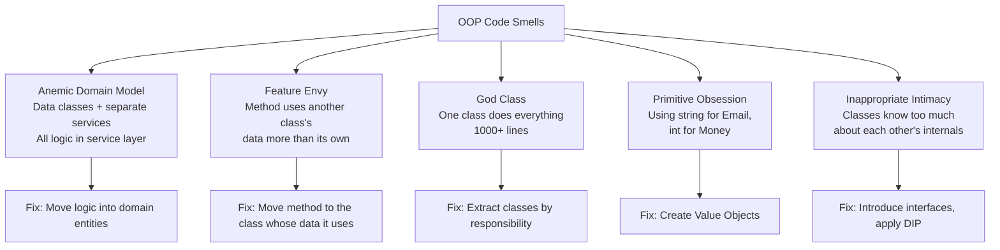

### Anemic vs Rich Domain Model

```
ANEMIC (Anti-pattern):                  RICH (Proper OOP):
┌──────────────────────────┐           ┌──────────────────────────┐
│ class Order              │           │ class Order              │
│   public Status { get;set}│           │   private Status _status │
│   public Lines { get;set }│           │   private List _lines    │
│   public Total { get;set }│           │                          │
│                           │           │   public void Submit()   │
│ class OrderService        │           │     // validates state   │
│   public void Submit(order)│          │     // transitions status│
│     if order.Status != ...│           │     // raises event      │
│     if order.Lines.Count..│           │                          │
│     order.Status = ...    │           │   public void AddLine()  │
│     order.Total = calc()  │           │     // validates rules   │
│                           │           │     // updates total     │
│ // Logic OUTSIDE entity   │           │ // Logic INSIDE entity   │
│ // Entity = just a bag    │           │ // Entity = encapsulated │
└──────────────────────────┘           └──────────────────────────┘
```

---

## 12. OOP with Modern C# Features

### Records and OOP

```csharp
// Records provide value equality - ideal for DTOs and Value Objects
public record Address(string Street, string City, string State, string Zip);

// Record with behavior (still immutable)
public record Temperature(double Value, TemperatureUnit Unit)
{
    public Temperature ToCelsius() => Unit switch
    {
        TemperatureUnit.Celsius => this,
        TemperatureUnit.Fahrenheit => this with { Value = (Value - 32) * 5 / 9, Unit = TemperatureUnit.Celsius },
        _ => throw new NotSupportedException()
    };
    
    public bool IsFreezing => ToCelsius().Value <= 0;
}

// Sealed class hierarchy with pattern matching (discriminated union pattern)
public abstract record Shape
{
    public record Circle(double Radius) : Shape;
    public record Rectangle(double Width, double Height) : Shape;
    public record Triangle(double Base, double Height) : Shape;
}

// Polymorphism via pattern matching (functional OOP hybrid)
public static double Area(Shape shape) => shape switch
{
    Shape.Circle c => Math.PI * c.Radius * c.Radius,
    Shape.Rectangle r => r.Width * r.Height,
    Shape.Triangle t => 0.5 * t.Base * t.Height,
    _ => throw new ArgumentException("Unknown shape")
};
```

---

## 13. Scenario-Based Questions

### Scenario: Design a notification system that supports Email, SMS, Push, and Slack

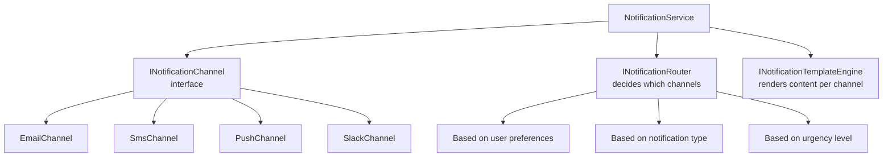

**OOP Principles Applied:**
- **Abstraction**: `INotificationChannel` hides implementation details
- **Polymorphism**: Same `SendAsync()` call works for all channels
- **Encapsulation**: Each channel manages its own connection, retry logic, rate limits
- **OCP**: Add Telegram channel by implementing interface - no existing code modified

### Scenario: Evolving a monolithic class into proper OOP

```
BEFORE: 2000-line OrderProcessor class
- Creates orders, validates, calculates tax, sends notifications,
  generates PDF, updates inventory, processes payment

AFTER: Proper OOP decomposition
├── Order (Entity - encapsulates order state and rules)
├── OrderValidator (SRP - validation only)
├── TaxCalculator (Strategy pattern - different tax rules per region)
├── INotificationService (Abstraction - decoupled notifications)
├── InvoiceGenerator (SRP - PDF generation)
├── IInventoryService (Abstraction - inventory management)
├── IPaymentGateway (Abstraction - payment processing)
└── PlaceOrderUseCase (Orchestrator - coordinates the flow)
```

---

## 14. Interview Questions with Detailed Answers

### Q: Explain all four OOP pillars with one real-world system

**Payment Processing System:**
- **Abstraction**: `IPaymentGateway` interface hides Stripe/PayPal internals. Client code calls `ProcessPayment()` without knowing which gateway handles it.
- **Encapsulation**: `Transaction` class protects its `Status` field. Can only transition through valid states (Pending → Processing → Completed/Failed). No direct setting allowed.
- **Inheritance**: `BasePaymentMethod` provides common validation. `CreditCard`, `BankTransfer`, `Wallet` extend with specific processing logic.
- **Polymorphism**: `PaymentProcessor.Process(IPaymentMethod method)` handles any payment type the same way. Adding cryptocurrency = just implement interface.

### Q: When would you prefer composition over inheritance?

**Senior-Level Answer:**
Almost always. I use composition by default and inheritance only when there's a clear, stable IS-A hierarchy (like .NET's Stream class hierarchy).

Reasons:
1. **Flexibility**: Can change behavior at runtime by swapping composed objects
2. **Testing**: Each composed piece is independently testable with mocks
3. **No diamond problem**: Interfaces + composition avoids multiple inheritance issues
4. **Follows SOLID**: Interface Segregation and Dependency Inversion naturally emerge
5. **Real-world fit**: Most relationships are HAS-A ("OrderService HAS-A validator") not IS-A

I use inheritance for: framework extension points (middleware, filters), stable hierarchies (Shape → Circle), and template method pattern where base class defines the algorithm skeleton.

### Q: How does polymorphism help in testing?

**Answer:**
Polymorphism through interfaces enables dependency injection of test doubles. In production, `IOrderRepository` resolves to `SqlOrderRepository`. In tests, it resolves to a `FakeOrderRepository` or Moq mock that returns controlled data without touching the database.

This enables: isolated unit tests (no external dependencies), deterministic results (no network flakiness), fast execution (no I/O), and testing edge cases (can simulate any failure scenario).

---

## 15. Best Practices Summary

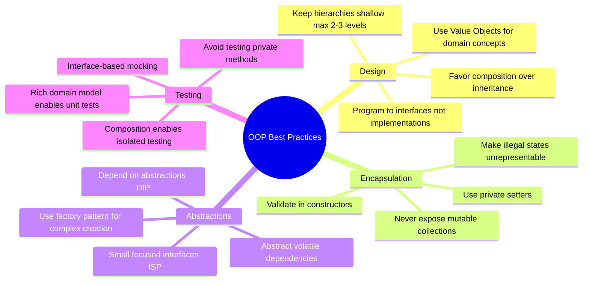

---

## 16. Interview Perspective - What Interviewers Expect

For 8+ years experience, OOP interviewers expect:

1. **Go beyond definitions** - Explain with real production examples, not textbook Animal/Dog
2. **Recognize anti-patterns** - Spot anemic models, God classes, inappropriate inheritance
3. **Design on the spot** - Given a scenario, decompose into proper classes and interfaces
4. **Know the trade-offs** - When inheritance IS appropriate, when records fit, when functional style is better
5. **Connect to architecture** - How OOP principles scale to microservices and DDD
6. **Modern C# awareness** - Records, pattern matching, sealed hierarchies

### Follow-up Questions to Prepare For:
- "Walk me through how you'd design the domain model for an e-commerce system"
- "When would you NOT use OOP? When is functional better?"
- "How do you prevent a domain model from becoming anemic?"
- "Explain the difference between an Entity and a Value Object"
- "How does OOP support testability?"
- "Show me how polymorphism eliminates switch statements"
