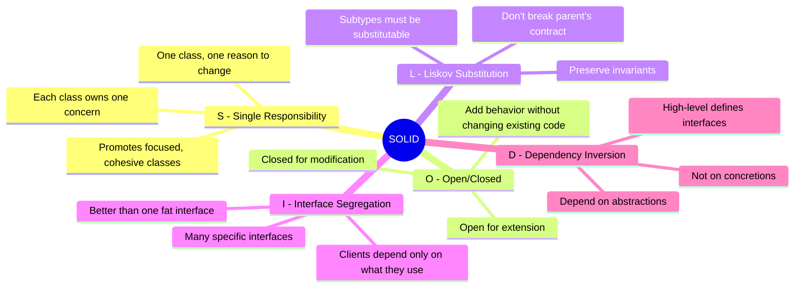
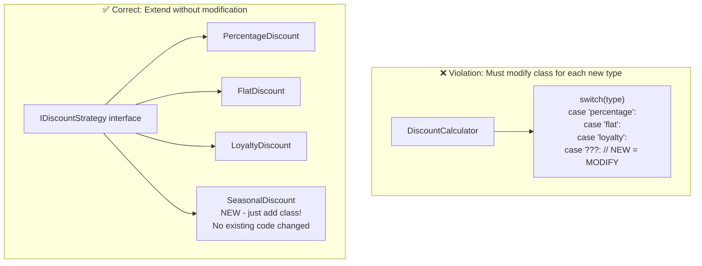
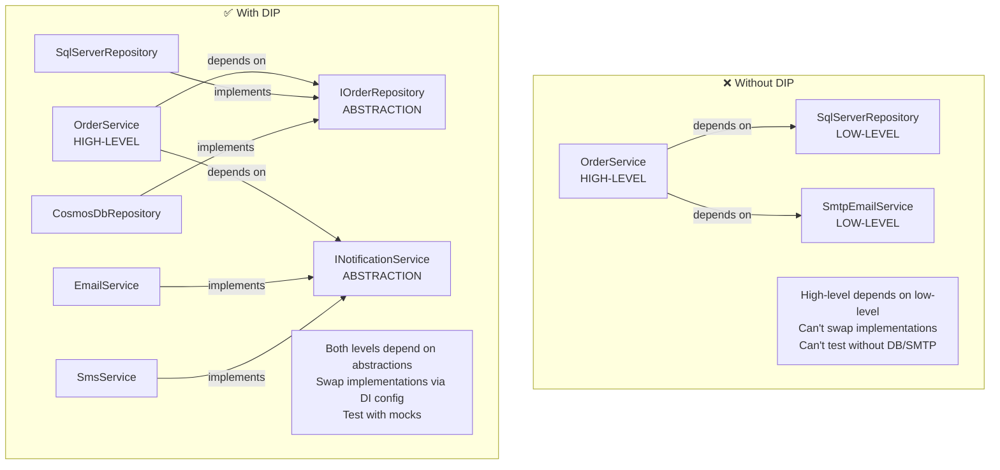
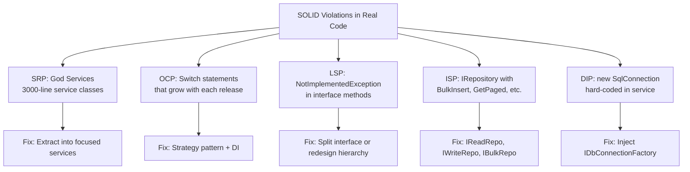
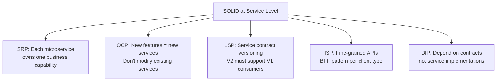
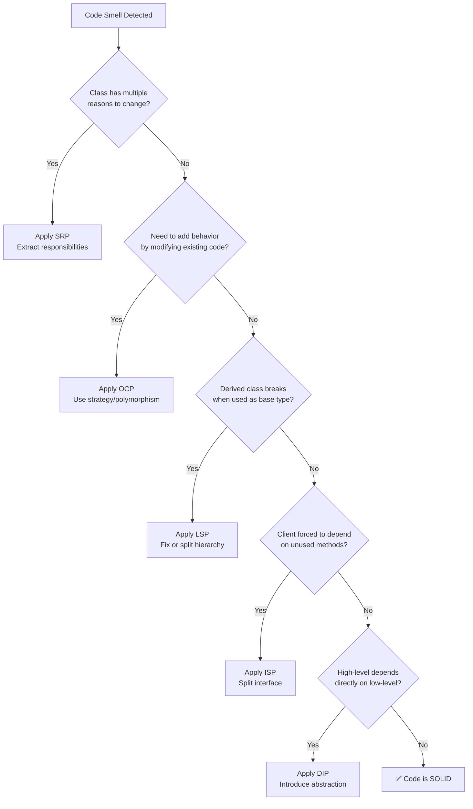
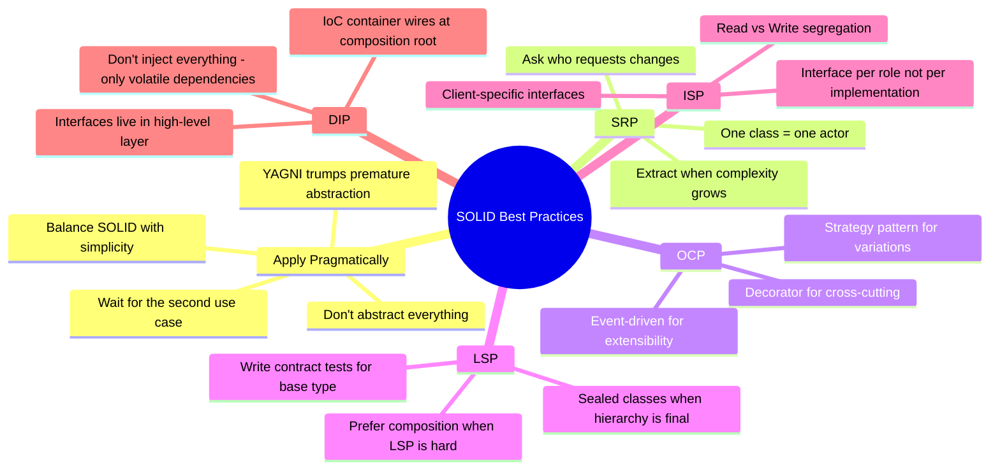

# SOLID Principles - Complete Interview Guide
## For 8+ Years Experienced Senior Developers

---

## 1. SOLID Overview

### Definition
SOLID is a set of five design principles that help developers create software that is maintainable, extensible, and robust. These principles guide decisions about how to organize code into classes and how those classes should interact.

### Purpose
To reduce software entropy - the natural tendency of code to become harder to change over time. Well-applied SOLID principles make systems that are easy to modify, test, and extend.

### Problem It Solves
- **Rigid code**: Changes require modifying existing working code (risk of regression)
- **Fragile code**: Fixing one thing breaks something else (ripple effects)
- **Immobile code**: Can't reuse components because they're too coupled to their context
- **Viscous code**: Doing the right thing is harder than doing the wrong thing (shortcuts accumulate)

### Industry Relevance
- SOLID is asked in every senior .NET interview (especially SRP and DIP)
- Foundation of Clean Architecture, Domain-Driven Design, and microservices boundaries
- Enables testability — teams without SOLID code can't write meaningful unit tests

### The Five Principles at a Glance



---

## 2. Single Responsibility Principle (SRP)

### Definition
A class should have only one reason to change. This means each class should have only one responsibility or concern.

### Problem It Solves
- **God classes** that are responsible for everything
- **Ripple effect** where changing one thing breaks unrelated features
- **Merge conflicts** when multiple developers modify the same class
- **Untestable code** that requires setting up unrelated dependencies

### Visual Explanation

```
❌ VIOLATION: Class with multiple responsibilities

┌─────────────────────────────────────┐
│          OrderService               │
├─────────────────────────────────────┤
│ • Validates order data              │ ← Validation concern
│ • Calculates discounts              │ ← Business logic concern
│ • Saves to database                 │ ← Persistence concern
│ • Sends confirmation email          │ ← Notification concern
│ • Generates PDF invoice             │ ← Reporting concern
│ • Logs operations                   │ ← Cross-cutting concern
├─────────────────────────────────────┤
│ 6 reasons to change!                │
│ Change email → risk breaking DB     │
│ Change DB → risk breaking email     │
└─────────────────────────────────────┘

✅ CORRECT: Each class has one responsibility

┌──────────────┐ ┌──────────────┐ ┌──────────────┐
│OrderValidator│ │DiscountCalc  │ │OrderRepo     │
│              │ │              │ │              │
│ Validates    │ │ Calculates   │ │ Persists     │
│ input data   │ │ pricing      │ │ to database  │
└──────────────┘ └──────────────┘ └──────────────┘

┌──────────────┐ ┌──────────────┐ ┌──────────────┐
│EmailService  │ │InvoiceGen    │ │OrderService  │
│              │ │              │ │              │
│ Sends        │ │ Creates      │ │ ORCHESTRATES │
│ notifications│ │ documents    │ │ the flow     │
└──────────────┘ └──────────────┘ └──────────────┘
```

---

## 3. Open/Closed Principle (OCP)

### Definition
Software entities should be open for extension but closed for modification. You should be able to add new behavior without changing existing, working code.

### Problem It Solves
- **Risk**: Every modification to existing code risks introducing bugs
- **Regression**: Testing the unchanged 90% of a class because you touched 10%
- **Growing switch statements**: Adding cases to switch/if-else chains forever

### Visual Explanation



### Code Example

```csharp
// ❌ VIOLATION: Must modify this method for every new discount type
public decimal Calculate(string type, decimal total) => type switch
{
    "percentage" => total * 0.1m,
    "flat" => 10m,
    "loyalty" => total * 0.15m,
    // Adding "seasonal" requires modifying this method!
    _ => 0
};

// ✅ CORRECT: New discounts = new classes, never modify existing
public interface IDiscountStrategy
{
    decimal Calculate(Order order);
}

public class PercentageDiscount : IDiscountStrategy { /* ... */ }
public class LoyaltyDiscount : IDiscountStrategy { /* ... */ }
public class SeasonalDiscount : IDiscountStrategy { /* ... */ } // NEW - no changes elsewhere!

// This class NEVER changes regardless of how many discount types exist
public class DiscountEngine
{
    private readonly IEnumerable<IDiscountStrategy> _strategies;
    
    public decimal GetBestDiscount(Order order)
        => _strategies.Max(s => s.Calculate(order));
}
```

---

## 4. Liskov Substitution Principle (LSP)

### Definition
Objects of a superclass should be replaceable with objects of a subclass without affecting the correctness of the program.

### Problem It Solves
- **Broken substitution**: Code works with base type but breaks with derived
- **Unexpected behavior**: Overrides that violate the base class contract
- **NotImplementedException**: Derived classes that can't fulfill the interface

### The Classic Violation: Rectangle/Square

```
Mathematical truth: A Square IS-A Rectangle
OOP truth: A Square CANNOT substitute for a Rectangle!

Why? Because Rectangle has independent Width and Height.
Setting Width on a Square ALSO changes Height (side effect).
Code expecting Rectangle behavior BREAKS with Square.

┌────────────────────────────────────────────────────────┐
│ void TestArea(Rectangle rect)                           │
│ {                                                       │
│     rect.Width = 5;                                     │
│     rect.Height = 4;                                    │
│     Assert.Equal(20, rect.Area);                        │
│                                                         │
│     // With Rectangle: 5 × 4 = 20 ✅                   │
│     // With Square:    4 × 4 = 16 ❌ (Width changed!)  │
│ }                                                       │
└────────────────────────────────────────────────────────┘
```

### LSP Rules

| Rule | Meaning | Violation Example |
|------|---------|-------------------|
| Preconditions can't be strengthened | Subclass can't demand MORE from callers | Base accepts any string; derived requires non-empty |
| Postconditions can't be weakened | Subclass must deliver AT LEAST what base promises | Base returns sorted; derived returns unsorted |
| Invariants must be preserved | Subclass can't break base class guarantees | Base guarantees positive balance; derived allows negative |
| No new exceptions | Subclass shouldn't throw unexpected exceptions | Base throws ArgumentException; derived throws IOException |

---

## 5. Interface Segregation Principle (ISP)

### Definition
No client should be forced to depend on interfaces it does not use. Prefer many specific interfaces over one general-purpose interface.

### Visual Explanation

```
❌ FAT INTERFACE: Forces unnecessary dependencies

┌─────────────────────────────────┐
│         IWorker                  │
├─────────────────────────────────┤
│ Work()                          │
│ Eat()        ← Robot can't eat  │
│ Sleep()      ← Robot can't sleep│
│ TakeBreak()  ← Robot doesn't    │
└─────────────────────────────────┘
        ↑               ↑
    Human           Robot
    (all OK)        (throws NotImplementedException! ❌)


✅ SEGREGATED INTERFACES: Each client depends only on what it needs

┌───────────────┐  ┌───────────────┐  ┌───────────────┐
│  IWorkable    │  │  IFeedable    │  │  ISleepable   │
├───────────────┤  ├───────────────┤  ├───────────────┤
│  Work()       │  │  Eat()        │  │  Sleep()      │
└───────────────┘  │  TakeBreak()  │  └───────────────┘
        ↑          └───────────────┘          ↑
        │                  ↑                  │
    ┌───┴───┐          ┌───┘                  │
    │       │          │                      │
  Human   Robot      Human                  Human
  (both)  (only      (implements            (implements
          IWorkable)  IFeedable too)         ISleepable)
```

---

## 6. Dependency Inversion Principle (DIP)

### Definition
High-level modules should not depend on low-level modules. Both should depend on abstractions. Abstractions should not depend on details. Details should depend on abstractions.

### Visual Explanation



### Key Insight
The "inversion" is that high-level modules DEFINE the interfaces they need (not the other way around). The interface belongs to the high-level layer, and low-level modules implement it.

---

## 7. Common Violations in Enterprise Code



---

## 8. Interview Questions with Detailed Answers

### Q: Which SOLID principle is most commonly violated?

**Senior-Level Answer:**
SRP is violated most because it's the hardest to judge. Classes naturally accumulate responsibilities over time ("just one more method"). The second most common is OCP - growing switch/if-else chains instead of using polymorphism.

How I address it: In code reviews, I ask "why would this class change?" If there are multiple answers (new validation rule, new notification channel, database change), it has too many responsibilities.

### Q: Can you over-apply SOLID?

**Senior-Level Answer:**
Absolutely. Over-applying SOLID leads to:
- Interface explosion (IOrderService with only one implementation ever)
- Too many tiny classes (hard to navigate, "where is the logic?")
- Indirection layers that add no value

My rule: Apply SOLID when you see a clear benefit - multiple implementations needed, class is hard to test, or frequent changes cause regressions. Don't preemptively add abstractions for hypothetical future needs.

### Q: How does DIP relate to Dependency Injection?

**Senior-Level Answer:**
They're related but distinct concepts:
- **DIP** is the PRINCIPLE: "Depend on abstractions, not concretions"
- **DI** is the MECHANISM: IoC containers inject dependencies via constructors

You can follow DIP without DI (manual object composition in Main). You can use DI without following DIP (injecting concrete `SqlConnection` instead of `IDbConnection`).

In practice, they work best together: DIP guides what to inject (interfaces), DI automates the injection (IoC container).

---

## 9. SOLID in Microservices Architecture

### How SOLID Scales Beyond Classes



| Principle | Class Level | Service Level |
|-----------|-------------|---------------|
| SRP | One class, one responsibility | One service, one bounded context |
| OCP | Add classes, don't modify | Add services/endpoints, don't modify existing |
| LSP | Subtypes substitutable | New API versions backward compatible |
| ISP | Small interfaces | Backend-for-Frontend, tailored endpoints |
| DIP | Depend on interfaces | Depend on message contracts, not service URLs |

### Code Example: SOLID Applied to a Complete Feature

```csharp
// ISP: Focused interfaces (not one mega-repository)
public interface IOrderReader
{
    Task<Order?> GetByIdAsync(Guid id);
    Task<IReadOnlyList<Order>> GetByCustomerAsync(Guid customerId);
}

public interface IOrderWriter
{
    Task SaveAsync(Order order);
    Task DeleteAsync(Guid id);
}

// DIP: High-level module defines the interfaces it needs
// SRP: Use case class does ONE thing - place an order
public class PlaceOrderUseCase
{
    private readonly IOrderWriter _writer;
    private readonly IInventoryChecker _inventory;
    private readonly IPaymentGateway _payment;
    private readonly IEventPublisher _events;
    
    public PlaceOrderUseCase(
        IOrderWriter writer,
        IInventoryChecker inventory,
        IPaymentGateway payment,
        IEventPublisher events)
    {
        _writer = writer;
        _inventory = inventory;
        _payment = payment;
        _events = events;
    }
    
    public async Task<Result<OrderConfirmation>> ExecuteAsync(PlaceOrderCommand command)
    {
        // OCP: New validation rules = new IOrderValidator implementations
        var order = Order.Create(command.CustomerId, command.Lines);
        
        if (!await _inventory.CheckAvailabilityAsync(order.Lines))
            return Result.Failure<OrderConfirmation>("Items unavailable");
        
        var paymentResult = await _payment.ChargeAsync(order.Total, command.PaymentMethod);
        if (!paymentResult.IsSuccess)
            return Result.Failure<OrderConfirmation>(paymentResult.Error);
        
        order.MarkAsPaid(paymentResult.TransactionId);
        await _writer.SaveAsync(order);
        await _events.PublishAsync(new OrderPlacedEvent(order.Id));
        
        return Result.Success(new OrderConfirmation(order.Id, order.Total));
    }
}

// OCP: Adding new payment method = new class, no modification
public class StripePaymentGateway : IPaymentGateway { /* Stripe implementation */ }
public class PayPalPaymentGateway : IPaymentGateway { /* PayPal implementation */ }

// LSP: Both gateways fully honor IPaymentGateway contract
// No NotImplementedException, no surprise exceptions
```

---

## 10. Testing Benefits of SOLID

### How Each Principle Enables Testing

```
Principle   │ Testing Benefit                        │ Without It
────────────┼────────────────────────────────────────┼──────────────────────
SRP         │ Small focused unit tests               │ Complex setup, many mocks
OCP         │ Test new behavior in isolation          │ Regression risk per change
LSP         │ Base class tests work for all derived   │ Tests pass for base, fail for derived
ISP         │ Mock only what's needed                 │ Must mock 20 methods to test 1
DIP         │ Inject test doubles easily              │ Can't test without real DB/API
```

### Testing with SOLID-Compliant Code

```csharp
// Because of DIP + ISP, testing is trivial:
[Fact]
public async Task PlaceOrder_WithAvailableInventory_Succeeds()
{
    // Arrange - Each mock is small (ISP) and injectable (DIP)
    var writer = new Mock<IOrderWriter>();
    var inventory = new Mock<IInventoryChecker>();
    var payment = new Mock<IPaymentGateway>();
    var events = new Mock<IEventPublisher>();
    
    inventory.Setup(i => i.CheckAvailabilityAsync(It.IsAny<IReadOnlyList<OrderLine>>()))
        .ReturnsAsync(true);
    payment.Setup(p => p.ChargeAsync(It.IsAny<decimal>(), It.IsAny<PaymentMethod>()))
        .ReturnsAsync(Result.Success(new PaymentTransaction("txn-123")));
    
    var useCase = new PlaceOrderUseCase(writer.Object, inventory.Object, payment.Object, events.Object);
    
    // Act
    var result = await useCase.ExecuteAsync(new PlaceOrderCommand(...));
    
    // Assert (SRP: testing only PlaceOrder logic, nothing else)
    result.IsSuccess.Should().BeTrue();
    writer.Verify(w => w.SaveAsync(It.IsAny<Order>()), Times.Once);
    events.Verify(e => e.PublishAsync(It.IsAny<OrderPlacedEvent>()), Times.Once);
}
```

---

## 11. SOLID Decision Flowchart

### When to Apply Which Principle



---

## 12. Best Practices Summary



---

## 13. Interview Perspective - What Interviewers Expect

For 8+ years experience, SOLID interviewers expect:

1. **Real examples from production** - "In our payment system, we applied OCP by..."
2. **Know when NOT to apply** - Over-engineering awareness, YAGNI principle
3. **Refactoring fluency** - Given a violating class, refactor it live
4. **Connection to patterns** - Strategy=OCP, Decorator=OCP+SRP, Factory=DIP
5. **Scaling beyond classes** - How SOLID applies to services, modules, and APIs
6. **Testing perspective** - How SOLID makes code testable

### Follow-up Questions to Prepare For:
- "Show me a SRP violation and refactor it"
- "When would breaking OCP be the right call?"
- "How do you convince a team to adopt SOLID without over-engineering?"
- "What's the difference between DIP and DI?"
- "How does SOLID relate to Clean Architecture?"
- "Give me a real example where LSP violation caused a production bug"
