# Design Patterns - Complete Interview Guide
## For 8+ Years Experienced Senior Developers

---

## 1. Design Patterns Overview

### Definition
Design patterns are reusable solutions to commonly occurring problems in software design. They are not finished code but templates for solving problems in different contexts.

### Purpose
To provide a shared vocabulary for developers and proven solutions to recurring design challenges, reducing the risk of architectural mistakes.

### Problem It Solves
- **Reinventing the wheel**: Solving the same structural problems repeatedly without recognizing the pattern
- **Communication gaps**: Developers describing solutions differently for the same concept
- **Poor extensibility**: Systems that require modifying core code for every new requirement
- **Untestable designs**: Tight coupling that prevents unit testing and mocking

### Industry Relevance
- Design patterns are a core interview topic for senior .NET developers
- Patterns like Repository, Mediator, Strategy are used in every enterprise .NET application
- Understanding patterns enables reading and contributing to existing codebases quickly

### Pattern Categories

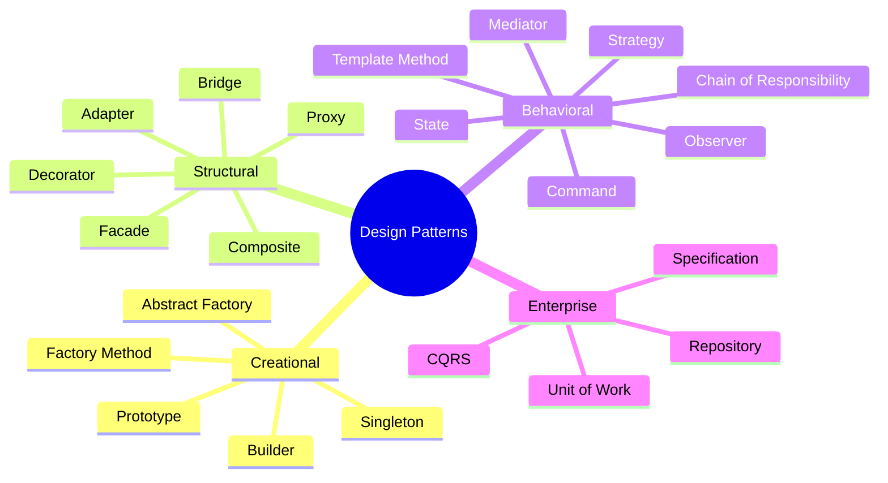

---

## 2. Creational Patterns

### Factory Pattern

**Definition:** Creates objects without specifying the exact class. Delegates instantiation logic to factory methods.

**Problem It Solves:**
- Client code shouldn't know which concrete class to create
- Object creation logic is complex or conditional
- Need to centralize and control object creation

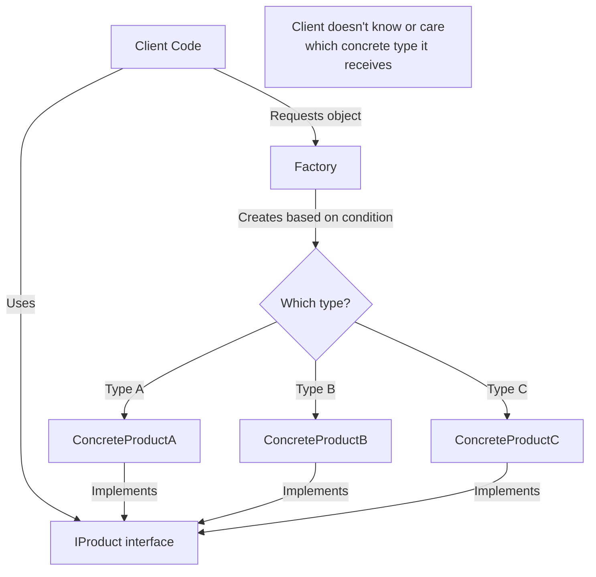

**Real-World Example:** Notification system where factory creates EmailSender, SmsSender, or PushSender based on user preferences.

### Builder Pattern

**Definition:** Constructs complex objects step by step, separating the construction process from the object's representation.

**Problem It Solves:**
- Object has many optional parameters (telescoping constructor anti-pattern)
- Object construction requires multiple steps
- Same construction process should create different representations

```
Without Builder (Telescoping Constructor):
┌─────────────────────────────────────────────────────────────────┐
│ new Report(title, subtitle, author, date, format, pageSize,     │
│     margins, headers, footers, watermark, toc, index, charts)   │
│                                                                  │
│ Which parameter is which? Easy to mix up!                        │
└─────────────────────────────────────────────────────────────────┘

With Builder (Fluent, Clear):
┌─────────────────────────────────────────────────────────────────┐
│ new ReportBuilder()                                              │
│     .WithTitle("Q4 Revenue")                                     │
│     .ByAuthor("Finance Team")                                    │
│     .InFormat(Format.PDF)                                        │
│     .WithTableOfContents()                                       │
│     .WithCharts(revenueCharts)                                   │
│     .Build();                                                    │
│                                                                  │
│ Clear, readable, impossible to mix up parameters!                │
└─────────────────────────────────────────────────────────────────┘
```

---

## 3. Structural Patterns

### Decorator Pattern

**Definition:** Attaches additional responsibilities to an object dynamically. Provides a flexible alternative to subclassing for extending functionality.

**Problem It Solves:**
- Adding behavior without modifying existing code (OCP)
- Combining multiple behaviors dynamically
- Avoiding class explosion from inheritance combinations

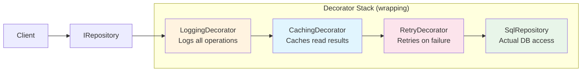

**How It Works:**
1. All decorators implement the same interface as the target
2. Each decorator holds a reference to the next one (or the real implementation)
3. Each decorator adds its behavior before/after calling the inner object
4. They're stackable and composable

### Adapter Pattern

**Definition:** Converts the interface of one class into another interface that clients expect. Allows incompatible interfaces to work together.

**Real-World Analogy:** A power adapter lets a US plug work in a European socket. It doesn't change the device or the socket, just bridges the gap.

```
Your Application's Interface:        Third-Party Library Interface:
┌─────────────────────────┐         ┌────────────────────────────┐
│ IPaymentGateway         │         │ ThirdPartyPaymentSDK       │
│                         │         │                            │
│ ChargeAsync(            │         │ ExecuteTransaction(        │
│   amount: decimal,      │   ≠     │   request: TxnRequest {   │
│   currency: string,     │         │     AmountInCents: int,    │
│   token: string)        │         │     CurrencyCode: string,  │
│                         │         │     PaymentToken: string    │
│ Returns: PaymentResult  │         │   })                       │
└─────────────────────────┘         │ Returns: TxnResponse       │
            ↑                       └────────────────────────────┘
            │                                     ↑
            │              ADAPTER                 │
            │    ┌─────────────────────────┐      │
            └────│ ThirdPartyAdapter       │──────┘
                 │ Implements YOUR interface│
                 │ Calls THEIR SDK         │
                 │ Translates both ways    │
                 └─────────────────────────┘
```

---

## 4. Behavioral Patterns

### Strategy Pattern

**Definition:** Defines a family of algorithms, encapsulates each one, and makes them interchangeable at runtime.

**Problem It Solves:**
- Multiple algorithms for the same task (pricing, sorting, validation)
- Algorithm selection should be dynamic (based on user, config, or context)
- Avoiding long if-else/switch chains for algorithm selection

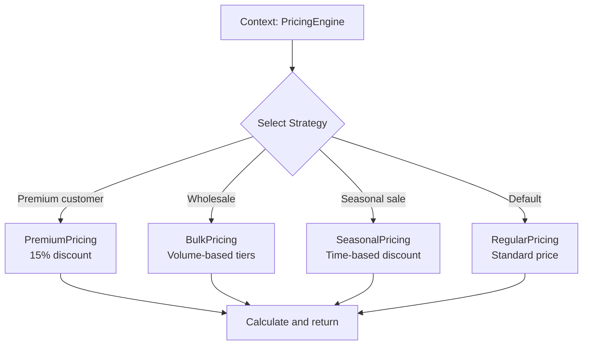

### Observer Pattern

**Definition:** Defines a one-to-many dependency so that when one object changes state, all its dependents are notified automatically.

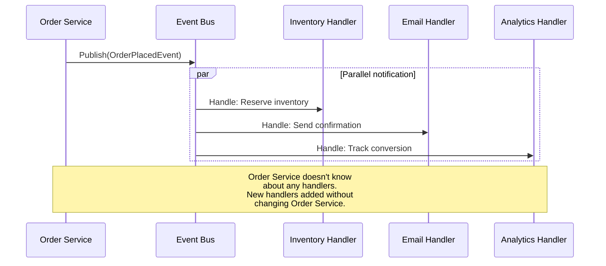

### Mediator Pattern (MediatR in .NET)

**Definition:** Defines an object that encapsulates how a set of objects interact. Objects communicate through the mediator instead of directly.

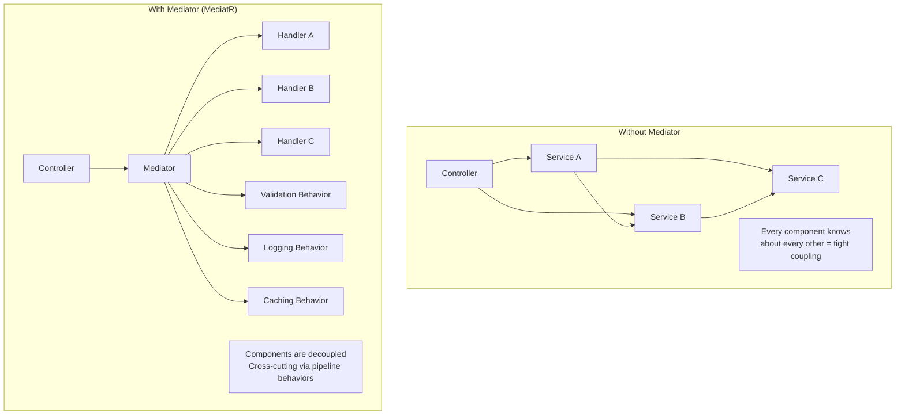

---

## 5. Enterprise Patterns

### Repository Pattern

**Definition:** Mediates between the domain and data mapping layers, acting as an in-memory collection of domain objects.

**Debate:** Some argue Repository over EF Core adds no value (leaky abstraction). The value comes from: testability, query encapsulation, and protecting domain from ORM changes.

### Unit of Work Pattern

**Definition:** Maintains a list of objects affected by a business transaction and coordinates writing out changes.

```
Without Unit of Work:              With Unit of Work:
┌─────────────────────────┐       ┌─────────────────────────────┐
│ orderRepo.Save(order);  │       │ unitOfWork.Orders.Add(order);│
│ // Transaction 1        │       │ unitOfWork.Customers.Update();│
│                         │       │ unitOfWork.Payments.Add();   │
│ customerRepo.Update();  │       │                              │
│ // Transaction 2        │       │ await unitOfWork.SaveAsync(); │
│                         │       │ // ALL in ONE transaction    │
│ paymentRepo.Save();     │       │ // All succeed or all fail   │
│ // Transaction 3        │       └─────────────────────────────┘
│                         │
│ What if Transaction 2   │
│ fails? Order already    │
│ saved! Inconsistent!    │
└─────────────────────────┘
```

---

## 6. Pattern Selection Guide

### Decision Matrix

| Scenario | Pattern | Why |
|----------|---------|-----|
| Create objects without specifying class | Factory | Decouples creation from usage |
| Complex object with many options | Builder | Step-by-step, readable construction |
| Add behavior to existing objects | Decorator | Stackable, follows OCP |
| Bridge incompatible interfaces | Adapter | Integration without modifying either |
| Select algorithm at runtime | Strategy | Flexible, interchangeable behavior |
| One change notifies many | Observer | Loose coupling, extensible |
| Decouple senders from receivers | Mediator | Clean architecture, pipeline behaviors |
| Complex query business rules | Specification | Composable, testable predicates |
| Single transaction across repos | Unit of Work | Data consistency guarantee |
| Manage complex object state | State | Clean state transitions |

### Anti-Patterns to Avoid

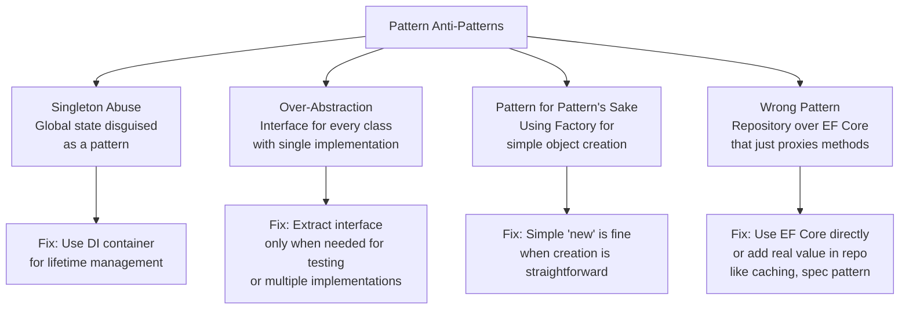

---

## 7. Interview Questions with Detailed Answers

### Q: What's the difference between Strategy and Factory?

**Answer:**
- **Factory** answers WHAT to create (decides which object to instantiate)
- **Strategy** answers HOW to do something (decides which algorithm to execute)

Factory returns a new object. Strategy encapsulates behavior that is executed. They often work together: a Factory selects the appropriate Strategy.

Example: `PaymentStrategyFactory.Create("stripe")` returns a `StripePaymentStrategy` instance.

### Q: When would you use Decorator over inheritance?

**Answer:**
Decorator when:
- Need to combine behaviors dynamically (caching + logging + retry)
- Behaviors are optional and composable
- Different consumers need different combinations
- Following Open/Closed principle

Inheritance when:
- Fixed, stable hierarchy (Stream → FileStream)
- Shared state is needed in base class
- Template Method pattern (algorithm skeleton in base)

Real example: I use decorators for cross-cutting concerns (caching repository decorator, logging decorator) because I can configure via DI which decorators to apply without changing any existing code.

### Q: How do you decide which pattern to use?

**Answer:**
I don't start with patterns. I start with the problem:
1. Identify the pain point (code smell, rigidity, testing difficulty)
2. Understand what's changing vs what's stable
3. Apply the simplest solution that addresses the problem
4. Often the "pattern" emerges naturally

Rule of Three: I don't abstract until I've seen the same problem three times. First time: solve directly. Second time: note the similarity. Third time: extract the pattern.

---

## 8. Chain of Responsibility Pattern

### Definition
Passes a request along a chain of handlers. Each handler decides either to process the request or pass it to the next handler in the chain.

### How It Works

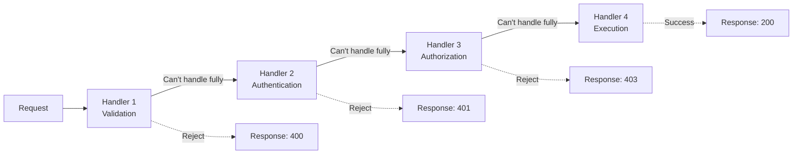

**Real-World Usage in .NET:**
- ASP.NET Core Middleware Pipeline (each middleware = handler in chain)
- MediatR Pipeline Behaviors (validation → logging → caching → handler)
- Polly Resilience Policies (retry → circuit breaker → timeout → bulkhead)

### Code Example

```csharp
// Chain of Responsibility with MediatR Pipeline Behaviors
public class ValidationBehavior<TRequest, TResponse> : IPipelineBehavior<TRequest, TResponse>
    where TRequest : IRequest<TResponse>
{
    private readonly IEnumerable<IValidator<TRequest>> _validators;
    
    public ValidationBehavior(IEnumerable<IValidator<TRequest>> validators)
        => _validators = validators;
    
    public async Task<TResponse> Handle(TRequest request, RequestHandlerDelegate<TResponse> next, CancellationToken ct)
    {
        // This handler: validate. If valid, pass to next in chain
        var failures = _validators
            .Select(v => v.Validate(request))
            .SelectMany(r => r.Errors)
            .Where(e => e != null)
            .ToList();
        
        if (failures.Any())
            throw new ValidationException(failures);
        
        return await next(); // Pass to next handler in pipeline
    }
}
```

---

## 9. Command Pattern

### Definition
Encapsulates a request as an object, allowing parameterization of clients with different requests, queuing of requests, and logging of operations.

### Architecture

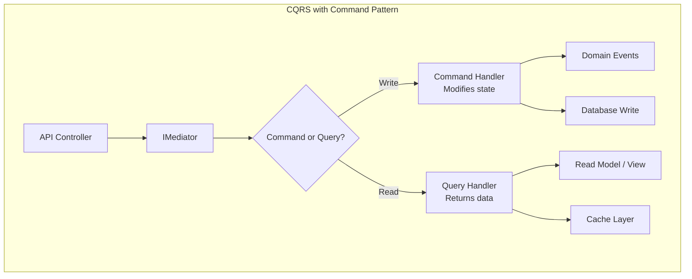

### Benefits in Enterprise Applications

```
Command Object enables:
┌─────────────────────────────────────────────────────────┐
│ 1. UNDO: Store inverse command                          │
│    PlaceOrder → CancelOrder                             │
│                                                          │
│ 2. QUEUE: Serialize commands, process asynchronously     │
│    Background job processes commands from queue           │
│                                                          │
│ 3. AUDIT: Log every command as an event                  │
│    Who did what, when, with what parameters              │
│                                                          │
│ 4. REPLAY: Re-execute commands for debugging             │
│    Reproduce production issues in dev                    │
│                                                          │
│ 5. VALIDATION: Validate command before execution         │
│    FluentValidation + MediatR pipeline                   │
└─────────────────────────────────────────────────────────┘
```

---

## 10. State Pattern

### Definition
Allows an object to alter its behavior when its internal state changes. The object appears to change its class.

### When to Use

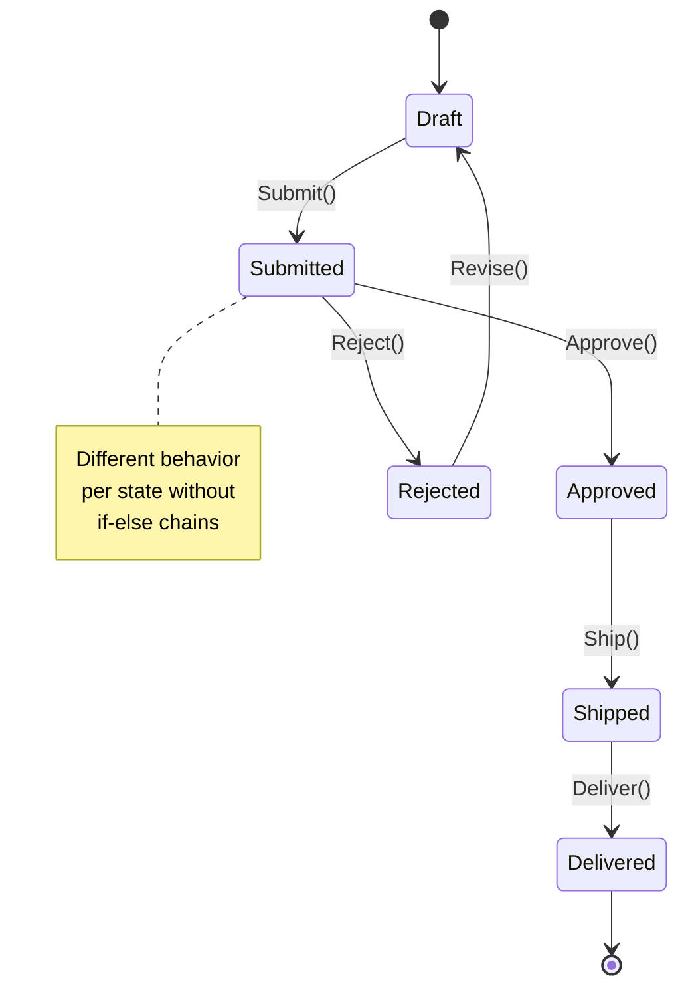

### Code Example

```csharp
// ❌ Without State Pattern: Growing switch statements
public class Order
{
    public void Cancel()
    {
        switch (Status)
        {
            case OrderStatus.Draft: /* can cancel, refund not needed */ break;
            case OrderStatus.Submitted: /* can cancel, notify warehouse */ break;
            case OrderStatus.Shipped: /* can't cancel! */ throw new InvalidOperationException();
            case OrderStatus.Delivered: /* initiate return instead */ break;
            // Every new status = modify EVERY method!
        }
    }
}

// ✅ With State Pattern: Each state knows its own behavior
public interface IOrderState
{
    IOrderState Submit(Order order);
    IOrderState Cancel(Order order);
    IOrderState Ship(Order order);
}

public class DraftState : IOrderState
{
    public IOrderState Submit(Order order)
    {
        order.SubmittedAt = DateTime.UtcNow;
        return new SubmittedState(); // Transition to next state
    }
    
    public IOrderState Cancel(Order order) => new CancelledState(); // Simple, no refund
    public IOrderState Ship(Order order) => throw new InvalidOperationException("Cannot ship a draft");
}

public class ShippedState : IOrderState
{
    public IOrderState Submit(Order order) => throw new InvalidOperationException("Already shipped");
    public IOrderState Cancel(Order order) => throw new InvalidOperationException("Cannot cancel shipped order");
    public IOrderState Ship(Order order) => throw new InvalidOperationException("Already shipped");
}
```

---

## 11. Specification Pattern

### Definition
Encapsulates business rules as composable, reusable, testable predicate objects that determine if an object satisfies certain criteria.

### Problem It Solves

```
WITHOUT Specification:
┌─────────────────────────────────────────────────────────┐
│ repository.GetOrders()                                   │
│   .Where(o => o.Status == "Active")                      │
│   .Where(o => o.Total > 100)                             │
│   .Where(o => o.Customer.Tier == "Premium")              │
│   .Where(o => o.CreatedAt > DateTime.UtcNow.AddDays(-30))│
│                                                          │
│ Problem: This query logic is duplicated everywhere!      │
│ Problem: Can't unit test the business rule in isolation  │
│ Problem: Can't compose rules dynamically                 │
└─────────────────────────────────────────────────────────┘

WITH Specification:
┌─────────────────────────────────────────────────────────┐
│ var spec = new ActiveOrdersSpec()                         │
│   .And(new HighValueOrderSpec(minTotal: 100))            │
│   .And(new PremiumCustomerOrderSpec())                    │
│   .And(new RecentOrderSpec(days: 30));                    │
│                                                          │
│ var orders = await repository.GetAsync(spec);             │
│                                                          │
│ ✅ Each spec is independently testable                   │
│ ✅ Composable with And/Or/Not                            │
│ ✅ Reusable across different queries                     │
│ ✅ Works with EF Core (translates to SQL)                │
└─────────────────────────────────────────────────────────┘
```

### Code Example

```csharp
// Base specification with expression tree support (EF Core compatible)
public abstract class Specification<T>
{
    public abstract Expression<Func<T, bool>> ToExpression();
    
    public Specification<T> And(Specification<T> other)
        => new AndSpecification<T>(this, other);
    
    public Specification<T> Or(Specification<T> other)
        => new OrSpecification<T>(this, other);
    
    public Specification<T> Not()
        => new NotSpecification<T>(this);
}

// Concrete specifications (each is a focused, testable business rule)
public class ActiveOrderSpec : Specification<Order>
{
    public override Expression<Func<Order, bool>> ToExpression()
        => order => order.Status == OrderStatus.Active;
}

public class HighValueOrderSpec : Specification<Order>
{
    private readonly decimal _minTotal;
    public HighValueOrderSpec(decimal minTotal) => _minTotal = minTotal;
    
    public override Expression<Func<Order, bool>> ToExpression()
        => order => order.Total >= _minTotal;
}
```

---

## 12. Patterns in Modern .NET Applications

### Pattern Usage Map

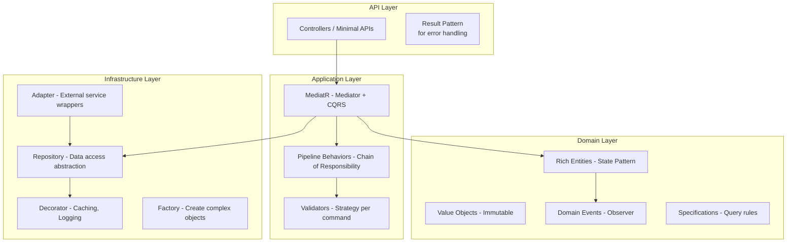

### Result Pattern (Modern Error Handling)

```csharp
// Instead of throwing exceptions for business failures:
public class Result<T>
{
    public T? Value { get; }
    public string? Error { get; }
    public bool IsSuccess => Error is null;
    
    public static Result<T> Success(T value) => new() { Value = value };
    public static Result<T> Failure(string error) => new() { Error = error };
}

// Usage: Handler returns Result, not exceptions
public async Task<Result<OrderDto>> Handle(PlaceOrderCommand cmd)
{
    if (!await _inventory.IsAvailable(cmd.ProductId))
        return Result<OrderDto>.Failure("Product out of stock"); // Not an exception!
    
    var order = Order.Create(cmd);
    await _repo.SaveAsync(order);
    return Result<OrderDto>.Success(_mapper.Map(order));
}
```

---

## 13. Scenario-Based Pattern Selection

### Scenario: Build a document processing pipeline

```
Requirements: PDF, Word, Excel → Parse → Validate → Transform → Store

Patterns to apply:
┌────────────────────────────────────────────────────────────────────┐
│ 1. Strategy: Different parsers per file type (IPdfParser, etc.)    │
│ 2. Factory: Create correct parser based on file extension          │
│ 3. Chain of Responsibility: Pipeline stages (parse → validate → )  │
│ 4. Template Method: Common pipeline skeleton, override specific    │
│ 5. Observer: Notify interested parties when processing completes   │
│ 6. Decorator: Add logging/retry around each stage                  │
└────────────────────────────────────────────────────────────────────┘
```

### Scenario: Design a flexible discount system

```
Requirements: Stack multiple discounts, different rules per customer tier,
seasonal overrides, volume discounts, loyalty points

Patterns applied:
- Strategy: Each discount type (percentage, flat, tiered)
- Composite: Stack multiple discounts
- Specification: Determine eligibility for each discount
- Factory: Create discount configuration per customer
- Chain of Responsibility: Apply discounts in priority order
```

---

## 14. Best Practices Summary

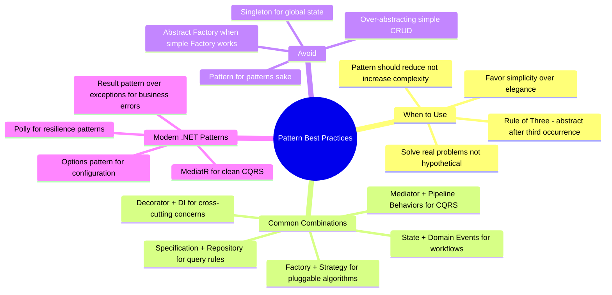

---

## 15. Interview Perspective - What Interviewers Expect

For 8+ years experience, design pattern interviewers expect:

1. **Pattern recognition from description** - "I need to add behavior without modifying..." = Decorator
2. **Real production examples** - "We used Mediator with pipeline behaviors for..."
3. **Know when NOT to use** - "Simple new() is fine when creation isn't complex"
4. **Combine patterns fluently** - Explain how Factory + Strategy + Decorator work together
5. **Refactoring towards patterns** - Take a code smell and refactor it using appropriate pattern
6. **Enterprise patterns** - CQRS, Event Sourcing, Outbox, Saga from real experience

### Follow-up Questions to Prepare For:
- "Implement a Strategy pattern for this pricing scenario"
- "How would you add caching to this repository without modifying it?"
- "When would you use Chain of Responsibility vs Mediator?"
- "Show me how the Specification pattern works with EF Core"
- "Design a state machine for an order workflow"
- "What patterns have you used in production that made the biggest impact?"
