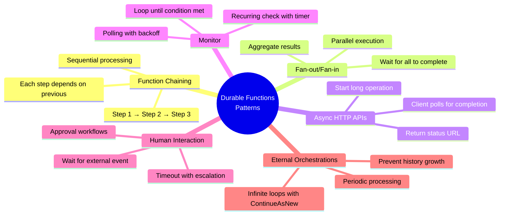
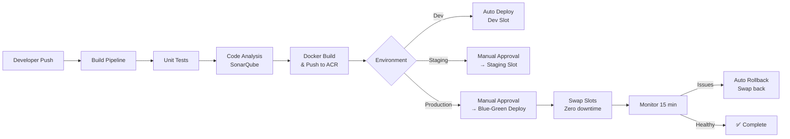
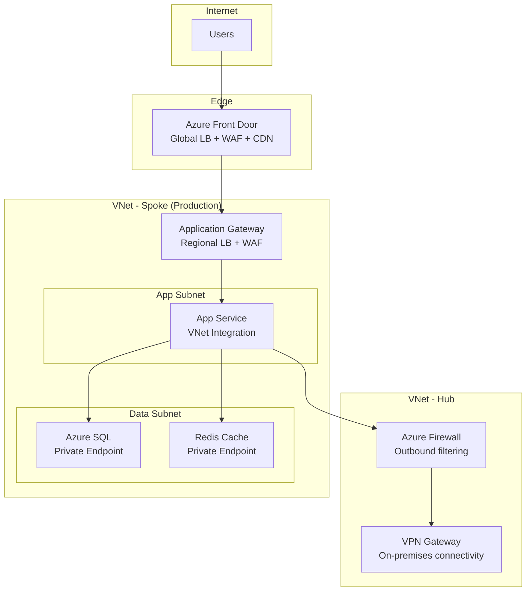
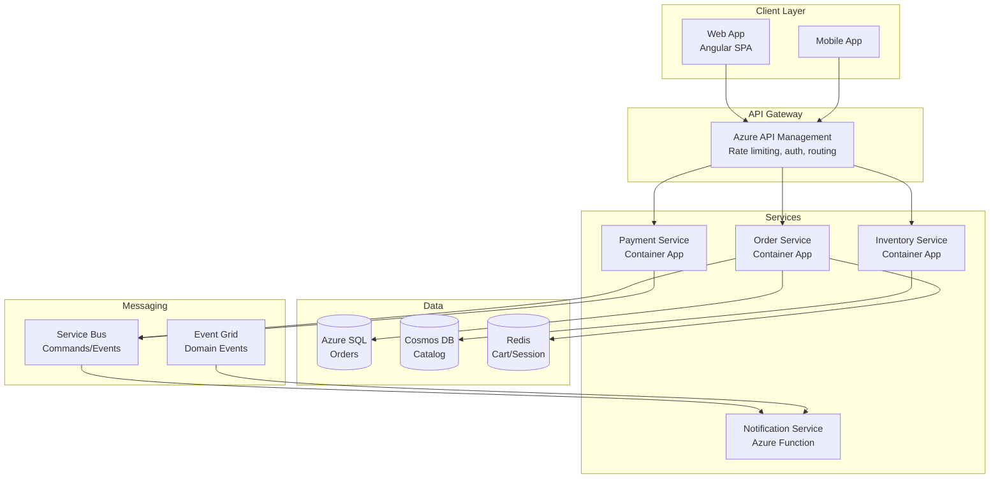
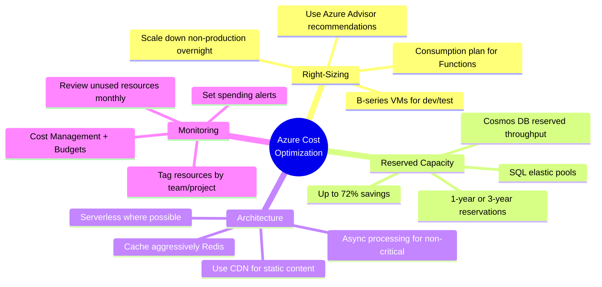
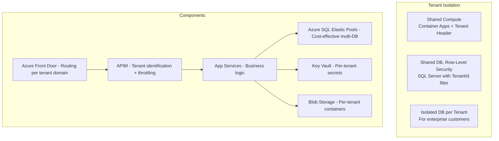

# Azure Cloud - Complete Interview Guide
## For 8+ Years Experienced Senior Developers

---

## 1. Azure Cloud Overview

### Definition
Microsoft Azure is a comprehensive cloud computing platform providing 200+ services for building, deploying, and managing applications through Microsoft's global network of data centers.

### Purpose
To provide on-demand computing resources (compute, storage, networking, AI, databases) that scale elastically, eliminating the need to own and maintain physical infrastructure while enabling global reach.

### Problem It Solves
- **Capital expenditure**: Buying servers upfront for peak capacity that's idle 80% of the time
- **Scaling delays**: Weeks to provision new hardware vs minutes in the cloud
- **Global deployment**: Reaching users worldwide without building data centers everywhere
- **Operational burden**: Patching, securing, and maintaining physical infrastructure
- **Disaster recovery**: Building redundancy across geographic regions is complex and expensive on-premises

### Why Azure for .NET Developers
- First-class .NET integration (App Service, Functions, SDK)
- Managed Identity eliminates secrets management
- Azure DevOps / GitHub Actions native CI/CD
- Enterprise adoption (95% of Fortune 500 use Azure)
- Hybrid capability (Azure Arc, Stack) for existing on-premises investments

---

## 2. Azure Compute Services

### Service Selection Guide

| Service | Use Case | Scaling | Cost Model |
|---------|----------|---------|------------|
| App Service | Web apps, APIs | Auto-scale rules | Plan-based |
| Azure Functions | Event-driven, short tasks | Automatic (consumption) | Per-execution |
| AKS | Container orchestration | Node pools | VM-based |
| Container Apps | Serverless containers | KEDA-based | Per-second |
| Azure VM | Full control, legacy apps | VM Scale Sets | Per-hour |

### Azure Functions Best Practices

```csharp
// Durable Functions for orchestration
[Function("OrderProcessingOrchestrator")]
public static async Task RunOrchestrator(
    [OrchestrationTrigger] TaskOrchestrationContext context)
{
    var orderId = context.GetInput<string>();
    
    // Fan-out/fan-in pattern
    var tasks = new List<Task<bool>>
    {
        context.CallActivityAsync<bool>("ValidateInventory", orderId),
        context.CallActivityAsync<bool>("ValidatePayment", orderId),
        context.CallActivityAsync<bool>("CheckFraud", orderId)
    };
    
    var results = await Task.WhenAll(tasks);
    
    if (results.All(r => r))
    {
        await context.CallActivityAsync("ConfirmOrder", orderId);
        await context.CallActivityAsync("SendConfirmation", orderId);
    }
    else
    {
        await context.CallActivityAsync("CancelOrder", orderId);
    }
}

// Timer trigger with dependency injection
[Function("DailyReportGenerator")]
public async Task Run([TimerTrigger("0 0 6 * * *")] TimerInfo timer)
{
    _logger.LogInformation("Generating daily report at {Time}", DateTime.UtcNow);
    await _reportService.GenerateAndSendAsync();
}
```

### Durable Functions Patterns



```csharp
// Pattern: Human Interaction (Approval Workflow)
[Function("ApprovalOrchestrator")]
public static async Task RunApproval(
    [OrchestrationTrigger] TaskOrchestrationContext context)
{
    var request = context.GetInput<ApprovalRequest>();
    
    // Send approval request
    await context.CallActivityAsync("SendApprovalEmail", request);
    
    // Wait for external event OR timeout
    using var cts = new CancellationTokenSource();
    var approvalTask = context.WaitForExternalEvent<bool>("ApprovalResult");
    var timeoutTask = context.CreateTimer(TimeSpan.FromHours(24), cts.Token);
    
    var winner = await Task.WhenAny(approvalTask, timeoutTask);
    
    if (winner == approvalTask)
    {
        cts.Cancel(); // Cancel the timer
        var approved = approvalTask.Result;
        if (approved)
            await context.CallActivityAsync("ProcessApproved", request);
        else
            await context.CallActivityAsync("ProcessRejected", request);
    }
    else
    {
        // Timeout - escalate
        await context.CallActivityAsync("EscalateToManager", request);
    }
}

// Pattern: Eternal Orchestration (avoid unbounded history)
[Function("PeriodicCleanup")]
public static async Task RunCleanup(
    [OrchestrationTrigger] TaskOrchestrationContext context)
{
    await context.CallActivityAsync("CleanExpiredSessions", null);
    await context.CreateTimer(TimeSpan.FromMinutes(30), CancellationToken.None);
    
    // CRITICAL: ContinueAsNew resets history to prevent memory growth
    context.ContinueAsNew(null);
}
```

### Durable Functions — Orchestrator Rules

```
ORCHESTRATOR CODE MUST BE DETERMINISTIC:
┌──────────────────────────────────────────────────────────┐
│ ❌ NO: DateTime.Now (use context.CurrentUtcDateTime)     │
│ ❌ NO: Guid.NewGuid() (use context.NewGuid())           │
│ ❌ NO: Random (use deterministic seed)                   │
│ ❌ NO: I/O or HTTP calls (use Activities for these)      │
│ ❌ NO: Thread.Sleep (use context.CreateTimer)            │
│ ❌ NO: Infinite loops (use ContinueAsNew)               │
│                                                          │
│ WHY: Orchestrator replays from history on resume.        │
│ Non-deterministic code produces different results        │
│ on replay = corrupted orchestration state!               │
└──────────────────────────────────────────────────────────┘
```

### Azure Container Apps

```yaml
# container-app.yaml
properties:
  configuration:
    ingress:
      external: true
      targetPort: 8080
    secrets:
      - name: connection-string
        value: ${CONNECTION_STRING}
    dapr:
      enabled: true
      appId: order-service
  template:
    containers:
      - image: myregistry.azurecr.io/order-service:latest
        resources:
          cpu: 0.5
          memory: 1Gi
    scale:
      minReplicas: 1
      maxReplicas: 10
      rules:
        - name: http-rule
          http:
            metadata:
              concurrentRequests: "100"
        - name: queue-rule
          azureQueue:
            queueName: orders
            queueLength: 50
```


---

## Azure Storage and Data

### Database Selection

| Service | Type | Use Case | Scale |
|---------|------|----------|-------|
| Azure SQL | Relational | OLTP, structured data | Elastic pools, Hyperscale |
| Cosmos DB | Multi-model | Global distribution, low latency | Unlimited (RU-based) |
| Redis Cache | In-memory | Caching, sessions | Clustered |
| Blob Storage | Object | Files, media, backups | Unlimited |
| Table Storage | NoSQL KV | Simple structured data | Unlimited, low cost |

### Cosmos DB Patterns

```csharp
// Partition key selection is CRITICAL
// Good: CustomerId (even distribution, query within partition)
// Bad: Status (hot partition - most orders are "Active")

// Point read (fastest - 1 RU)
var response = await container.ReadItemAsync<Order>(
    id: orderId, 
    partitionKey: new PartitionKey(customerId));

// Cross-partition query (expensive - avoid in hot paths)
var query = container.GetItemQueryIterator<Order>(
    "SELECT * FROM c WHERE c.status = 'Active'"); // Fans out to all partitions!

// Optimized: Query within partition
var query = container.GetItemQueryIterator<Order>(
    "SELECT * FROM c WHERE c.customerId = @customerId AND c.status = 'Active'",
    requestOptions: new QueryRequestOptions 
    { 
        PartitionKey = new PartitionKey(customerId) 
    });

// Change Feed for event-driven updates
var changeFeedProcessor = container
    .GetChangeFeedProcessorBuilder<Order>("orderProcessor", HandleChangesAsync)
    .WithInstanceName("instance1")
    .WithLeaseContainer(leaseContainer)
    .WithStartTime(DateTime.UtcNow.AddHours(-1))
    .Build();
```

---

## Azure Messaging and Events

### Service Bus vs Event Grid vs Event Hubs

| Feature | Service Bus | Event Grid | Event Hubs |
|---------|------------|------------|------------|
| Pattern | Queue/Topic | Pub/Sub events | Stream processing |
| Ordering | FIFO (sessions) | No guarantee | Per partition |
| Throughput | Moderate | High | Very High (millions/sec) |
| Use Case | Commands, workflows | Reactive events | Telemetry, logging |
| Retention | Configurable | 24 hours | Days |

### Service Bus Implementation

```csharp
// Producer
public class OrderEventPublisher
{
    private readonly ServiceBusSender _sender;
    
    public async Task PublishOrderCreatedAsync(Order order)
    {
        var message = new ServiceBusMessage(JsonSerializer.SerializeToUtf8Bytes(order))
        {
            MessageId = order.Id.ToString(), // Deduplication
            SessionId = order.CustomerId.ToString(), // FIFO per customer
            Subject = "OrderCreated",
            ApplicationProperties = { ["version"] = "1.0" },
            TimeToLive = TimeSpan.FromHours(24)
        };
        
        await _sender.SendMessageAsync(message);
    }
}

// Consumer with session handling
public class OrderEventConsumer : BackgroundService
{
    protected override async Task ExecuteAsync(CancellationToken ct)
    {
        var processor = _client.CreateSessionProcessor("orders-topic", "shipping-sub",
            new ServiceBusSessionProcessorOptions
            {
                MaxConcurrentSessions = 10,
                AutoCompleteMessages = false
            });
            
        processor.ProcessMessageAsync += async (args) =>
        {
            var order = JsonSerializer.Deserialize<Order>(args.Message.Body);
            await ProcessOrderAsync(order);
            await args.CompleteMessageAsync(args.Message);
        };
        
        processor.ProcessErrorAsync += async (args) =>
        {
            _logger.LogError(args.Exception, "Error processing message");
        };
        
        await processor.StartProcessingAsync(ct);
    }
}
```

---

## Azure Security

### Managed Identity and Key Vault

```csharp
// Use Managed Identity - no secrets in config!
builder.Configuration.AddAzureKeyVault(
    new Uri("https://myapp-vault.vault.azure.net/"),
    new DefaultAzureCredential()); // Uses Managed Identity in Azure, CLI locally

// Access Key Vault secrets as configuration
var connectionString = builder.Configuration["DatabaseConnectionString"];

// Azure AD authentication for SQL
services.AddDbContext<AppDbContext>(options =>
{
    options.UseSqlServer(connectionString, sqlOptions =>
    {
        sqlOptions.EnableRetryOnFailure(3);
    });
});

// Token-based auth for SQL (Managed Identity)
services.AddSingleton<ITokenProvider>(new AzureIdentityTokenProvider());
```

### Network Security

```
Best Practices:
1. Private Endpoints for PaaS services (no public internet)
2. VNet Integration for App Services
3. NSG rules: deny all inbound, allow specific
4. WAF (Web Application Firewall) on Application Gateway
5. DDoS Protection Standard on VNet
6. Service Endpoints for Azure-to-Azure traffic
```

---

## Monitoring and Diagnostics

### Application Insights

```csharp
// Custom telemetry
public class OrderTelemetry
{
    private readonly TelemetryClient _telemetry;
    
    public void TrackOrderCreated(Order order)
    {
        _telemetry.TrackEvent("OrderCreated", new Dictionary<string, string>
        {
            ["CustomerId"] = order.CustomerId.ToString(),
            ["OrderTotal"] = order.Total.ToString()
        }, new Dictionary<string, double>
        {
            ["ItemCount"] = order.Items.Count,
            ["ProcessingTimeMs"] = order.ProcessingTime.TotalMilliseconds
        });
    }
    
    public void TrackDependencyCall(string name, string target, TimeSpan duration, bool success)
    {
        _telemetry.TrackDependency(name, target, "", DateTimeOffset.UtcNow, duration, success);
    }
}

// KQL queries for troubleshooting
// Slow requests
// requests | where duration > 2000 | summarize count() by name | order by count_ desc

// Failed dependencies
// dependencies | where success == false | summarize count() by target, type | order by count_ desc
```

---

## Interview Questions & Answers

### Q1: When would you choose Azure Functions over App Service?
**Answer:** Functions for: event-driven workloads, short-running tasks (< 10 min on Consumption), pay-per-execution pricing, triggered by queues/timers/HTTP. App Service for: always-on APIs, long-running requests, WebSocket support, complex middleware pipelines, full control over hosting environment. Functions are cheaper for sporadic workloads; App Service is better for steady traffic.

### Q2: How do you handle secrets in Azure?
**Answer:** Use Azure Key Vault with Managed Identity. Never store secrets in app settings, code, or source control. Access pattern: App Service/Function → Managed Identity → Key Vault. For local development, use Azure CLI authentication (DefaultAzureCredential falls back to CLI). Rotate secrets automatically using Key Vault rotation policies.

### Q3: Explain Cosmos DB partition strategy for an e-commerce app
**Answer:** Choose partition key based on query patterns. For orders: partition by CustomerId (queries are usually per-customer). For products: partition by CategoryId. Avoid hot partitions (don't use Status or date). Consider synthetic partition keys for cross-partition scenarios. Use hierarchical partition keys (.NET SDK) for multi-tenant scenarios.

### Q4: How do you design for high availability in Azure?
**Answer:** Multi-region deployment with Traffic Manager/Front Door, zone-redundant services (App Service, SQL), geo-replicated databases, paired regions for DR, retry policies with circuit breakers, health probes on load balancers, and auto-scaling rules. Define RTO/RPO and design accordingly.

### Q5: How would you migrate a monolith to Azure microservices?
**Answer:** Strangler Fig pattern: deploy monolith to Azure, identify bounded contexts, extract services one at a time starting with the least coupled. Use API Gateway (APIM) to route traffic. Share data via events initially (dual-write period). Migrate database per service. Use feature flags to control rollout. Establish CI/CD and observability before splitting.

---

## Azure DevOps and CI/CD

### Pipeline Architecture



### Deployment Strategies

| Strategy | Downtime | Risk | Rollback Speed | Use Case |
|----------|----------|------|----------------|----------|
| Blue-Green (Slot Swap) | Zero | Low | Instant (swap back) | App Service / Functions |
| Canary | Zero | Very Low | Fast (route traffic) | Container Apps / AKS |
| Rolling Update | Zero | Medium | Slow (redeploy) | AKS pods |
| Feature Flags | Zero | Very Low | Instant (toggle) | Any deployment model |

### Infrastructure as Code (Bicep)

```bicep
// Main infrastructure definition
param environment string = 'production'
param location string = resourceGroup().location

// App Service with staging slot
resource appServicePlan 'Microsoft.Web/serverfarms@2023-01-01' = {
  name: 'asp-${environment}'
  location: location
  sku: {
    name: 'P1v3'
    tier: 'PremiumV3'
  }
  properties: {
    reserved: true // Linux
    zoneRedundant: true // Zone redundancy for HA
  }
}

resource webApp 'Microsoft.Web/sites@2023-01-01' = {
  name: 'app-orders-${environment}'
  location: location
  identity: {
    type: 'SystemAssigned' // Managed Identity
  }
  properties: {
    serverFarmId: appServicePlan.id
    siteConfig: {
      linuxFxVersion: 'DOTNETCORE|8.0'
      alwaysOn: true
      healthCheckPath: '/health'
    }
  }
}

// Key Vault with RBAC
resource keyVault 'Microsoft.KeyVault/vaults@2023-07-01' = {
  name: 'kv-orders-${environment}'
  location: location
  properties: {
    sku: { family: 'A', name: 'standard' }
    tenantId: subscription().tenantId
    enableRbacAuthorization: true
  }
}
```

---

## Azure Networking

### Network Architecture for Enterprise



### Key Networking Concepts

| Concept | Purpose | When to Use |
|---------|---------|-------------|
| Private Endpoints | PaaS over private IP | Always for production data services |
| VNet Integration | App Service → VNet traffic | Access private resources from PaaS |
| Service Endpoints | Optimized Azure backbone | Legacy approach (prefer Private Endpoints) |
| NSG | Subnet-level firewall rules | Every subnet should have one |
| Azure Front Door | Global routing + CDN + WAF | Multi-region applications |
| Application Gateway | Regional L7 load balancer | Single-region with WAF |

---

## Architecture Patterns on Azure

### Microservices Architecture



### Event-Driven Architecture

```
Event Flow for Order Processing:
┌──────────────────────────────────────────────────────────────┐
│                                                              │
│  1. API → Service Bus Queue: "PlaceOrder" command            │
│  2. Order Service processes → SQL (ACID transaction)         │
│  3. Order Service → Service Bus Topic: "OrderPlaced" event   │
│  4. Subscriptions:                                           │
│     ├── Inventory Service → Reserve stock                    │
│     ├── Payment Service → Charge customer                    │
│     ├── Notification Function → Send email                   │
│     └── Analytics → Event Hubs → Stream Analytics            │
│                                                              │
│  Compensation (Saga):                                        │
│  If Payment fails → Publish "PaymentFailed"                  │
│     ├── Inventory Service → Release stock                    │
│     └── Order Service → Mark as cancelled                    │
│                                                              │
└──────────────────────────────────────────────────────────────┘
```

---

## Cost Optimization

### Cost Reduction Strategies



| Technique | Savings | Effort | Risk |
|-----------|---------|--------|------|
| Reserved Instances | 30-72% | Low | Commitment |
| Auto-scale (scale down) | 20-40% | Medium | Under-provisioning |
| Spot VMs (batch jobs) | 60-90% | Medium | Eviction |
| Serverless migration | 40-80% | High | Cold starts |
| Storage tiering | 50-80% | Low | Access latency |

---

## Scenario-Based Architecture

### Scenario: Design a multi-tenant SaaS platform



### Scenario: Global low-latency API (< 50ms response)

```
Solution:
1. Azure Front Door (global anycast routing to nearest region)
2. Multi-region Container Apps (each region handles local traffic)
3. Cosmos DB with multi-region writes (data local to user)
4. Redis Cache per region (most reads from cache)
5. Azure CDN for static API responses (immutable resources)

Performance budget:
- Front Door routing: 5ms
- Cache hit: 1-5ms (most traffic)
- Cache miss → Cosmos DB: 10-20ms (same region)
- Total: < 30ms at P95

Cost controls:
- Cosmos DB autoscale (100-10,000 RU/s)
- Container Apps scale to zero in low-traffic regions
- CDN for heavy responses (product catalogs)
```

---

## Interview Perspective - What Interviewers Expect

For 8+ years experience, Azure interviewers expect:

1. **Service selection rationale** - "I chose Container Apps over AKS because..."
2. **Security-first thinking** - Managed Identity by default, private endpoints, no secrets in config
3. **Cost awareness** - Know pricing models and optimization strategies
4. **HA/DR design** - Multi-region, RPO/RTO, failover strategies
5. **Real production experience** - "We migrated from X to Y because..."
6. **Trade-off analysis** - Serverless vs always-on, Cosmos vs SQL, simplicity vs flexibility

### Follow-up Questions to Prepare For:
- "How would you handle a sudden 10x traffic spike?"
- "What's your approach to zero-downtime deployments?"
- "How do you secure communication between microservices?"
- "Design a cost-effective architecture for a startup that might scale"
- "How do you troubleshoot a distributed system issue across services?"
- "Walk me through your disaster recovery strategy"
