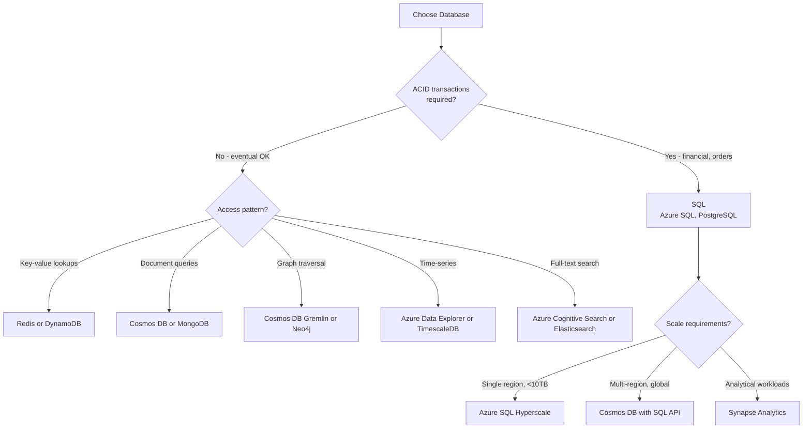
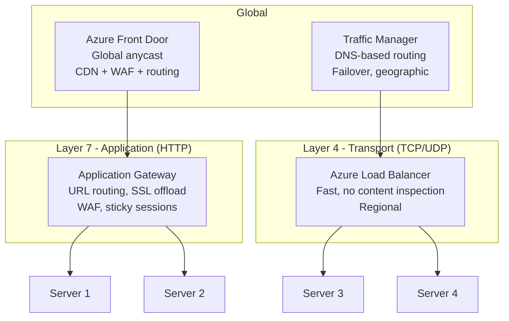
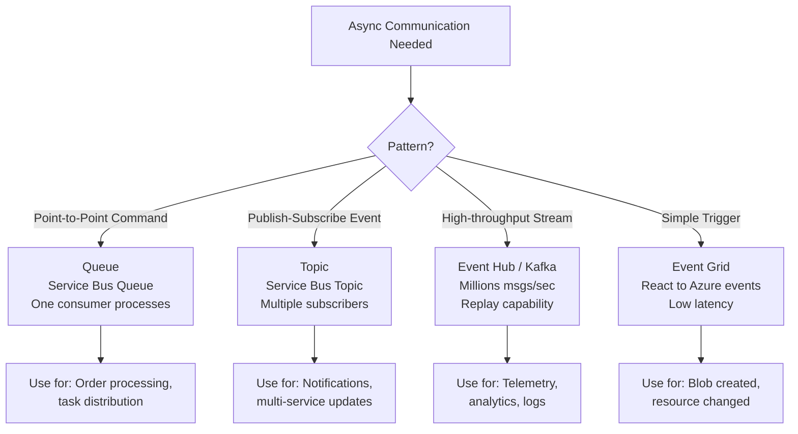
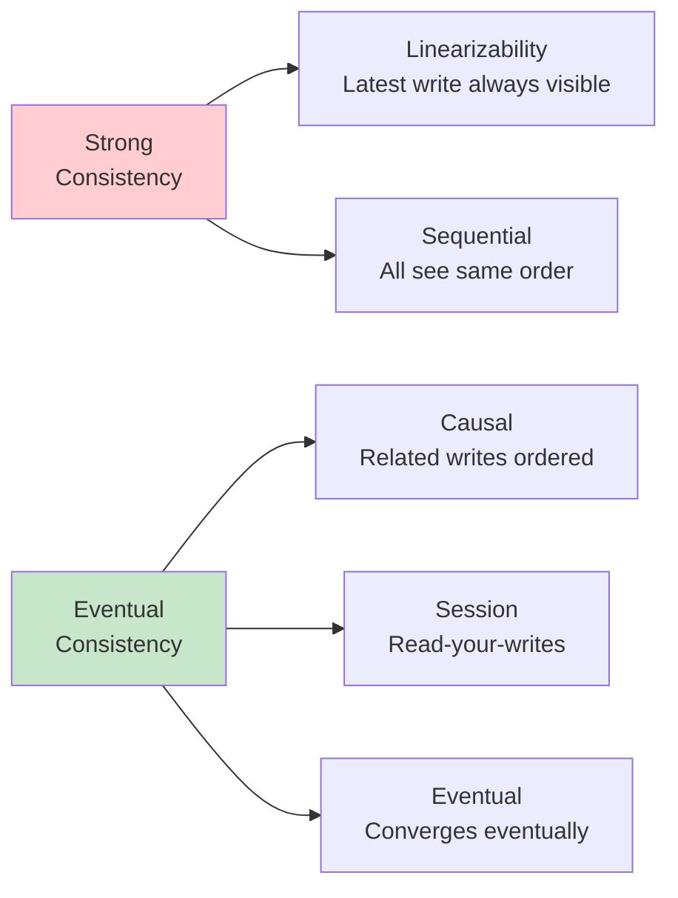
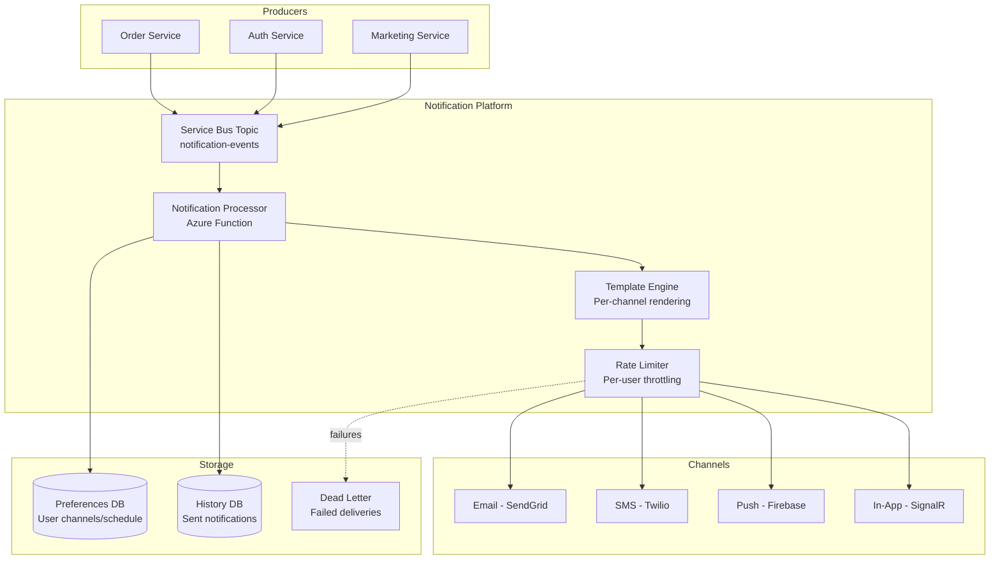
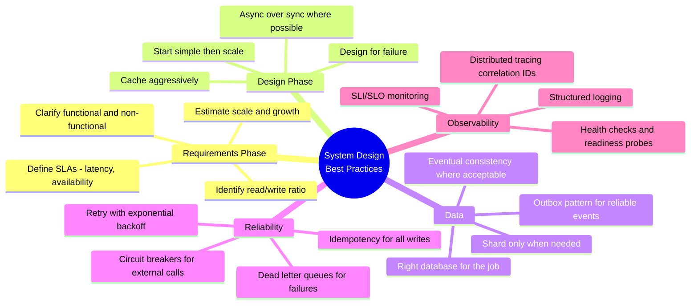

# System Design - Complete Interview Guide
## For 8+ Years Experienced Senior Developers

---

## 1. System Design Overview

### Definition
System design is the process of defining the architecture, components, modules, interfaces, and data flow of a system to satisfy specified requirements — particularly at scale.

### Purpose
To create systems that handle millions of users reliably, scale horizontally, remain available during failures, and evolve without full rewrites. In interviews, it demonstrates your ability to think architecturally.

### Problem It Solves
- **Scalability**: Single-server apps break at 10K+ concurrent users
- **Availability**: Hardware fails — systems must survive failures gracefully
- **Latency**: Users expect < 200ms responses globally
- **Data growth**: Databases slow down as data grows to terabytes
- **Team independence**: Multiple teams need to deploy without blocking each other

### Industry Relevance
- Every senior developer interview includes a 45-minute system design round
- Real production systems require these decisions daily
- Architecture mistakes are the most expensive to fix (can't refactor distributed systems easily)

---

## 2. System Design Framework

### Step-by-Step Approach (Use in every interview)

```
1. CLARIFY REQUIREMENTS (3-5 min)
   - Functional: What does the system do?
   - Non-functional: Scale, latency, availability, consistency
   - Constraints: Budget, team size, existing tech stack

2. ESTIMATE SCALE (2-3 min)
   - Users: DAU, peak concurrent
   - Data: Storage per user, growth rate
   - Traffic: Requests/second, read/write ratio
   - Bandwidth: Data transfer needs

3. HIGH-LEVEL DESIGN (5-10 min)
   - Core components and data flow
   - API design (endpoints)
   - Database schema (key entities)

4. DEEP DIVE (10-15 min)
   - Scale bottlenecks and solutions
   - Database choices and sharding
   - Caching layer
   - Async processing

5. TRADE-OFFS AND ALTERNATIVES (3-5 min)
   - What are the trade-offs?
   - What would you do differently with more time/budget?
   - How would this evolve?
```

### Back-of-Envelope Calculations

```
Key Numbers to Remember:
- 1 web server: ~1000-10,000 QPS (depends on complexity)
- 1 database server: ~5,000-10,000 simple queries/sec
- Redis: 100,000+ operations/sec
- Kafka: 1M+ messages/sec per cluster
- 1 MB = 1,000 KB; 1 GB = 1,000 MB; 1 TB = 1,000 GB
- 1 day = 86,400 seconds ≈ 100K seconds
- 1 month ≈ 2.5M seconds

Example: Design for 10M DAU
- 10M DAU × 10 requests/day = 100M requests/day
- 100M / 100K seconds = 1,000 QPS average
- Peak = 3× average = 3,000 QPS
- Need: 1-3 servers behind load balancer + read replicas
```


---

## Scalability Concepts

### Horizontal vs Vertical Scaling

| Aspect | Vertical (Scale Up) | Horizontal (Scale Out) |
|--------|--------------------|-----------------------|
| How | Bigger machine | More machines |
| Limit | Hardware ceiling | Virtually unlimited |
| Cost | Exponential | Linear |
| Complexity | Low | High (distributed) |
| Downtime | Usually required | Rolling updates |

### Database Scaling Strategies

```
1. READ REPLICAS
   Primary (writes) → Replica 1 (reads) → Replica 2 (reads)
   Use for: Read-heavy workloads (90% reads)
   Trade-off: Eventual consistency for reads

2. SHARDING (Horizontal Partitioning)
   Shard by: user_id % N, geographic region, date range
   Challenges: Cross-shard queries, rebalancing, hotspots
   
3. CQRS
   Write DB (normalized) → Event → Read DB (denormalized)
   Use for: Different read/write patterns

4. CONNECTION POOLING
   App → Pool (10-50 connections) → Database
   Prevents connection exhaustion under load
```

---

## Caching Strategies

### Cache Patterns

```
1. CACHE-ASIDE (Lazy Loading)
   Read: Check cache → Miss → Read DB → Store in cache → Return
   Write: Update DB → Invalidate cache
   Pro: Only caches what's needed
   Con: Initial cache miss penalty

2. WRITE-THROUGH
   Write: Write to cache + DB simultaneously
   Pro: Cache always fresh
   Con: Write latency, caches unused data

3. WRITE-BEHIND (Write-Back)
   Write: Write to cache → Async write to DB
   Pro: Fast writes
   Con: Data loss risk if cache crashes

4. READ-THROUGH
   Read: Cache handles DB reads transparently
   Pro: Simpler application code
   Con: Cache must know about data source
```

### Cache Invalidation Strategies

```csharp
// TTL-based expiration
cache.Set(key, value, TimeSpan.FromMinutes(5));

// Event-based invalidation
// When data changes, publish event to invalidate cache
await _eventBus.PublishAsync(new CacheInvalidationEvent("orders", orderId));

// Versioned keys
var cacheKey = $"product:{productId}:v{product.Version}";

// Tag-based invalidation (Redis)
// Tag all product caches, invalidate entire tag group
await _cache.InvalidateByTagAsync("products");
```

---

## Common System Designs

### Design: E-Commerce Order System

```
Components:
┌─────────┐     ┌──────────┐     ┌─────────────┐
│  Client  │────▶│  API GW  │────▶│ Order Service│
└─────────┘     └──────────┘     └─────────────┘
                                         │
                    ┌────────────────────┼────────────────────┐
                    ▼                    ▼                    ▼
            ┌───────────┐      ┌──────────────┐     ┌──────────────┐
            │  Payment  │      │  Inventory   │     │ Notification │
            │  Service  │      │   Service    │     │   Service    │
            └───────────┘      └──────────────┘     └──────────────┘
                    │                    │                    │
                    ▼                    ▼                    ▼
            ┌───────────┐      ┌──────────────┐     ┌──────────────┐
            │Payment DB │      │ Inventory DB │     │  Email/SMS   │
            └───────────┘      └──────────────┘     └──────────────┘

Key Decisions:
- Saga pattern for distributed transactions
- Event-driven communication (Service Bus)
- Redis for cart/session data
- Cosmos DB for order read model (global distribution)
- SQL Server for payment (ACID required)
```

### Design: Real-Time Chat System

```
Requirements: 1M concurrent users, <100ms latency, message persistence

Architecture:
- WebSocket connections via Azure SignalR Service (managed)
- Redis Pub/Sub for real-time message fan-out
- Cosmos DB for message persistence (partition by conversationId)
- Blob Storage for media attachments
- Azure CDN for media delivery
- Presence service with Redis sorted sets (last-seen timestamps)

Scaling:
- SignalR Service handles 1M+ connections
- Horizontal scaling with sticky sessions or Redis backplane
- Message fan-out: Direct delivery (online) + Push notification (offline)
- Read receipts via async queue processing
```

### Design: URL Shortener

```
Requirements: 100M URLs, 1B redirects/month, <10ms redirect latency

Back of envelope:
- 1B / 2.5M sec = 400 redirects/sec (avg), 1200/sec peak
- Storage: 100M × 1KB = 100GB (fits in single DB)
- Base62 encoding: 6 chars = 62^6 = 56B combinations

Architecture:
- Create: API → Generate short code → Store (SQL/DynamoDB)
- Redirect: CDN (cache popular URLs) → Redis → Database
- Short code generation: Counter-based (centralized) or pre-generated pool
- Analytics: Kafka stream → Analytics DB (async)

Key decisions:
- Redis caches top 20% (Pareto) of URLs
- 301 (permanent) vs 302 (temporary) redirect based on use case
- Rate limiting per API key for creation
- Custom domains support via CNAME mapping
```

---

## Architecture Decision Records

### ADR Template

```markdown
# ADR-001: Use Event-Driven Architecture for Inter-Service Communication

## Status: Accepted

## Context
Our microservices need to communicate. Options considered:
1. Synchronous HTTP calls
2. Asynchronous messaging (Service Bus)
3. Event streaming (Event Hubs/Kafka)

## Decision
Use Azure Service Bus for command-style messages and Event Grid for domain events.

## Consequences
- Positive: Decoupled services, better resilience, natural retry
- Negative: Eventual consistency, harder debugging, operational complexity
- Mitigation: Implement correlation IDs, structured logging, dead letter handling
```

---

## Interview Questions & Answers

### Q1: How would you design a system to handle 100K requests per second?
**Answer:**
1. Load balancer distributing across multiple app servers
2. Redis caching (cache hit ratio > 90%)
3. Read replicas for database
4. CDN for static content
5. Connection pooling
6. Async processing for non-critical paths
7. Database query optimization and indexing
8. Horizontal scaling with auto-scale rules

### Q2: How do you choose between SQL and NoSQL?
**Answer:** SQL when: ACID transactions needed, complex joins, structured data, reporting. NoSQL when: flexible schema, horizontal scale, high write throughput, denormalized data access patterns, global distribution. For e-commerce: SQL for orders/payments (consistency), NoSQL for product catalog (flexible, read-heavy).

### Q3: Explain the CAP theorem with a practical example
**Answer:** In a distributed system, you can only guarantee two of: Consistency, Availability, Partition-tolerance. Since network partitions are inevitable, the real choice is CP vs AP. Banking (CP): Prefer returning errors over stale balances. Social media feed (AP): Show slightly stale feed rather than error. Most systems are somewhere in between with tunable consistency.

---

## Database Design Decisions

### SQL vs NoSQL Decision Framework



### Data Partitioning Strategies

```
SHARDING STRATEGIES:
┌────────────────────────────────────────────────────────────────┐
│ 1. HASH-BASED: shard = hash(key) % num_shards                 │
│    Pro: Even distribution                                       │
│    Con: Hard to range query, resharding expensive              │
│                                                                 │
│ 2. RANGE-BASED: shard by date range or ID range                │
│    Pro: Range queries efficient                                 │
│    Con: Hotspots (latest shard gets all writes)                │
│                                                                 │
│ 3. GEOGRAPHIC: shard by user region                            │
│    Pro: Data locality, compliance (GDPR)                       │
│    Con: Uneven distribution, cross-region queries expensive     │
│                                                                 │
│ 4. DIRECTORY-BASED: lookup table maps key → shard              │
│    Pro: Flexible, handles hotspots with rebalancing            │
│    Con: Lookup table becomes bottleneck/single point of failure │
└────────────────────────────────────────────────────────────────┘
```

---

## Load Balancing

### Load Balancing Layers



### Load Balancing Algorithms

| Algorithm | How It Works | Best For |
|-----------|-------------|----------|
| Round Robin | Sequential distribution | Equal-capacity servers |
| Weighted Round Robin | Higher weight = more traffic | Mixed-capacity servers |
| Least Connections | Routes to server with fewest active | Varying request duration |
| IP Hash | Same client → same server | Session affinity needs |
| URL Hash | Same URL → same server | Caching optimization |

---

## Message Queues and Event Streaming

### When to Use Each



### Message Queue Patterns

```
COMPETING CONSUMERS:
Queue → [Consumer 1] processes msg A
      → [Consumer 2] processes msg B
      → [Consumer 3] processes msg C
Scale: Add more consumers for throughput

DEAD LETTER QUEUE:
Main Queue → Consumer → Process
                      ↓ (fails 3x)
              Dead Letter Queue → Alert + Manual review

OUTBOX PATTERN (Transactional messaging):
┌─────────────────────────────────────┐
│ BEGIN TRANSACTION                    │
│   INSERT INTO Orders (...)           │
│   INSERT INTO Outbox (event_payload) │
│ COMMIT                               │
└─────────────────────────────────────┘
         ↓
Background service reads Outbox → Publishes to Service Bus → Marks as sent

Why: Guarantees event is published if and only if data is committed
```

---

## API Design

### REST Best Practices

| Practice | Good | Bad |
|----------|------|-----|
| Resource naming | /orders/{id}/items | /getOrderItems?orderId=1 |
| HTTP methods | POST /orders | POST /createOrder |
| Status codes | 201 Created + Location header | 200 OK with "success: true" |
| Versioning | /api/v2/orders or Accept header | /api/orders?version=2 |
| Pagination | ?page=2&size=20 + Link headers | Return all 10K items |
| Filtering | ?status=active&sort=-createdAt | Custom query string format |

### API Pagination Patterns

```
OFFSET-BASED (Simple, slow for deep pages):
GET /orders?page=3&size=20
Response: { data: [...], totalCount: 1000, page: 3 }
Problem: Page 500 requires scanning 10,000 rows

CURSOR-BASED (Consistent, fast for any page):
GET /orders?after=eyJpZCI6MTAwfQ&size=20
Response: { data: [...], nextCursor: "eyJpZCI6MTIwfQ", hasMore: true }
Best for: Infinite scroll, real-time feeds

KEYSET-BASED (Most efficient):
GET /orders?createdAfter=2024-01-01T00:00:00Z&limit=20
Best for: Time-series data, ordered results
```

---

## CAP Theorem and Consistency

### Consistency Models



### Consistency vs Availability Trade-offs by Use Case

| Use Case | Model | Why |
|----------|-------|-----|
| Bank balance | Strong (CP) | Cannot show stale balance |
| Shopping cart | Session consistency | User sees their own writes |
| Product catalog | Eventual (AP) | Slightly stale OK, must be available |
| Inventory count | Bounded staleness | Approximate OK, exact at checkout |
| Social media feed | Eventual (AP) | Stale feed > no feed |
| Leaderboard | Eventual | Update lag OK for non-competitive |

---

## Additional System Designs

### Design: Notification System (Push + Email + SMS)



### Design: Rate Limiter

```
Algorithms:
┌─────────────────────────────────────────────────────────────┐
│ 1. TOKEN BUCKET                                             │
│    - Bucket holds N tokens, refilled at rate R/sec          │
│    - Each request consumes 1 token                          │
│    - Empty bucket = reject (429 Too Many Requests)          │
│    - Allows bursts up to bucket size                        │
│                                                             │
│ 2. SLIDING WINDOW                                           │
│    - Count requests in sliding time window                  │
│    - More precise than fixed window                         │
│    - Redis ZRANGEBYSCORE for implementation                 │
│                                                             │
│ 3. FIXED WINDOW COUNTER                                     │
│    - Simple counter per time window (e.g., per minute)      │
│    - Problem: burst at window boundary                      │
│    - Redis INCR + EXPIRE                                    │
└─────────────────────────────────────────────────────────────┘

Distributed Rate Limiting (Multi-server):
- Redis as centralized counter (atomic INCR)
- Sliding window with sorted sets
- Lua script for atomic check-and-increment
```

### Design: Search Autocomplete

```
Requirements: < 100ms response, handles typos, personalized

Architecture:
1. Trie data structure (prefix matching) stored in Redis
2. Pre-computed suggestions updated hourly from analytics
3. Personalization layer (recent searches, user behavior)
4. Fallback to fuzzy search (Levenshtein distance)

Data flow:
User types "sho" → 
  1. Check local cache (browser) → miss
  2. Request to autocomplete service
  3. Redis Trie lookup: "sho" → [shoes, shopping, shorts, ...]
  4. Apply personalization weights
  5. Return top 5-10 results in < 50ms

Scaling:
- Redis cluster per region
- CDN caching for popular prefixes
- Background job rebuilds Trie from search analytics
```

---

## Distributed System Patterns

### Circuit Breaker

```mermaid
stateDiagram-v2
    [*] --> Closed
    Closed --> Open: Failure threshold exceeded
    Open --> HalfOpen: Timeout expires
    HalfOpen --> Closed: Test request succeeds
    HalfOpen --> Open: Test request fails
    
    note right of Closed: Normal operation<br/>Track failure count
    note right of Open: Fail fast immediately<br/>Don't call service
    note right of HalfOpen: Allow one test request<br/>Decide: recover or stay open
```

### Saga Pattern for Distributed Transactions

```
CHOREOGRAPHY (Event-driven):
┌───────────┐  OrderCreated  ┌───────────┐  PaymentReceived  ┌───────────┐
│   Order   │──────────────▶│  Payment  │──────────────────▶│ Inventory │
│  Service  │               │  Service  │                    │  Service  │
└───────────┘               └───────────┘                    └───────────┘
      ↑                           │                               │
      │    PaymentFailed          │    InventoryReserved           │
      └───────────────────────────┘    or InventoryFailed          │
                                       └───────────────────────────┘

ORCHESTRATION (Central coordinator):
┌───────────────────────────────────────────┐
│           Saga Orchestrator                │
│                                           │
│  1. Create Order (order service)          │
│  2. Reserve Inventory (inventory service) │
│  3. Charge Payment (payment service)      │
│  4. Confirm Order                         │
│                                           │
│  On failure at step N:                    │
│    Compensate steps N-1, N-2, ... 1       │
└───────────────────────────────────────────┘
```

---

## Best Practices Summary



---

## Interview Perspective - What Interviewers Expect

For 8+ years experience, system design interviewers expect:

1. **Structured approach** - Follow the framework (requirements → estimate → design → deep dive)
2. **Trade-off analysis** - Explain WHY each choice, what you'd lose with alternatives
3. **Scale numbers** - Quick back-of-envelope calculations
4. **Failure thinking** - "What happens when X goes down?"
5. **Real experience** - "In production we handled this by..."
6. **Depth on demand** - Able to dive deep into any component when probed
7. **Communication** - Talk through your thinking, don't just draw boxes

### Follow-up Questions to Prepare For:
- "What's the single point of failure in your design?"
- "How would this change at 100x scale?"
- "How do you handle data consistency across services?"
- "What monitoring would you set up?"
- "How would you roll this out gradually?"
- "What would you do differently with unlimited budget?"
