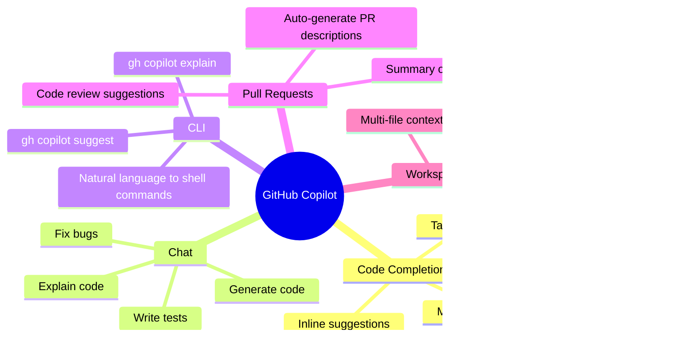
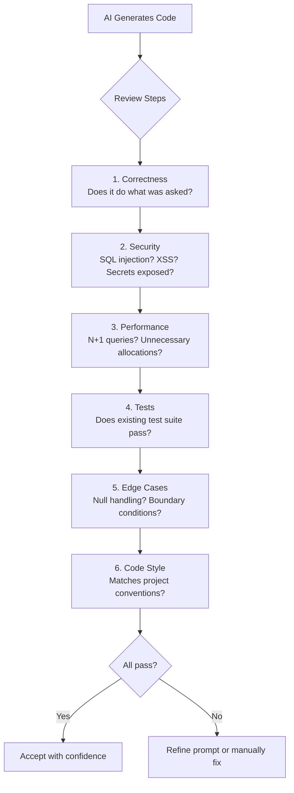
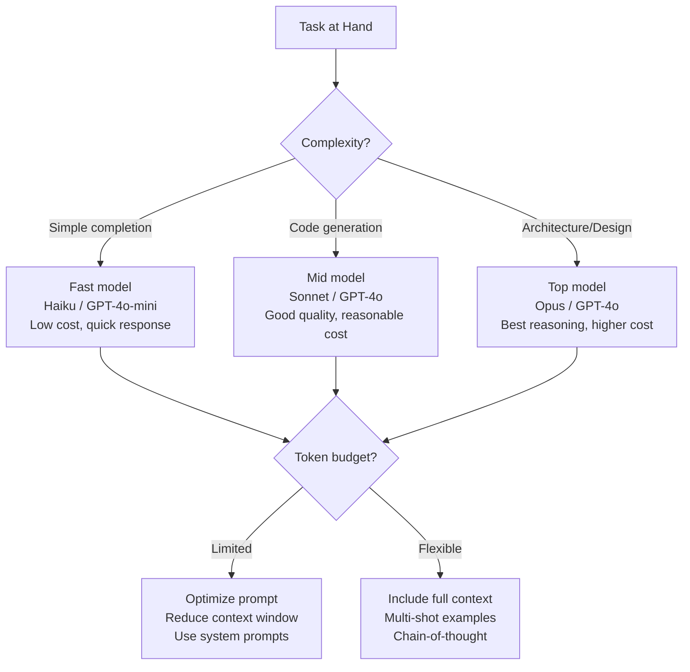
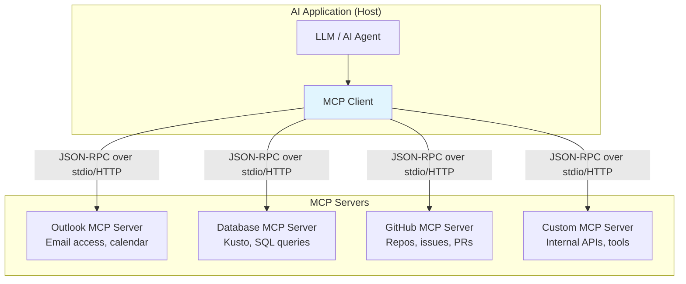
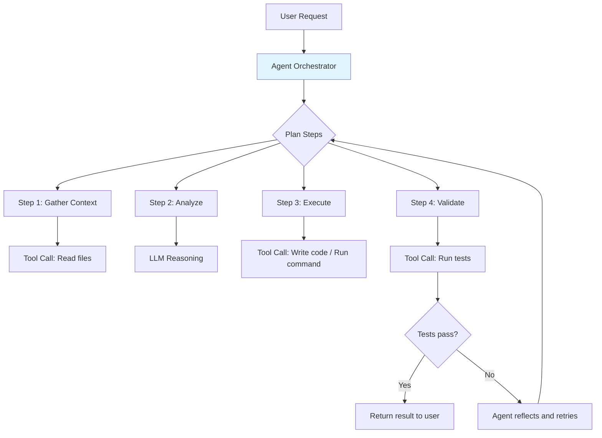
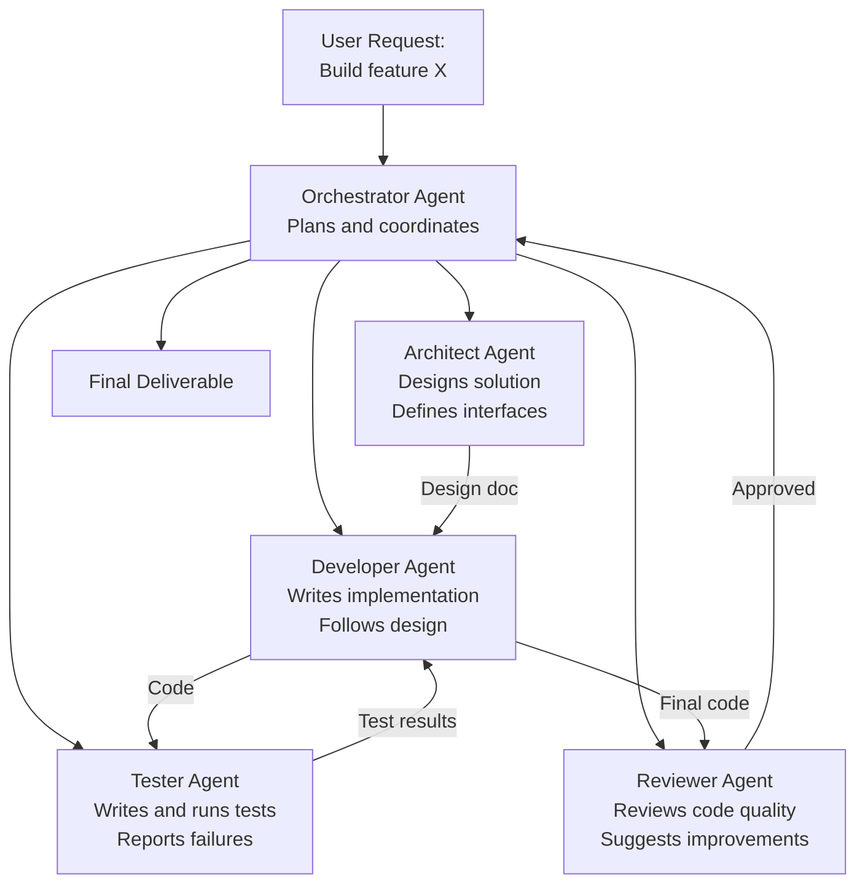
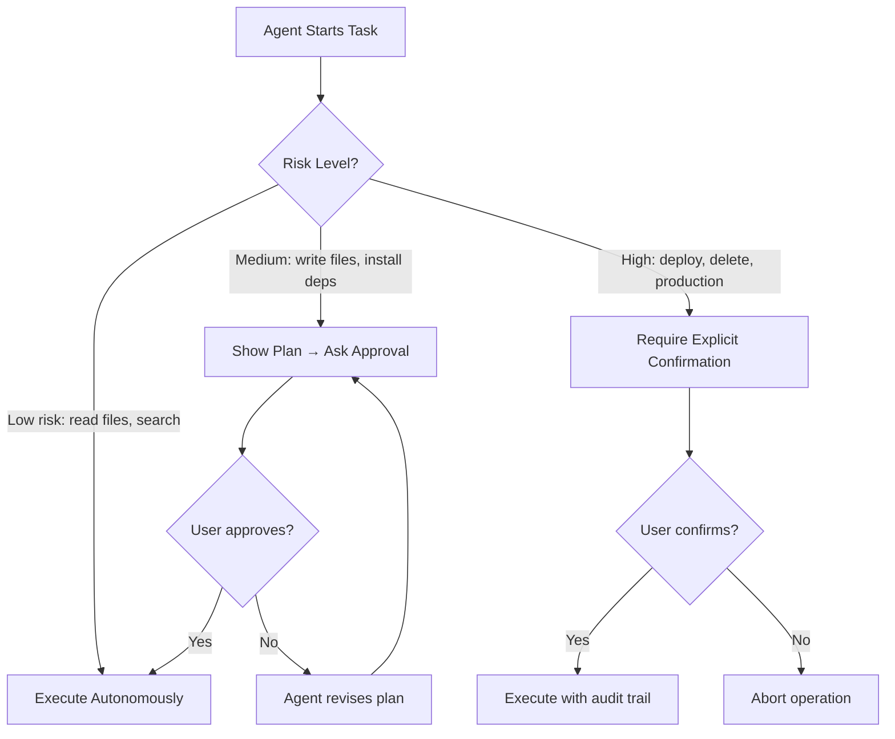
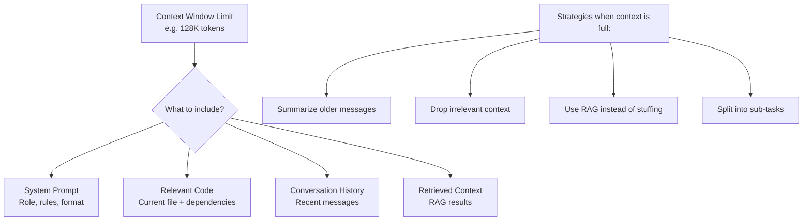
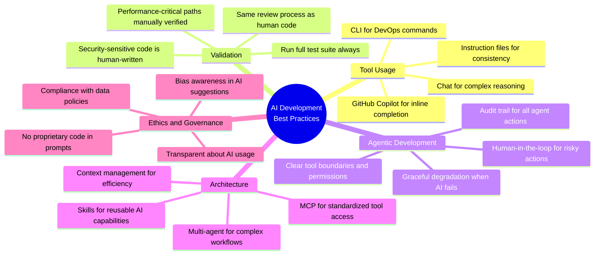

# AI Tools, Agents & Gen AI Development - Complete Interview Guide
## For 8+ Years Experienced Senior Developers

---

## 1. AI Tools Overview

### Definition
AI-assisted development tools use large language models (LLMs) to augment software development — from code completion and generation to testing, documentation, debugging, and architectural design.

### Purpose
To accelerate development velocity while maintaining code quality by leveraging AI for repetitive, boilerplate, and exploratory tasks while developers focus on architecture, design decisions, and business logic.

### Industry Relevance
- GitHub Copilot has 1.8M+ paying subscribers (2024)
- 55% of developers use AI coding tools daily (Stack Overflow 2024)
- EPAM, Microsoft, Google all require AI fluency for senior roles
- AI-assisted development is now a core engineering competency, not optional

### Problem It Solves
- **Boilerplate fatigue**: Writing repetitive CRUD, DTOs, mappers, tests manually
- **Context switching**: Leaving IDE to search docs, Stack Overflow, or API references
- **Knowledge gaps**: Understanding unfamiliar codebases or libraries quickly
- **Onboarding time**: New team members needing weeks to become productive
- **Testing coverage**: Tests that developers skip due to time pressure

---

## 2. GitHub Copilot Ecosystem

### GitHub Copilot Features Across SDLC



### Copilot in SDLC Phases

| SDLC Phase | Copilot Feature | How It Helps |
|-----------|----------------|--------------|
| Requirements | Chat + Workspace | Analyze requirements, suggest architecture |
| Design | Chat | Generate system diagrams, API contracts |
| Development | Inline completion | Accelerate coding, reduce boilerplate |
| Testing | /tests command | Generate unit tests, edge cases |
| Code Review | PR summaries | Auto-describe changes, suggest improvements |
| Documentation | Chat | Generate docs, README, API descriptions |
| Debugging | Chat + Explain | Understand errors, suggest fixes |
| Deployment | CLI | Generate CI/CD scripts, IaC |

### Copilot Best Practices

```
DO:                                       DON'T:
┌──────────────────────────────┐         ┌──────────────────────────────┐
│ ✅ Review ALL suggestions     │         │ ❌ Blindly accept completions │
│ ✅ Provide context via comments│        │ ❌ Trust for security logic   │
│ ✅ Use for boilerplate/tests  │         │ ❌ Skip code review           │
│ ✅ Validate against requirements│       │ ❌ Use for proprietary algos  │
│ ✅ Use instruction files      │         │ ❌ Paste secrets in prompts   │
│ ✅ Keep human in the loop     │         │ ❌ Assume correctness         │
└──────────────────────────────┘         └──────────────────────────────┘
```

### Validation Strategy for AI-Generated Code



---

## 3. AI Models and Selection Strategy

### Model Comparison

| Model | Strengths | Best For | Cost |
|-------|-----------|----------|------|
| GPT-4o | Reasoning, complex tasks | Architecture, design | High |
| Claude Sonnet | Code quality, long context | Code generation, review | Medium |
| Claude Haiku | Speed, simple tasks | Quick completions, chat | Low |
| GPT-4o-mini | Balance of speed/quality | General development | Low |
| Codex/Copilot | Inline code completion | Real-time suggestions | Subscription |

### Model Selection Decision Tree



### Token Consumption Optimization

```
Strategies to reduce token usage:
┌──────────────────────────────────────────────────────────┐
│ 1. SYSTEM PROMPTS: Set role/context once (not per msg)   │
│ 2. SUMMARIZATION: Condense conversation history          │
│ 3. SELECTIVE CONTEXT: Only include relevant code files   │
│ 4. CACHING: Cache frequent prompts/responses             │
│ 5. PROMPT COMPRESSION: Remove redundant instructions     │
│ 6. MODEL ROUTING: Use cheap models for simple tasks      │
│ 7. STRUCTURED OUTPUT: Request JSON to avoid verbose text │
│ 8. RAG: Retrieve only relevant docs, not entire corpus   │
└──────────────────────────────────────────────────────────┘
```

---

## 4. Prompt Engineering Best Practices

### Definition
Prompt engineering is the practice of crafting instructions to AI models to elicit accurate, relevant, and useful responses.

### Prompt Structure Framework

```
Effective Prompt = Role + Context + Task + Constraints + Format

Example:
┌──────────────────────────────────────────────────────────┐
│ ROLE: You are a senior .NET developer                    │
│ CONTEXT: Working on an e-commerce API using .NET 8       │
│ TASK: Create a retry policy for HTTP calls               │
│ CONSTRAINTS: Use Polly, max 3 retries, exponential       │
│              backoff, log each retry                      │
│ FORMAT: Complete C# class with XML documentation         │
└──────────────────────────────────────────────────────────┘
```

### Prompting Techniques

| Technique | Description | When to Use |
|-----------|-------------|-------------|
| Zero-shot | Direct instruction, no examples | Simple, well-defined tasks |
| Few-shot | Provide input/output examples | Pattern-based generation |
| Chain-of-thought | Ask to reason step by step | Complex logic, debugging |
| Self-consistency | Generate multiple answers, pick best | Critical decisions |
| ReAct | Reason + Act + Observe loop | Agentic multi-step tasks |
| Tree-of-thought | Explore multiple reasoning paths | Architecture decisions |

### Instruction Files (.github/copilot-instructions.md)

```markdown
# Project Instructions for AI Assistants

## Code Style
- Use C# 12 features (primary constructors, collection expressions)
- Follow Clean Architecture: Controllers → Services → Repositories
- All methods async unless pure computation
- Use Result<T> pattern instead of exceptions for business errors

## Naming Conventions
- Interfaces: IOrderService (not IOrderServiceInterface)
- Async methods: suffix with Async
- Private fields: _camelCase

## Testing
- Use xUnit + Moq + FluentAssertions
- One assertion per test (prefer)
- Test naming: MethodName_Scenario_ExpectedResult

## Architecture
- CQRS with MediatR for all commands/queries
- Validation via FluentValidation pipeline behaviors
- EF Core with repository pattern for complex queries only
```

---

## 5. MCP (Model Context Protocol)

### Definition
MCP (Model Context Protocol) is an open standard that enables AI models to securely connect to external data sources and tools. It provides a standardized way for AI assistants to access databases, APIs, file systems, and other services.

### Architecture



### MCP Core Concepts

```
MCP Server provides three types of capabilities:
┌─────────────────────────────────────────────────────────┐
│ 1. TOOLS: Functions the AI can call                      │
│    Example: query_database(sql), send_email(to, body)    │
│    AI decides WHEN to call them                          │
│                                                          │
│ 2. RESOURCES: Data the AI can read                       │
│    Example: file://docs/api-spec.yaml                    │
│    Provides context without execution                    │
│                                                          │
│ 3. PROMPTS: Reusable prompt templates                    │
│    Example: "Analyze this log file for errors"           │
│    Pre-built workflows for common tasks                  │
└─────────────────────────────────────────────────────────┘
```

### MCP Configuration Example

```json
{
  "mcpServers": {
    "outlook": {
      "command": "npx",
      "args": ["@microsoft/outlook-mcp-server"],
      "env": { "TENANT_ID": "..." }
    },
    "kusto": {
      "command": "python",
      "args": ["-m", "kusto_mcp_server"],
      "env": { "CLUSTER_URL": "https://mycluster.kusto.windows.net" }
    },
    "github": {
      "command": "npx",
      "args": ["@github/mcp-server"],
      "env": { "GITHUB_TOKEN": "..." }
    }
  }
}
```

### Real-World MCP Use Case

```
Scenario: Integrated Outlook + Kusto MCP servers for observability

1. Developer asks AI: "What alerts fired yesterday for order-service?"
2. AI calls Kusto MCP tool: query_kusto("AlertsFired | where service == 'order-service' | where timestamp > ago(1d)")
3. AI analyzes results, finds spike at 3:00 PM
4. AI calls Kusto MCP tool: query_kusto("Traces | where timestamp between(2:55PM..3:05PM)")
5. AI identifies root cause: database connection pool exhaustion
6. AI drafts remediation via Outlook MCP: send_email(to: team, body: analysis + fix)

All without developer leaving their IDE!
```

---

## 6. AI Agents and Agentic Workflows

### Definition
An AI agent is an autonomous system that uses an LLM as its reasoning engine to plan, decide, and execute multi-step tasks — calling tools, reading data, and making decisions with minimal human intervention.

### Agent Architecture



### Agentic Workflow Patterns

| Pattern | Description | Example |
|---------|-------------|---------|
| ReAct | Reason → Act → Observe loop | Debugging: analyze error → try fix → run tests → observe |
| Plan-and-Execute | Create plan first, then execute steps | Feature implementation with design → code → test |
| Reflection | Agent reviews its own output for quality | Code review agent checks its generated code |
| Tool Use | Agent decides which tools to call and when | Query DB, read files, call APIs autonomously |
| Multi-Agent | Multiple specialized agents collaborate | Architect agent → Developer agent → Tester agent |

### Tool Calls - How Agents Interact with the World

```
Agent Loop:
┌───────────────────────────────────────────────────────┐
│ 1. RECEIVE: User message or task                       │
│ 2. THINK: LLM reasons about what to do next            │
│ 3. DECIDE: Choose a tool to call (or respond directly) │
│ 4. ACT: Execute the tool call                          │
│ 5. OBSERVE: Read the tool's response                   │
│ 6. REPEAT: Go back to step 2 until task complete       │
│ 7. RESPOND: Return final answer to user                │
└───────────────────────────────────────────────────────┘

Tool Call Format (OpenAI-style):
{
  "tool_calls": [{
    "function": {
      "name": "search_codebase",
      "arguments": "{\"query\": \"payment service retry logic\"}"
    }
  }]
}
```

### Multi-Agent Systems



### Human-in-the-Loop Workflows



---

## 7. Custom Agents and Skills

### Custom Agent Creation

```
Building a Custom Agent:
┌──────────────────────────────────────────────────────────┐
│ 1. DEFINE PURPOSE: What problem does this agent solve?    │
│    Example: "Automate incident response for our service"  │
│                                                          │
│ 2. DEFINE TOOLS: What can the agent DO?                  │
│    - query_logs(service, timerange)                       │
│    - restart_service(name)                                │
│    - create_incident(severity, description)               │
│    - notify_team(channel, message)                        │
│                                                          │
│ 3. DEFINE INSTRUCTIONS: System prompt + constraints       │
│    - Always check logs before restarting                  │
│    - Never restart production without approval            │
│    - Escalate if error rate > 5%                         │
│                                                          │
│ 4. DEFINE WORKFLOW: How steps connect                     │
│    - Detect anomaly → Gather context → Decide action     │
│    - If critical → Alert human → Wait for approval       │
│                                                          │
│ 5. TEST & ITERATE: Run against historical incidents      │
└──────────────────────────────────────────────────────────┘
```

### Skills and Skills Gateway

```
Skill = A packaged capability that an agent can use

Example Skills:
┌────────────────────────────────────────────────────┐
│ WorkIQ Skill (Inbox Automation):                   │
│   - read_inbox(): Get unread emails                │
│   - categorize_email(id): Classify by priority     │
│   - draft_reply(id, context): Generate response    │
│   - schedule_meeting(participants, time): Book     │
│                                                    │
│ Reliability Skill (Custom):                        │
│   - check_health(service): Health check            │
│   - query_metrics(service, metric): Get data       │
│   - trigger_runbook(name): Execute playbook        │
│   - create_postmortem(incident_id): Draft doc      │
└────────────────────────────────────────────────────┘

Skills Gateway = Registry that agents discover available skills
  - Like a "service catalog" for AI capabilities
  - Agents request skills by capability name
  - Gateway routes to correct skill implementation
  - Handles auth, rate limiting, versioning
```

---

## 8. Context Management and Memory

### Context Window Management



### Memory Types for Agents

| Memory Type | Scope | Example |
|-------------|-------|---------|
| Working Memory | Current conversation | Chat history, current task state |
| Short-term Memory | Current session | Files opened, decisions made |
| Long-term Memory | Across sessions | User preferences, project patterns |
| Episodic Memory | Specific events | Past incident resolutions |
| Semantic Memory | Knowledge base | Architecture docs, API specs |

---

## 9. Gen AI in Enterprise .NET Development

### Azure OpenAI + .NET SDK Integration

```csharp
// Azure OpenAI integration in .NET
using Azure.AI.OpenAI;

public class AiService
{
    private readonly OpenAIClient _client;
    
    public AiService(IConfiguration config)
    {
        _client = new OpenAIClient(
            new Uri(config["AzureOpenAI:Endpoint"]),
            new DefaultAzureCredential()); // Managed Identity!
    }
    
    public async Task<string> GenerateResponseAsync(string prompt)
    {
        var options = new ChatCompletionsOptions
        {
            DeploymentName = "gpt-4o",
            Messages = {
                new ChatRequestSystemMessage("You are a helpful assistant."),
                new ChatRequestUserMessage(prompt)
            },
            MaxTokens = 1000,
            Temperature = 0.7f
        };
        
        var response = await _client.GetChatCompletionsAsync(options);
        return response.Value.Choices[0].Message.Content;
    }
    
    // Function calling (tool use) pattern
    public async Task<string> ProcessWithToolsAsync(string userMessage)
    {
        var tools = new List<ChatCompletionsFunctionToolDefinition>
        {
            new("get_order_status", "Get current order status",
                BinaryData.FromObjectAsJson(new {
                    type = "object",
                    properties = new {
                        order_id = new { type = "string", description = "The order ID" }
                    },
                    required = new[] { "order_id" }
                }))
        };
        
        // AI decides whether to call the tool based on user message
        var options = new ChatCompletionsOptions
        {
            DeploymentName = "gpt-4o",
            Tools = { tools[0] },
            Messages = { new ChatRequestUserMessage(userMessage) }
        };
        
        var response = await _client.GetChatCompletionsAsync(options);
        // Handle tool calls if AI decided to use them
        return response.Value.Choices[0].Message.Content;
    }
}
```

### AI-Assisted Observability

```
Using AI for log analysis and incident response:

1. STRUCTURED LOGGING → Feed to AI
   Log.Information("Order {OrderId} processed in {Duration}ms", orderId, duration);
   
2. AI PATTERN DETECTION
   - Anomaly detection on latency trends
   - Error pattern clustering (similar exceptions grouped)
   - Root cause correlation across services
   
3. AI-ASSISTED DEBUGGING
   "Analyze these logs and tell me why latency spiked at 3:00 PM"
   AI: "The spike correlates with a deployment at 2:58 PM. 
        The new version has N+1 query issue in OrderService.GetAll()
        Evidence: SQL query count went from 2/request to 150/request"

4. AUTOMATED REMEDIATION
   AI detects issue → Creates incident → Suggests fix → Awaits approval
```

---

## 10. AI Usage Metrics and Reporting

### How to Report AI Usage in Interviews

```
Framework for discussing AI tool usage:

USAGE PERCENTAGE: "I use GitHub Copilot for ~40% of my code output"
  - 40% AI-generated (completions + chat)
  - 60% manual (architecture, complex logic, reviews)

USE CASES (by frequency):
  1. Boilerplate generation (DTOs, CRUD, tests) — 80% acceptance rate
  2. Test case generation — 60% acceptance (need edge case additions)
  3. Code explanation and debugging — daily use
  4. Documentation and comments — high acceptance
  5. Architecture suggestions — take as starting point, heavily modify

VALIDATION STRATEGY:
  - All AI code goes through same PR review process
  - Run full test suite before merging
  - Security-sensitive code always human-written
  - Performance-critical paths manually optimized
  
PRODUCTIVITY IMPACT:
  - 30-50% faster for routine development tasks
  - Reduced context switching (less Stack Overflow/docs searching)
  - Better test coverage (AI generates tests I'd skip)
  - Faster onboarding to unfamiliar codebases
```

---

## 11. Interview Questions with Detailed Answers

### Q: How do you use AI tools in your daily development workflow?

**Senior-Level Answer:**
I use GitHub Copilot in my IDE for inline completions — primarily for boilerplate code, test generation, and repetitive patterns. For complex problems, I use Copilot Chat or Claude to discuss architectural approaches, rubber-duck debug, or generate initial implementations I then refine.

My validation strategy: I treat AI output like a junior developer's code review. I verify correctness, check for security issues (injection, exposed secrets), validate performance implications (N+1 queries, unnecessary allocations), and ensure it follows project conventions.

Key insight: AI is best for the "what" (implementation), while I focus on the "why" (architecture decisions, trade-offs, business logic correctness).

### Q: Explain MCP and how you've used it

**Senior-Level Answer:**
MCP (Model Context Protocol) is an open standard that lets AI assistants connect to external tools and data sources through a standardized JSON-RPC interface. An MCP server exposes tools (callable functions), resources (readable data), and prompts (templates).

I've integrated MCP servers for Outlook (email automation) and Kusto (log analysis). The agent can query our observability data, correlate incidents, and draft communications — all within the IDE context. The key benefit is that the AI can now take actions in external systems rather than just generate text.

### Q: What is an AI agent vs a chatbot?

**Senior-Level Answer:**
A chatbot is reactive — it responds to messages one at a time with no memory of state or ability to take actions.

An agent is proactive and autonomous. It:
1. Plans multi-step approaches to achieve goals
2. Calls tools (APIs, databases, file systems) to take actions
3. Observes results and adjusts its plan
4. Maintains context across steps
5. Can delegate to sub-agents for specialized tasks

Example: A chatbot tells you how to fix a bug. An agent reads your code, identifies the bug, writes the fix, runs the tests, and submits a PR — with human approval at key checkpoints.

### Q: How do you handle hallucination and trust in AI-generated code?

**Senior-Level Answer:**
AI hallucination in code manifests as: plausible but non-existent API methods, incorrect library usage, subtly wrong business logic, or outdated patterns.

My mitigation strategy:
1. **Compilation**: Does it actually compile? (Catches fabricated APIs)
2. **Tests**: Does the existing test suite still pass?
3. **Type checking**: TypeScript/C# type system catches many issues
4. **Domain knowledge**: I validate business logic against requirements
5. **Security review**: Never trust AI for auth, encryption, or access control
6. **Incremental use**: Small, verifiable chunks rather than large generations

### Q: Explain the difference between model selection for different tasks

**Senior-Level Answer:**
I match model capability to task complexity:
- **Simple completions** (variable names, boilerplate): Fast/cheap model (Haiku, GPT-4o-mini)
- **Code generation** (functions, classes): Mid-tier (Sonnet, GPT-4o)
- **Architecture/reasoning** (system design, complex debugging): Top-tier (Opus, o1)
- **Real-time inline completion**: Specialized code model (Copilot/Codex)

Cost optimization: Route 80% of requests to cheap models, reserve expensive models for complex reasoning. Use caching for repeated patterns. Minimize context window by sending only relevant code, not entire files.

---

## 12. Best Practices Summary



---

## 13. Interview Perspective - What Interviewers Expect

For EPAM senior developer interviews, AI interviewers expect:

1. **Daily usage evidence** — Specific examples of how you use Copilot, not just "I've tried it"
2. **Validation maturity** — You don't blindly trust AI; you have a review process
3. **MCP understanding** — Know what it is, how servers connect, real use cases
4. **Agentic awareness** — Understand agents, tool calls, orchestration concepts
5. **Prompt engineering** — Can craft effective prompts with role, context, constraints
6. **Security consciousness** — Know what NOT to put in AI tools (secrets, proprietary logic)
7. **Productivity metrics** — Can quantify the impact (% time saved, acceptance rate)

### Follow-up Questions to Prepare For:
- "What's your GitHub Copilot acceptance rate and how do you validate suggestions?"
- "How would you build a custom AI agent for incident response?"
- "Explain MCP and give a real example of how you'd use it"
- "What's the difference between an AI assistant and an AI agent?"
- "How do you handle the security implications of AI-generated code?"
- "Describe a scenario where AI tools helped you solve a complex problem"
- "How would you design a multi-agent system for automating code reviews?"
