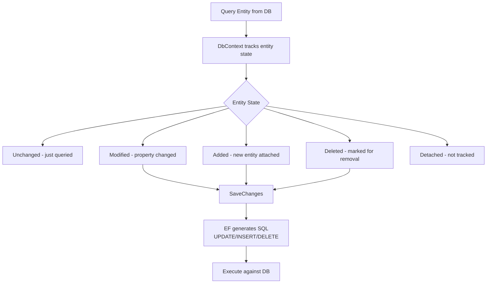
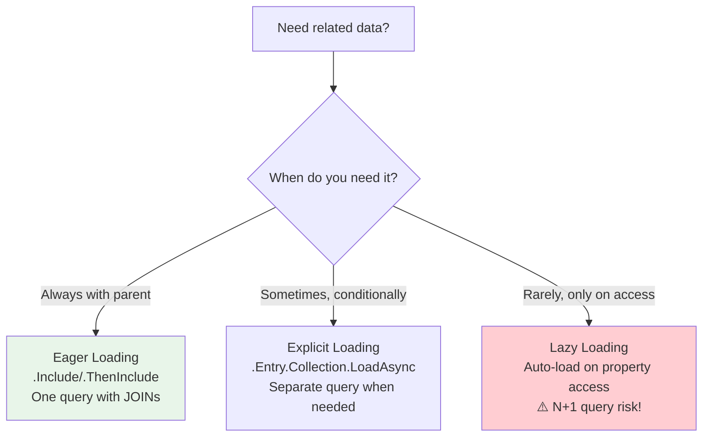
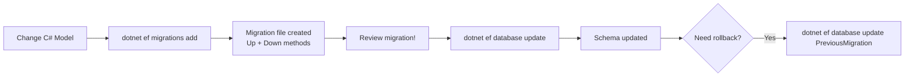
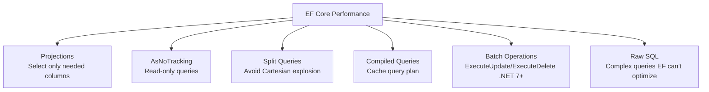

# Entity Framework Core - Complete Interview Guide
## For 8+ Years Experienced Senior Developers

---

## 1. EF Core Overview

### Definition
Entity Framework Core is Microsoft's modern object-relational mapper (ORM) for .NET that enables developers to work with databases using .NET objects, eliminating most data-access code.

### Purpose
To bridge the impedance mismatch between object-oriented C# code and relational database tables, providing a productive, type-safe way to query and manipulate data.

### Problem It Solves
- Writing repetitive ADO.NET code (connections, commands, readers)
- Manual SQL string concatenation (SQL injection risk)
- Object-relational mapping boilerplate
- Database schema synchronization with code changes

### Industry Relevance
- Default ORM for all .NET enterprise applications
- EF Core 8 performance rivals hand-written SQL for most scenarios
- Understanding EF internals (change tracking, query translation) is expected for senior roles
- Knowing when to bypass EF (raw SQL, Dapper) is equally important

---

## 2. Change Tracking

### How Change Tracking Works



### AsNoTracking — When and Why

```
WITH Tracking (default):                WITHOUT Tracking (AsNoTracking):
┌──────────────────────────────┐       ┌──────────────────────────────┐
│ • Entity stored in identity map│      │ • No identity map storage    │
│ • Change detection on SaveChanges│    │ • No change detection        │
│ • Same query returns same instance│   │ • Each query returns NEW object│
│ • Memory overhead per entity  │       │ • Lower memory, faster queries│
│                               │       │                               │
│ USE FOR: Read-Write operations│       │ USE FOR: Read-only queries    │
│ (CRUD pages, forms, updates) │       │ (Reports, lists, APIs that    │
│                               │       │  return DTOs anyway)          │
└──────────────────────────────┘       └──────────────────────────────┘
```

```csharp
// ❌ Wasteful: Tracking entities you'll never modify
var orders = await _db.Orders
    .Include(o => o.Items)
    .ToListAsync(); // Tracked! But we only display them...

// ✅ Efficient: No tracking for read-only queries
var orders = await _db.Orders
    .AsNoTracking()
    .Include(o => o.Items)
    .ToListAsync(); // 30-50% faster for large result sets

// ✅ Even better: Project to DTOs (no entity materialization)
var orderDtos = await _db.Orders
    .Select(o => new OrderDto
    {
        Id = o.Id,
        Total = o.Total,
        ItemCount = o.Items.Count
    })
    .ToListAsync(); // Fastest: only needed columns from DB
```

---

## 3. Loading Strategies

### Eager vs Lazy vs Explicit Loading



### N+1 Query Problem

```
PROBLEM: Lazy loading in a loop

// Executes 1 query for orders
var orders = await _db.Orders.ToListAsync();  // SELECT * FROM Orders

// Then N additional queries (one per order!)
foreach (var order in orders)
{
    var items = order.Items; // SELECT * FROM OrderItems WHERE OrderId = @id
    // This fires for EACH order = N+1 queries total!
}

If 100 orders: 1 + 100 = 101 database round trips!

FIX: Eager load with Include
var orders = await _db.Orders
    .Include(o => o.Items)  // Single query with JOIN
    .ToListAsync();
// Result: 1 query instead of 101
```

---

## 4. Migrations and Schema Management

### Migration Workflow



### Production Migration Best Practices

```
Zero-Downtime Migration Strategy:
┌──────────────────────────────────────────────────────┐
│ 1. EXPAND: Add new column (nullable or with default) │
│    ALTER TABLE Orders ADD NewStatus NVARCHAR(50) NULL │
│                                                       │
│ 2. DUAL-WRITE: Code writes to both old and new       │
│    order.Status = "Active";                           │
│    order.NewStatus = "Active";                        │
│                                                       │
│ 3. BACKFILL: Migrate existing data                   │
│    UPDATE Orders SET NewStatus = Status               │
│                                                       │
│ 4. SWITCH: Code reads from new column only           │
│                                                       │
│ 5. CONTRACT: Remove old column in next release       │
│    ALTER TABLE Orders DROP COLUMN Status              │
└──────────────────────────────────────────────────────┘

NEVER in production:
❌ Rename columns directly
❌ Drop columns without migration period
❌ Change column types without data conversion
❌ Add NOT NULL without default value
```

---

## 5. Concurrency Handling

### Optimistic vs Pessimistic Concurrency

| Approach | How | When | Trade-off |
|----------|-----|------|-----------|
| Optimistic | Check version on save, reject if changed | High read, low conflict | Retry on conflict |
| Pessimistic | Lock row on read, hold until done | High conflict, short transactions | Blocks other readers |

### Optimistic Concurrency with Row Version

```csharp
// Entity with concurrency token
public class Order
{
    public int Id { get; set; }
    public string Status { get; set; }
    public decimal Total { get; set; }
    
    [Timestamp]
    public byte[] RowVersion { get; set; } // SQL Server rowversion
}

// EF Core automatically checks RowVersion on SaveChanges
// If another user modified the row, throws DbUpdateConcurrencyException

public async Task UpdateOrderAsync(int orderId, string newStatus)
{
    var order = await _db.Orders.FindAsync(orderId);
    order.Status = newStatus;
    
    try
    {
        await _db.SaveChangesAsync();
    }
    catch (DbUpdateConcurrencyException ex)
    {
        // Someone else modified this row since we loaded it!
        var entry = ex.Entries.Single();
        var dbValues = await entry.GetDatabaseValuesAsync();
        
        if (dbValues == null)
            throw new NotFoundException("Order was deleted");
        
        // Strategy: Last-write-wins, or merge, or reject
        entry.OriginalValues.SetValues(dbValues);
        await _db.SaveChangesAsync(); // Retry with current DB values
    }
}
```

---

## 6. Performance Optimization

### Query Performance Patterns



### Key Optimizations

```csharp
// ❌ SLOW: Loading entire entities for a simple list
var names = await _db.Customers.ToListAsync();
return names.Select(c => c.Name); // Loaded ALL columns from DB!

// ✅ FAST: Projection - only query needed columns
var names = await _db.Customers
    .Select(c => c.Name)
    .ToListAsync(); // SELECT Name FROM Customers

// ❌ SLOW: Cartesian explosion with multiple Includes
var orders = await _db.Orders
    .Include(o => o.Items)      // 10 items per order
    .Include(o => o.Payments)   // 3 payments per order
    .ToListAsync();             // Result: 10 × 3 = 30 rows per order!

// ✅ FAST: Split queries avoid Cartesian product
var orders = await _db.Orders
    .Include(o => o.Items)
    .Include(o => o.Payments)
    .AsSplitQuery()  // Separate SQL per Include
    .ToListAsync();  // 3 queries, no duplication

// ✅ Bulk operations (.NET 7+) - no entity loading needed
await _db.Orders
    .Where(o => o.Status == "Completed" && o.Date < cutoff)
    .ExecuteUpdateAsync(s => s.SetProperty(o => o.Status, "Archived"));
// Single SQL: UPDATE Orders SET Status='Archived' WHERE ...
// No entities loaded into memory!

// ✅ Compiled query - cache the expression tree translation
private static readonly Func<AppDbContext, int, Task<Order?>> GetOrderById =
    EF.CompileAsyncQuery((AppDbContext db, int id) =>
        db.Orders.Include(o => o.Items).FirstOrDefault(o => o.Id == id));

// Usage: Skips expression tree compilation on subsequent calls
var order = await GetOrderById(_db, orderId);
```

---

## 7. Interview Questions

### Q: How do you prevent N+1 queries in EF Core?

**Answer:**
1. Use `.Include()` for eager loading related data
2. Use `.Select()` projections to load only what you need
3. Use `.AsSplitQuery()` when multiple Includes cause Cartesian explosion
4. Never enable lazy loading in web APIs (use explicit loading if conditional)
5. Monitor with EF Core logging or MiniProfiler to detect N+1 in development

### Q: When would you use raw SQL over LINQ?

**Answer:**
- Complex queries EF can't translate (recursive CTEs, window functions)
- Performance-critical paths where EF's generated SQL is suboptimal
- Bulk operations on older EF versions (pre-.NET 7 ExecuteUpdate)
- Stored procedure calls
- Full-text search queries

Always use parameterized raw SQL (`FromSqlInterpolated`) never string concatenation.

---

## 8. Interview Perspective

For senior developers, EF Core interviewers expect:
1. **Performance awareness** — Know about N+1, projections, compiled queries
2. **Concurrency strategy** — Optimistic vs pessimistic, how to handle conflicts
3. **Migration expertise** — Zero-downtime migrations, expand-contract pattern
4. **When NOT to use EF** — Bulk operations, complex reports, real-time requirements
